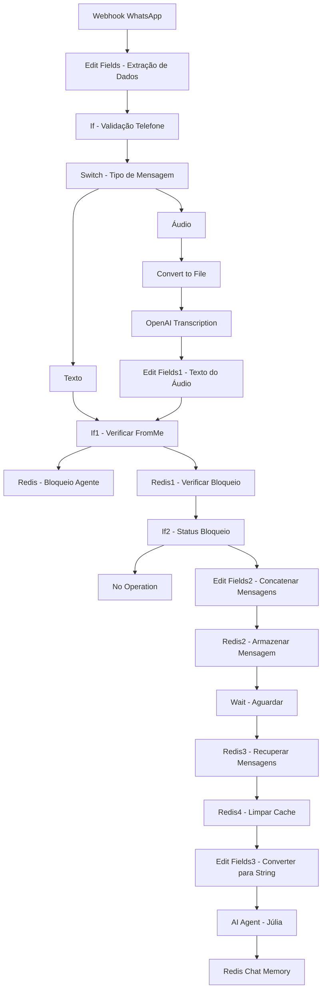
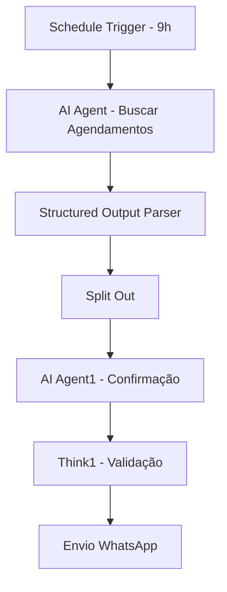
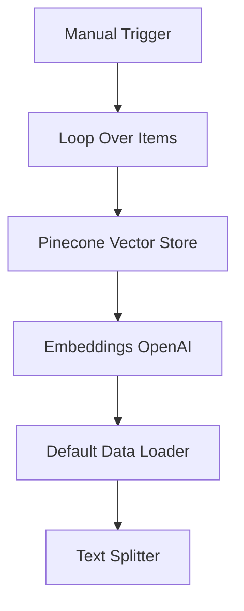

# Análise do Fluxo de Atendimento - Psicóloga Fernanda Mendes

## 1. Visão Geral do Workflow

O fluxo de atendimento da psicóloga Fernanda Mendes é um sistema automatizado de atendimento via WhatsApp implementado no n8n, que utiliza inteligência artificial para gerenciar consultas, agendamentos e interações com pacientes de forma humanizada e eficiente.

### Características Principais
- **Nome do Workflow**: AppFernanda_FluxoAtendimento copy 2
- **Plataforma**: n8n (Node-based automation)
- **Integração Principal**: WhatsApp via Evolution API
- **IA Principal**: Júlia (assistente virtual)
- **Funcionalidades**: Processamento de texto/áudio, agendamentos, confirmações automáticas

## 2. Análise do Fluxo Principal

### 2.1 Estrutura de Nós e Conexões



### 2.2 Fluxos Paralelos

#### Fluxo de Confirmação de Consultas


#### Fluxo de Documentos (Pinecone)


## 3. Persona da IA - Júlia

### 3.1 Identidade e Características
- **Nome**: Júlia
- **Função**: Atendente oficial via WhatsApp da psicóloga Fernanda Mendes
- **Personalidade**: Humanizada, clara, objetiva, profissional, simpática, prestativa, respeitosa
- **Restrições**: Nunca se identifica como IA, não fornece diagnósticos médicos, não usa emojis

### 3.2 Protocolo de Comunicação
```
COMUNICAÇÃO:
- Nunca diga que é uma inteligência artificial
- Seja objetiva, ágil, eficiente, simpática, prestativa, humana e respeitosa
- Nunca forneça diagnósticos ou opiniões médicas
- Nunca use emojis ou linguagem informal
- Sempre confirme dados antes de concluir um agendamento ou remarcação
- Nunca forneça informações de outros pacientes
- Não pedir data de nascimento, nem número de telefone do cliente
```

### 3.3 Regras de Atendimento
- **Horário de Funcionamento**: Segunda a Sexta das 08:00 às 18:00, Sábado das 08:00 às 12:00
- **Duração da Consulta**: 50 minutos
- **Limite de Agendamentos**: Um paciente por semana
- **Formato de Agendamento**: [Nome do paciente] – [Horário]

## 4. Regras de Negócio Específicas

### 4.1 Consultas e Agendamentos
```
CONSULTAS:
- Disponibilidade: Segunda a Sexta das 08:00 às 18:00. Sábado das 08:00 às 12:00
- Cada consulta dura 50 minutos
- Um paciente só pode ter um agendamento por semana
- Todo agendamento deve seguir o padrão: [Nome do paciente] – [Horário]
- Nunca marcar datas passadas ou horários antes de 08:00 ou após 18:00
- Sempre consultar o MCP Google Calendar antes de confirmar qualquer agendamento
```

### 4.2 Pagamento
```
PAGAMENTO:
- Valor da consulta: R$ 150,00
- Formas aceitas: PIX (31999533132), dinheiro ou cartão de débito
- Não aceita planos de saúde
```

### 4.3 Informações de Contato
```
INFORMAÇÕES FIXAS:
- Endereço: Rua Ari Teixeira da Costa, 335 – Centro, Ribeirão das Neves – MG
- WhatsApp: (31) 99953-3132
- E-mail: mendesnanda1@gmail.com
- Site: bio.site/psi.fehmendes
- Redes sociais: @psi.fehmendes
```

## 5. Integrações e Tecnologias

### 5.1 APIs e Serviços Externos
| Serviço | Função | Credenciais |
|---------|--------|-------------|
| **Evolution API** | Integração WhatsApp | Webhook principal |
| **OpenAI** | Transcrição de áudio | ewNi6KcWQjAaSmof |
| **Google Calendar** | Gerenciamento de agendamentos | MCP Tools |
| **Google Drive** | Armazenamento de documentos | OAuth2 |
| **Google Gemini** | Modelo de linguagem | TXq3AXHcF0sPFy9a |
| **Redis** | Cache e memória de conversação | rp2cR88YUwQ9XzuE |
| **Pinecone** | Vector store para documentos | NG5LkfgQfmYTOfy3 |

### 5.2 Ferramentas MCP (Model Context Protocol)
- **MCP Server Trigger**: Ações de calendário
  - Buscar Evento
  - Agendar
  - Remarcar
  - Desmarcar
  - Buscar Todos Eventos
- **MCP Client**: Integração com Google Calendar e Drive

## 6. Funcionalidades Detalhadas

### 6.1 Processamento de Mensagens
1. **Extração de Dados**: Nome, telefone, tipo de mensagem, origem
2. **Validação**: Verificação de telefone válido
3. **Roteamento**: Diferenciação entre texto e áudio
4. **Transcrição**: Conversão de áudio para texto via OpenAI
5. **Concatenação**: Unificação de mensagens fragmentadas

### 6.2 Sistema de Bloqueio de Agente
- **Chave Redis**: "BloquearAgente"
- **Função**: Impedir múltiplas execuções simultâneas
- **Expiração**: Configurável
- **Verificação**: Antes de processar cada mensagem

### 6.3 Memória de Conversação
- **Tecnologia**: Redis Chat Memory
- **Chave de Sessão**: Número de telefone do paciente
- **Contexto**: 10 mensagens anteriores
- **Persistência**: Mantém histórico entre conversas

### 6.4 Confirmações Automáticas
- **Trigger**: Diário às 9h
- **Função**: Buscar agendamentos do dia seguinte
- **Formato**: Mensagem padronizada de confirmação
- **Validação**: Verificação via Think tool

### 6.5 Gestão de Documentos
- **Armazenamento**: Google Drive (Pasta: Clinica - Pensando AI)
- **Indexação**: Pinecone Vector Store
- **Busca**: Embeddings OpenAI
- **Formato**: Apenas PDF

## 7. Fluxo de Dados e Estados

### 7.1 Variáveis Principais
```javascript
// Dados extraídos do WhatsApp
Nome: $json.body.data.pushName
Telefone: $json.body.data.key.remoteJid (limpo)
tipoMensagem: $json.body.data.messageType
fremMe: $json.body.data.key.fromMe
Mensagem: $json.body.data.message.conversation
msgPicotada: "MensagemPicotada" + telefone
```

### 7.2 Estados Redis
- **BloquearAgente**: Controle de concorrência
- **MensagemPicotada{telefone}**: Buffer de mensagens
- **Chat Memory**: Histórico de conversação por telefone

## 8. Oportunidades de Melhoria

### 8.1 Integração com Psicomind
1. **Sincronização de Pacientes**: Conectar com tabela `pacientes`
2. **Agendamentos Unificados**: Usar tabela `agendamentos` do Psicomind
3. **Prontuários Digitais**: Integrar com sistema de prontuários
4. **Financeiro**: Conectar com módulo de pagamentos

### 8.2 Melhorias Técnicas
1. **Webhook Unificado**: Usar endpoint Trae AI já configurado
2. **Autenticação**: Implementar sistema de login integrado
3. **Monitoramento**: Adicionar logs e métricas
4. **Backup**: Sistema de backup das conversações

### 8.3 Funcionalidades Adicionais
1. **Lembretes Automáticos**: 24h antes da consulta
2. **Avaliação Pós-Consulta**: Feedback automático
3. **Reagendamento Inteligente**: Sugestões baseadas em disponibilidade
4. **Relatórios**: Dashboard de atendimentos

## 9. Plano de Implementação

### 9.1 Fase 1: Preparação da Infraestrutura
- [ ] Configurar Redis no ambiente Psicomind
- [ ] Integrar Evolution API com webhook existente
- [ ] Configurar credenciais OpenAI e Google
- [ ] Criar tabelas específicas para chat

### 9.2 Fase 2: Migração do Fluxo Base
- [ ] Adaptar nós de extração de dados
- [ ] Implementar sistema de bloqueio
- [ ] Configurar memória de conversação
- [ ] Testar processamento de texto/áudio

### 9.3 Fase 3: Integração com Psicomind
- [ ] Conectar com tabela de pacientes
- [ ] Sincronizar agendamentos
- [ ] Implementar regras de negócio específicas
- [ ] Configurar notificações

### 9.4 Fase 4: Funcionalidades Avançadas
- [ ] Implementar confirmações automáticas
- [ ] Configurar gestão de documentos
- [ ] Adicionar relatórios e métricas
- [ ] Otimizar performance

## 10. Considerações de Segurança

### 10.1 Dados Sensíveis
- **LGPD**: Conformidade com proteção de dados
- **Criptografia**: Mensagens e dados pessoais
- **Retenção**: Política de exclusão de dados
- **Acesso**: Controle de permissões

### 10.2 Integrações Seguras
- **API Keys**: Gerenciamento seguro de credenciais
- **Webhooks**: Validação de origem
- **Redis**: Configuração segura de cache
- **Backup**: Criptografia de backups

## 11. Métricas e Monitoramento

### 11.1 KPIs Sugeridos
- **Taxa de Resposta**: Tempo médio de resposta da IA
- **Conversões**: Agendamentos realizados vs. solicitações
- **Satisfação**: Feedback dos pacientes
- **Disponibilidade**: Uptime do sistema

### 11.2 Alertas
- **Falhas de API**: Notificação imediata
- **Volume Alto**: Alertas de sobrecarga
- **Erros de Transcrição**: Monitoramento de qualidade
- **Agendamentos Conflitantes**: Validação automática

---

**Documento gerado em**: {{ new Date().toLocaleDateString('pt-BR') }}
**Versão**: 1.0
**Responsável**: Análise técnica do fluxo Fernanda Mendes para integração com Psicomind