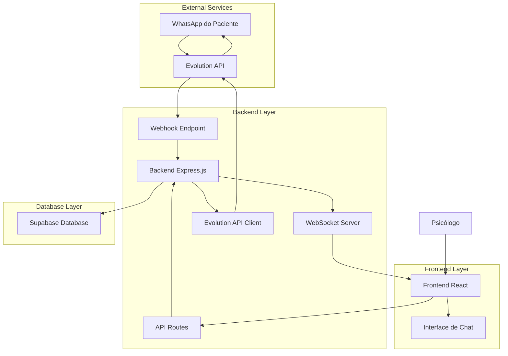
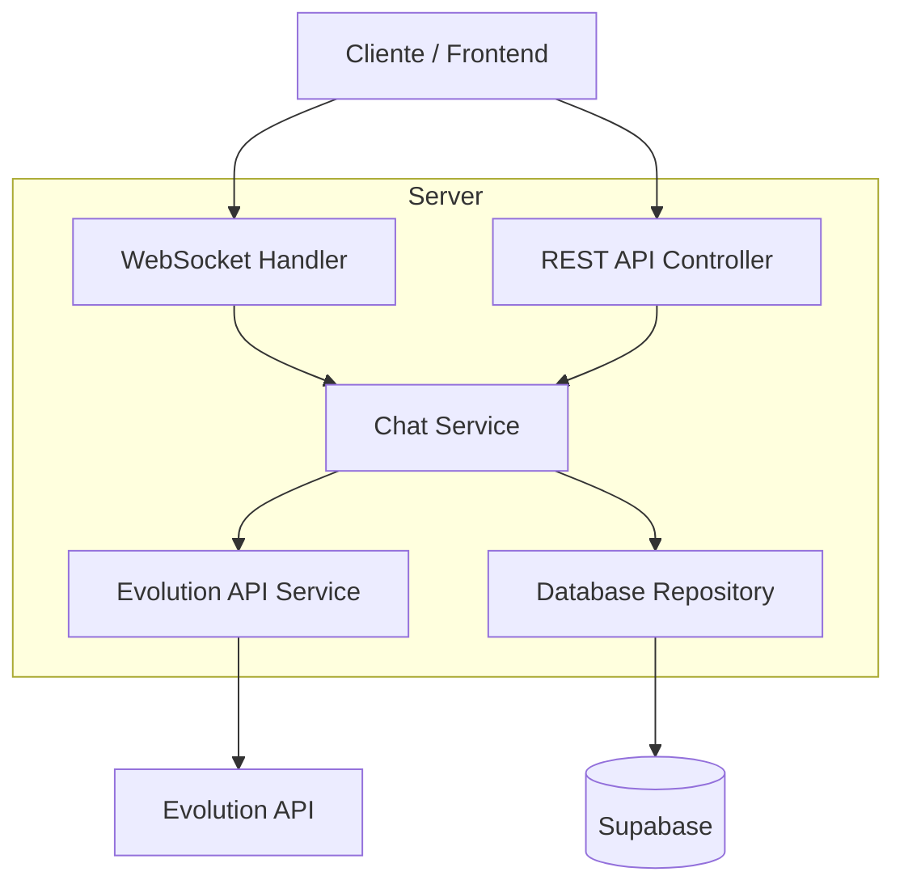
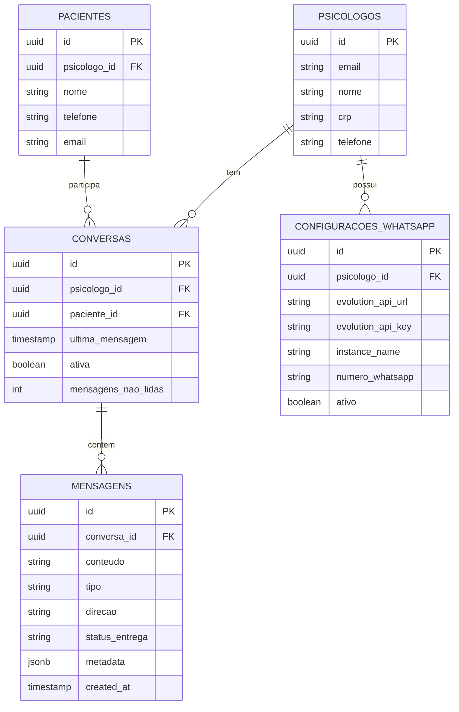

# Arquitetura Técnica - Sistema de Chat WhatsApp

## 1. Diagrama de Arquitetura



## 2. Descrição das Tecnologias

- **Frontend**: React@18 + TypeScript + TailwindCSS + Socket.io-client
- **Backend**: Express@4 + TypeScript + Socket.io + Evolution API SDK
- **Database**: Supabase (PostgreSQL) + Real-time subscriptions
- **WebSocket**: Socket.io para comunicação em tempo real
- **API Externa**: Evolution API para integração WhatsApp
- **Autenticação**: Supabase Auth (já existente)

## 3. Definições de Rotas

| Rota | Propósito |
|------|-----------|
| /chat | Página principal de conversas e interface de chat |
| /chat/configuracoes | Configurações da Evolution API e WhatsApp |
| /chat/historico | Histórico completo de conversas por paciente |
| /chat/notificacoes | Centro de notificações e alertas |

## 4. Definições de API

### 4.1 APIs Core do Chat

**Listar conversas**
```
GET /api/chat/conversas
```

Request:
| Parâmetro | Tipo | Obrigatório | Descrição |
|-----------|------|-------------|-----------|
| limit | number | false | Limite de conversas (padrão: 50) |
| offset | number | false | Offset para paginação |
| search | string | false | Busca por nome do paciente ou conteúdo |

Response:
| Parâmetro | Tipo | Descrição |
|-----------|------|-----------|
| conversas | array | Lista de conversas com última mensagem |
| total | number | Total de conversas |
| hasMore | boolean | Indica se há mais conversas |

**Buscar mensagens de uma conversa**
```
GET /api/chat/conversas/:pacienteId/mensagens
```

Request:
| Parâmetro | Tipo | Obrigatório | Descrição |
|-----------|------|-------------|-----------|
| pacienteId | string | true | ID do paciente |
| limit | number | false | Limite de mensagens (padrão: 50) |
| before | string | false | ID da mensagem para paginação |

Response:
| Parâmetro | Tipo | Descrição |
|-----------|------|-----------|
| mensagens | array | Lista de mensagens ordenadas por data |
| hasMore | boolean | Indica se há mais mensagens |

**Enviar mensagem**
```
POST /api/chat/mensagens
```

Request:
| Parâmetro | Tipo | Obrigatório | Descrição |
|-----------|------|-------------|-----------|
| pacienteId | string | true | ID do paciente destinatário |
| conteudo | string | true | Conteúdo da mensagem |
| tipo | string | false | Tipo da mensagem (texto, imagem, audio) |

Response:
| Parâmetro | Tipo | Descrição |
|-----------|------|-----------|
| mensagemId | string | ID da mensagem criada |
| status | string | Status do envio |
| timestamp | string | Data/hora do envio |

**Webhook para receber mensagens**
```
POST /api/chat/webhook/evolution
```

Request (Evolution API):
| Parâmetro | Tipo | Obrigatório | Descrição |
|-----------|------|-------------|-----------|
| event | string | true | Tipo do evento (message, status) |
| data | object | true | Dados da mensagem ou status |

**Configurar Evolution API**
```
POST /api/chat/configuracao/evolution
```

Request:
| Parâmetro | Tipo | Obrigatório | Descrição |
|-----------|------|-------------|-----------|
| apiUrl | string | true | URL da Evolution API |
| apiKey | string | true | Chave de autenticação |
| instanceName | string | true | Nome da instância WhatsApp |

### 4.2 WebSocket Events

**Eventos do Cliente para Servidor:**
- `join_chat`: Entrar em uma conversa específica
- `leave_chat`: Sair de uma conversa
- `typing_start`: Indicar que está digitando
- `typing_stop`: Parar indicação de digitação

**Eventos do Servidor para Cliente:**
- `new_message`: Nova mensagem recebida
- `message_status`: Atualização de status da mensagem
- `user_typing`: Outro usuário está digitando
- `conversation_updated`: Conversa foi atualizada

## 5. Arquitetura do Servidor



## 6. Modelo de Dados

### 6.1 Definição do Modelo de Dados



### 6.2 DDL (Data Definition Language)

**Tabela de Conversas**
```sql
-- Criar tabela de conversas
CREATE TABLE conversas (
    id UUID PRIMARY KEY DEFAULT gen_random_uuid(),
    psicologo_id UUID NOT NULL REFERENCES psicologos(id) ON DELETE CASCADE,
    paciente_id UUID NOT NULL REFERENCES pacientes(id) ON DELETE CASCADE,
    ultima_mensagem TIMESTAMP WITH TIME ZONE DEFAULT NOW(),
    ativa BOOLEAN DEFAULT true,
    mensagens_nao_lidas INTEGER DEFAULT 0,
    created_at TIMESTAMP WITH TIME ZONE DEFAULT NOW(),
    updated_at TIMESTAMP WITH TIME ZONE DEFAULT NOW(),
    
    UNIQUE(psicologo_id, paciente_id)
);

-- Índices para performance
CREATE INDEX idx_conversas_psicologo_id ON conversas(psicologo_id);
CREATE INDEX idx_conversas_paciente_id ON conversas(paciente_id);
CREATE INDEX idx_conversas_ultima_mensagem ON conversas(ultima_mensagem DESC);
CREATE INDEX idx_conversas_ativa ON conversas(ativa);
```

**Tabela de Mensagens**
```sql
-- Criar tabela de mensagens
CREATE TABLE mensagens (
    id UUID PRIMARY KEY DEFAULT gen_random_uuid(),
    conversa_id UUID NOT NULL REFERENCES conversas(id) ON DELETE CASCADE,
    conteudo TEXT NOT NULL,
    tipo VARCHAR(20) DEFAULT 'texto' CHECK (tipo IN ('texto', 'imagem', 'audio', 'documento')),
    direcao VARCHAR(20) NOT NULL CHECK (direcao IN ('enviada', 'recebida')),
    status_entrega VARCHAR(20) DEFAULT 'enviando' CHECK (status_entrega IN ('enviando', 'entregue', 'lida', 'erro')),
    metadata JSONB DEFAULT '{}',
    created_at TIMESTAMP WITH TIME ZONE DEFAULT NOW(),
    
    -- Campos específicos para integração WhatsApp
    whatsapp_message_id VARCHAR(255),
    reply_to_message_id UUID REFERENCES mensagens(id)
);

-- Índices para performance
CREATE INDEX idx_mensagens_conversa_id ON mensagens(conversa_id);
CREATE INDEX idx_mensagens_created_at ON mensagens(created_at DESC);
CREATE INDEX idx_mensagens_status ON mensagens(status_entrega);
CREATE INDEX idx_mensagens_whatsapp_id ON mensagens(whatsapp_message_id);
```

**Tabela de Configurações WhatsApp**
```sql
-- Criar tabela de configurações WhatsApp
CREATE TABLE configuracoes_whatsapp (
    id UUID PRIMARY KEY DEFAULT gen_random_uuid(),
    psicologo_id UUID NOT NULL REFERENCES psicologos(id) ON DELETE CASCADE,
    evolution_api_url VARCHAR(255) NOT NULL,
    evolution_api_key VARCHAR(255) NOT NULL,
    instance_name VARCHAR(100) NOT NULL,
    numero_whatsapp VARCHAR(20),
    ativo BOOLEAN DEFAULT false,
    webhook_url VARCHAR(255),
    created_at TIMESTAMP WITH TIME ZONE DEFAULT NOW(),
    updated_at TIMESTAMP WITH TIME ZONE DEFAULT NOW(),
    
    UNIQUE(psicologo_id)
);

-- Índices
CREATE INDEX idx_config_whatsapp_psicologo_id ON configuracoes_whatsapp(psicologo_id);
CREATE INDEX idx_config_whatsapp_ativo ON configuracoes_whatsapp(ativo);
```

**Triggers e Funções**
```sql
-- Função para atualizar última mensagem na conversa
CREATE OR REPLACE FUNCTION update_conversa_ultima_mensagem()
RETURNS TRIGGER AS $$
BEGIN
    UPDATE conversas 
    SET 
        ultima_mensagem = NEW.created_at,
        mensagens_nao_lidas = CASE 
            WHEN NEW.direcao = 'recebida' THEN mensagens_nao_lidas + 1
            ELSE mensagens_nao_lidas
        END,
        updated_at = NOW()
    WHERE id = NEW.conversa_id;
    
    RETURN NEW;
END;
$$ LANGUAGE plpgsql;

-- Trigger para atualizar conversa quando nova mensagem é inserida
CREATE TRIGGER trigger_update_conversa_ultima_mensagem
    AFTER INSERT ON mensagens
    FOR EACH ROW
    EXECUTE FUNCTION update_conversa_ultima_mensagem();

-- Função para marcar mensagens como lidas
CREATE OR REPLACE FUNCTION marcar_mensagens_como_lidas(conversa_uuid UUID)
RETURNS void AS $$
BEGIN
    UPDATE mensagens 
    SET status_entrega = 'lida'
    WHERE conversa_id = conversa_uuid 
    AND direcao = 'recebida' 
    AND status_entrega != 'lida';
    
    UPDATE conversas 
    SET mensagens_nao_lidas = 0
    WHERE id = conversa_uuid;
END;
$$ LANGUAGE plpgsql;
```

**Políticas RLS (Row Level Security)**
```sql
-- Habilitar RLS nas novas tabelas
ALTER TABLE conversas ENABLE ROW LEVEL SECURITY;
ALTER TABLE mensagens ENABLE ROW LEVEL SECURITY;
ALTER TABLE configuracoes_whatsapp ENABLE ROW LEVEL SECURITY;

-- Políticas para conversas
CREATE POLICY "Psicólogos podem ver suas conversas" ON conversas
    FOR ALL USING (psicologo_id = auth.uid());

-- Políticas para mensagens
CREATE POLICY "Psicólogos podem ver mensagens de suas conversas" ON mensagens
    FOR ALL USING (
        EXISTS (
            SELECT 1 FROM conversas 
            WHERE conversas.id = mensagens.conversa_id 
            AND conversas.psicologo_id = auth.uid()
        )
    );

-- Políticas para configurações
CREATE POLICY "Psicólogos podem gerenciar suas configurações" ON configuracoes_whatsapp
    FOR ALL USING (psicologo_id = auth.uid());

-- Conceder permissões
GRANT ALL PRIVILEGES ON conversas TO authenticated;
GRANT ALL PRIVILEGES ON mensagens TO authenticated;
GRANT ALL PRIVILEGES ON configuracoes_whatsapp TO authenticated;
```

**Dados Iniciais**
```sql
-- Inserir configuração padrão para psicólogos existentes
INSERT INTO configuracoes_whatsapp (psicologo_id, evolution_api_url, evolution_api_key, instance_name)
SELECT 
    id,
    'https://api.evolution.com',
    'sua_api_key_aqui',
    'psicomind_' || LOWER(REPLACE(nome, ' ', '_'))
FROM psicologos
WHERE NOT EXISTS (
    SELECT 1 FROM configuracoes_whatsapp 
    WHERE configuracoes_whatsapp.psicologo_id = psicologos.id
);
```