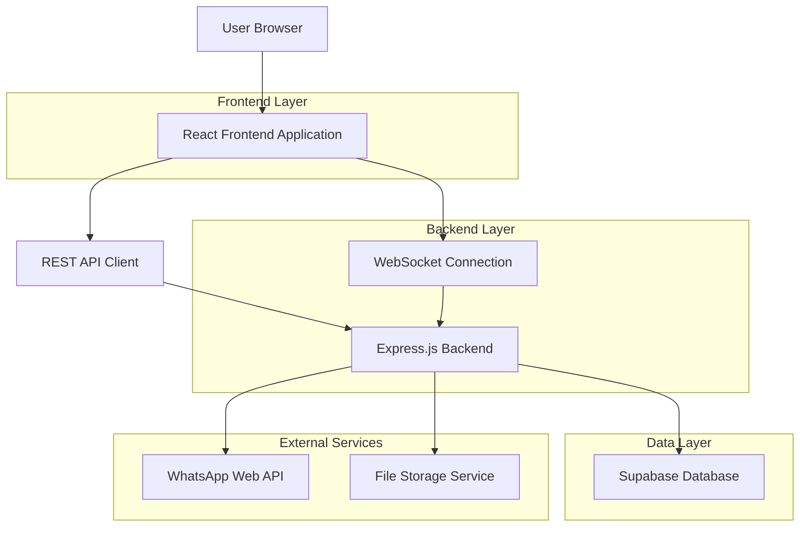
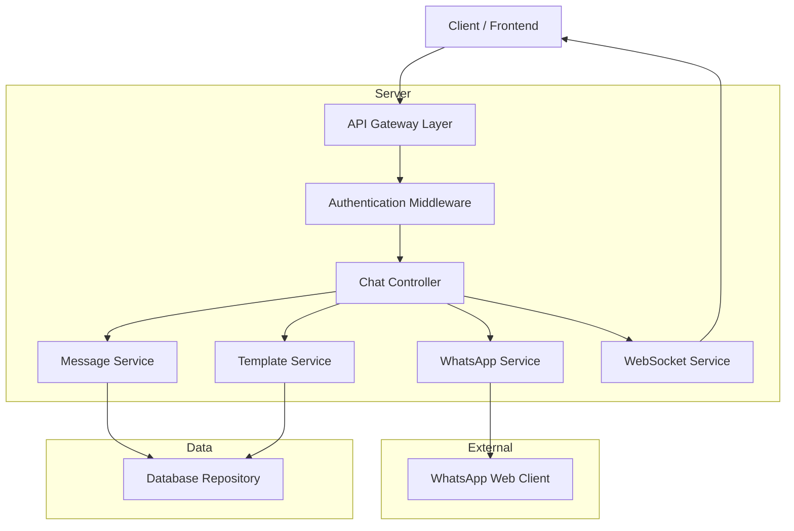
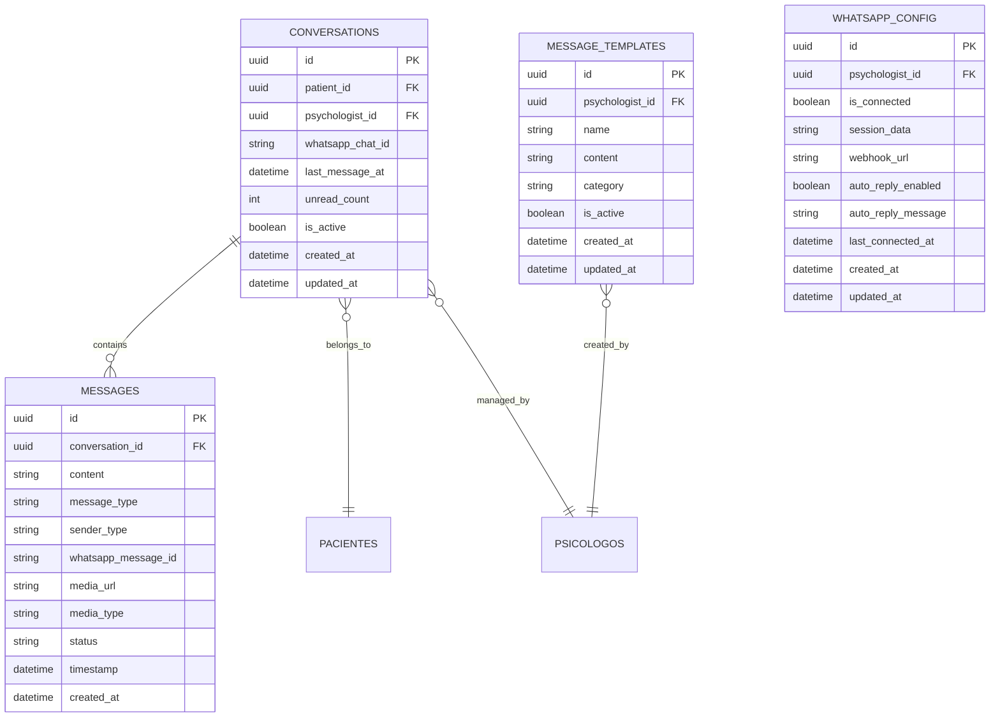

# Arquitetura Técnica - Sistema de Chat WhatsApp Web

## 1. Architecture design



## 2. Technology Description

- Frontend: React@18 + TypeScript + TailwindCSS@3 + Vite + Socket.io-client
- Backend: Node.js + Express@4 + Socket.io + TypeScript
- Database: Supabase (PostgreSQL)
- WhatsApp Integration: whatsapp-web.js
- File Storage: Supabase Storage
- Real-time: WebSocket (Socket.io)

## 3. Route definitions

| Route | Purpose |
|-------|---------|
| /chat | Página principal do chat com lista de conversas e área de mensagens |
| /chat/config | Configuração da conexão WhatsApp Web e QR Code |
| /chat/templates | Gestão de templates de mensagens |
| /chat/history | Histórico e busca avançada de conversas |

## 4. API definitions

### 4.1 Core API

**WhatsApp Connection**
```
GET /api/whatsapp/status
```
Response:
| Param Name | Param Type | Description |
|------------|------------|-------------|
| connected | boolean | Status da conexão WhatsApp |
| qrCode | string | QR Code para conexão (se desconectado) |

```
POST /api/whatsapp/connect
```
Inicia processo de conexão com WhatsApp Web

**Chat Management**
```
GET /api/chat/conversations
```
Response:
| Param Name | Param Type | Description |
|------------|------------|-------------|
| conversations | array | Lista de conversas com pacientes |
| id | string | ID da conversa |
| patientId | string | ID do paciente |
| patientName | string | Nome do paciente |
| lastMessage | object | Última mensagem da conversa |
| unreadCount | number | Número de mensagens não lidas |

```
GET /api/chat/messages/:conversationId
```
Response:
| Param Name | Param Type | Description |
|------------|------------|-------------|
| messages | array | Lista de mensagens da conversa |
| id | string | ID da mensagem |
| content | string | Conteúdo da mensagem |
| type | string | Tipo (text, image, document, audio) |
| sender | string | Remetente (patient, psychologist) |
| timestamp | datetime | Data/hora da mensagem |
| status | string | Status (sent, delivered, read) |

```
POST /api/chat/send
```
Request:
| Param Name | Param Type | isRequired | Description |
|------------|------------|------------|-------------|
| conversationId | string | true | ID da conversa |
| content | string | true | Conteúdo da mensagem |
| type | string | false | Tipo da mensagem (default: text) |
| file | file | false | Arquivo para envio (imagem/documento) |

**Templates Management**
```
GET /api/chat/templates
```
Response:
| Param Name | Param Type | Description |
|------------|------------|-------------|
| templates | array | Lista de templates |
| id | string | ID do template |
| name | string | Nome do template |
| content | string | Conteúdo do template |
| category | string | Categoria do template |

```
POST /api/chat/templates
```
Request:
| Param Name | Param Type | isRequired | Description |
|------------|------------|------------|-------------|
| name | string | true | Nome do template |
| content | string | true | Conteúdo do template |
| category | string | true | Categoria do template |

## 5. Server architecture diagram



## 6. Data model

### 6.1 Data model definition



### 6.2 Data Definition Language

**Conversations Table**
```sql
-- create table
CREATE TABLE conversations (
    id UUID PRIMARY KEY DEFAULT gen_random_uuid(),
    patient_id UUID NOT NULL REFERENCES pacientes(id),
    psychologist_id UUID NOT NULL REFERENCES psicologos(id),
    whatsapp_chat_id VARCHAR(255) UNIQUE NOT NULL,
    last_message_at TIMESTAMP WITH TIME ZONE,
    unread_count INTEGER DEFAULT 0,
    is_active BOOLEAN DEFAULT true,
    created_at TIMESTAMP WITH TIME ZONE DEFAULT NOW(),
    updated_at TIMESTAMP WITH TIME ZONE DEFAULT NOW()
);

-- create indexes
CREATE INDEX idx_conversations_patient_id ON conversations(patient_id);
CREATE INDEX idx_conversations_psychologist_id ON conversations(psychologist_id);
CREATE INDEX idx_conversations_whatsapp_chat_id ON conversations(whatsapp_chat_id);
CREATE INDEX idx_conversations_last_message_at ON conversations(last_message_at DESC);
```

**Messages Table**
```sql
-- create table
CREATE TABLE messages (
    id UUID PRIMARY KEY DEFAULT gen_random_uuid(),
    conversation_id UUID NOT NULL REFERENCES conversations(id) ON DELETE CASCADE,
    content TEXT,
    message_type VARCHAR(50) DEFAULT 'text' CHECK (message_type IN ('text', 'image', 'document', 'audio', 'video')),
    sender_type VARCHAR(20) NOT NULL CHECK (sender_type IN ('patient', 'psychologist')),
    whatsapp_message_id VARCHAR(255),
    media_url TEXT,
    media_type VARCHAR(100),
    status VARCHAR(20) DEFAULT 'sent' CHECK (status IN ('sent', 'delivered', 'read', 'failed')),
    timestamp TIMESTAMP WITH TIME ZONE NOT NULL,
    created_at TIMESTAMP WITH TIME ZONE DEFAULT NOW()
);

-- create indexes
CREATE INDEX idx_messages_conversation_id ON messages(conversation_id);
CREATE INDEX idx_messages_timestamp ON messages(timestamp DESC);
CREATE INDEX idx_messages_whatsapp_id ON messages(whatsapp_message_id);
CREATE INDEX idx_messages_status ON messages(status);
```

**Message Templates Table**
```sql
-- create table
CREATE TABLE message_templates (
    id UUID PRIMARY KEY DEFAULT gen_random_uuid(),
    psychologist_id UUID NOT NULL REFERENCES psicologos(id),
    name VARCHAR(255) NOT NULL,
    content TEXT NOT NULL,
    category VARCHAR(100) NOT NULL,
    is_active BOOLEAN DEFAULT true,
    created_at TIMESTAMP WITH TIME ZONE DEFAULT NOW(),
    updated_at TIMESTAMP WITH TIME ZONE DEFAULT NOW()
);

-- create indexes
CREATE INDEX idx_message_templates_psychologist_id ON message_templates(psychologist_id);
CREATE INDEX idx_message_templates_category ON message_templates(category);
CREATE INDEX idx_message_templates_is_active ON message_templates(is_active);
```

**WhatsApp Config Table**
```sql
-- create table
CREATE TABLE whatsapp_config (
    id UUID PRIMARY KEY DEFAULT gen_random_uuid(),
    psychologist_id UUID NOT NULL REFERENCES psicologos(id),
    is_connected BOOLEAN DEFAULT false,
    session_data TEXT,
    webhook_url VARCHAR(500),
    auto_reply_enabled BOOLEAN DEFAULT false,
    auto_reply_message TEXT,
    last_connected_at TIMESTAMP WITH TIME ZONE,
    created_at TIMESTAMP WITH TIME ZONE DEFAULT NOW(),
    updated_at TIMESTAMP WITH TIME ZONE DEFAULT NOW()
);

-- create indexes
CREATE UNIQUE INDEX idx_whatsapp_config_psychologist_id ON whatsapp_config(psychologist_id);
CREATE INDEX idx_whatsapp_config_is_connected ON whatsapp_config(is_connected);
```

**Permissions and RLS**
```sql
-- Grant permissions
GRANT SELECT, INSERT, UPDATE, DELETE ON conversations TO authenticated;
GRANT SELECT, INSERT, UPDATE, DELETE ON messages TO authenticated;
GRANT SELECT, INSERT, UPDATE, DELETE ON message_templates TO authenticated;
GRANT SELECT, INSERT, UPDATE, DELETE ON whatsapp_config TO authenticated;

-- Enable RLS
ALTER TABLE conversations ENABLE ROW LEVEL SECURITY;
ALTER TABLE messages ENABLE ROW LEVEL SECURITY;
ALTER TABLE message_templates ENABLE ROW LEVEL SECURITY;
ALTER TABLE whatsapp_config ENABLE ROW LEVEL SECURITY;

-- RLS Policies
CREATE POLICY "Psychologists can manage their conversations" ON conversations
    FOR ALL USING (psychologist_id = auth.uid());

CREATE POLICY "Psychologists can manage their messages" ON messages
    FOR ALL USING (
        conversation_id IN (
            SELECT id FROM conversations WHERE psychologist_id = auth.uid()
        )
    );

CREATE POLICY "Psychologists can manage their templates" ON message_templates
    FOR ALL USING (psychologist_id = auth.uid());

CREATE POLICY "Psychologists can manage their WhatsApp config" ON whatsapp_config
    FOR ALL USING (psychologist_id = auth.uid());
```