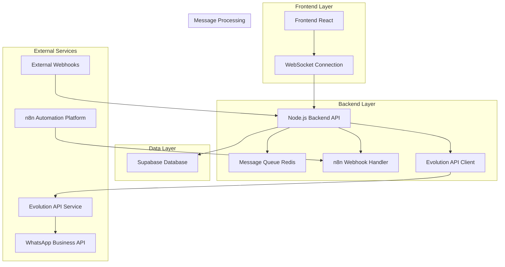
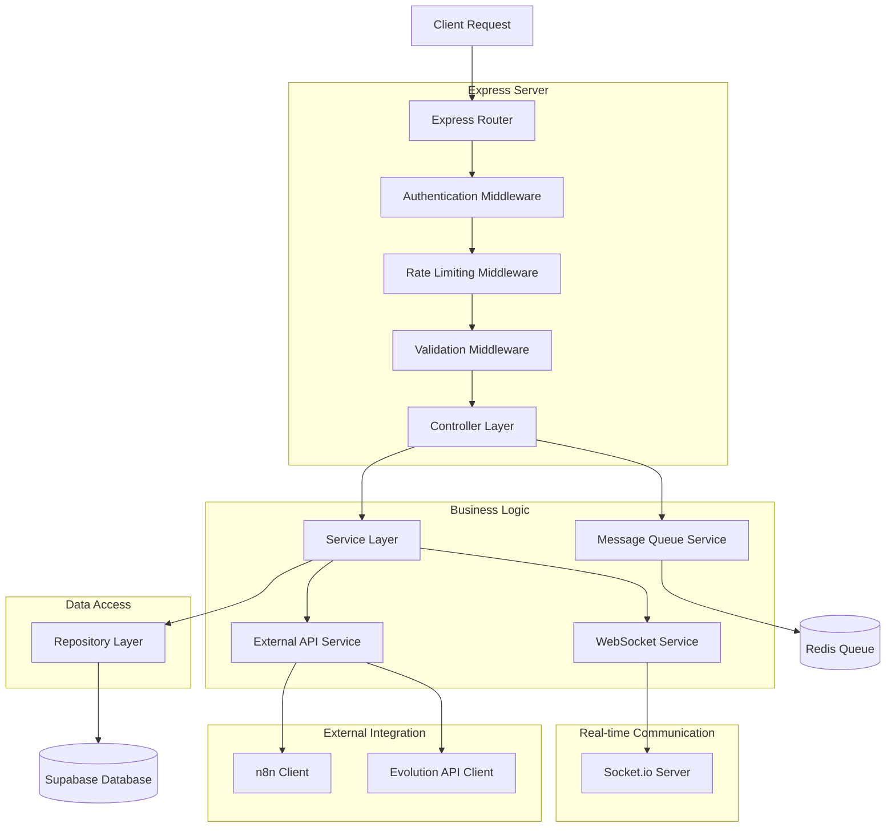
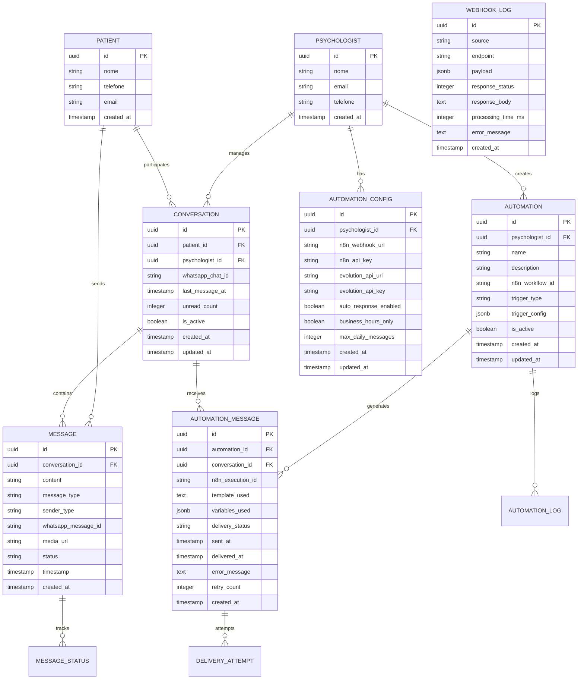

# Arquitetura Técnica - Integração de Mensagens n8n + Evolution API

## 1. Arquitetura Design



## 2. Technology Description

- **Frontend:** React@18 + TypeScript + Tailwind CSS + Vite + Socket.io-client
- **Backend:** Node.js + Express@4 + TypeScript + Socket.io + Bull Queue
- **Database:** Supabase (PostgreSQL) + Redis (Message Queue & Cache)
- **External APIs:** n8n Webhooks + Evolution API + WhatsApp Business API
- **Real-time:** WebSocket (Socket.io) + Server-Sent Events
- **Security:** JWT + API Keys + Rate Limiting + CORS

## 3. Route Definitions

| Route | Purpose |
|-------|---------|
| `/chat` | Interface principal de chat com automações |
| `/chat/conversations` | Lista de conversas ativas e históricas |
| `/chat/automations` | Configuração e gerenciamento de automações |
| `/chat/templates` | Gerenciamento de templates de mensagem |
| `/chat/analytics` | Dashboard de métricas e relatórios |
| `/chat/settings` | Configurações de integração (n8n, Evolution API) |
| `/chat/logs` | Logs de webhooks e debugging |
| `/chat/test` | Ambiente de testes para automações |

## 4. API Definitions

### 4.1 Core API

**Webhook de Entrada do n8n**
```
POST /api/webhooks/n8n/message
```

Request:
| Param Name | Param Type | isRequired | Description |
|------------|------------|------------|-------------|
| automation_id | string | true | ID da automação no n8n |
| patient_id | string | true | ID do paciente no sistema |
| psychologist_id | string | true | ID do psicólogo responsável |
| message_template | object | true | Template da mensagem com variáveis |
| trigger_data | object | true | Dados que dispararam a automação |
| delivery_options | object | false | Opções de entrega (agendamento, retry) |

Response:
| Param Name | Param Type | Description |
|------------|------------|-------------|
| success | boolean | Status da operação |
| message_id | string | ID da mensagem criada |
| delivery_status | string | Status inicial de entrega |
| error | string | Mensagem de erro (se houver) |

Example Request:
```json
{
  "automation_id": "n8n_workflow_123",
  "patient_id": "uuid-patient-456",
  "psychologist_id": "uuid-psycho-789",
  "message_template": {
    "content": "Olá {patient_name}, sua consulta está agendada para {appointment_time}",
    "variables": {
      "patient_name": "João Silva",
      "appointment_time": "15/01/2024 às 10:00"
    }
  },
  "trigger_data": {
    "type": "appointment_reminder",
    "appointment_id": "uuid-appointment-101",
    "scheduled_time": "2024-01-15T10:00:00Z"
  },
  "delivery_options": {
    "immediate": true,
    "retry_attempts": 3
  }
}
```

**Webhook de Entrada da Evolution API**
```
POST /api/webhooks/evolution/incoming
```

Request:
| Param Name | Param Type | isRequired | Description |
|------------|------------|------------|-------------|
| instance | string | true | Instância da Evolution API |
| data | object | true | Dados da mensagem recebida |
| event | string | true | Tipo de evento (message, status, etc.) |

Response:
| Param Name | Param Type | Description |
|------------|------------|-------------|
| processed | boolean | Se a mensagem foi processada |
| conversation_id | string | ID da conversa no sistema |
| forwarded_to_n8n | boolean | Se foi encaminhada para n8n |

**Gerenciamento de Automações**
```
GET /api/automations
POST /api/automations
PUT /api/automations/:id
DELETE /api/automations/:id
```

**Configurações de Integração**
```
GET /api/integrations/config
PUT /api/integrations/config
POST /api/integrations/test
```

**Métricas e Analytics**
```
GET /api/analytics/messages
GET /api/analytics/automations
GET /api/analytics/delivery-rates
```

### 4.2 WebSocket Events

**Client to Server Events:**
```typescript
interface ClientToServerEvents {
  join_chat_room: (data: { psychologist_id: string }) => void;
  send_message: (data: {
    conversation_id: string;
    content: string;
    type: 'text' | 'image' | 'document';
  }) => void;
  typing_start: (data: { conversation_id: string }) => void;
  typing_stop: (data: { conversation_id: string }) => void;
  mark_as_read: (data: { conversation_id: string }) => void;
}
```

**Server to Client Events:**
```typescript
interface ServerToClientEvents {
  new_message: (data: {
    conversation_id: string;
    message: Message;
    is_automation: boolean;
  }) => void;
  message_status_update: (data: {
    message_id: string;
    status: 'sent' | 'delivered' | 'read' | 'failed';
  }) => void;
  automation_triggered: (data: {
    automation_id: string;
    patient_id: string;
    trigger_type: string;
  }) => void;
  typing_indicator: (data: {
    conversation_id: string;
    user_id: string;
    is_typing: boolean;
  }) => void;
  connection_status: (data: {
    evolution_api: 'connected' | 'disconnected';
    n8n: 'connected' | 'disconnected';
  }) => void;
}
```

## 5. Server Architecture Diagram



## 6. Data Model

### 6.1 Data Model Definition



### 6.2 Data Definition Language

**Tabela de Automações**
```sql
-- Criar tabela de automações
CREATE TABLE automations (
    id UUID PRIMARY KEY DEFAULT gen_random_uuid(),
    psychologist_id UUID NOT NULL REFERENCES psicologos(id) ON DELETE CASCADE,
    name VARCHAR(255) NOT NULL,
    description TEXT,
    n8n_workflow_id VARCHAR(255),
    trigger_type VARCHAR(50) NOT NULL CHECK (trigger_type IN ('appointment_reminder', 'follow_up', 'welcome', 'emergency', 'custom')),
    trigger_config JSONB DEFAULT '{}',
    is_active BOOLEAN DEFAULT true,
    created_at TIMESTAMP WITH TIME ZONE DEFAULT NOW(),
    updated_at TIMESTAMP WITH TIME ZONE DEFAULT NOW()
);

-- Índices para performance
CREATE INDEX idx_automations_psychologist_id ON automations(psychologist_id);
CREATE INDEX idx_automations_trigger_type ON automations(trigger_type);
CREATE INDEX idx_automations_is_active ON automations(is_active);

-- Trigger para updated_at
CREATE OR REPLACE FUNCTION update_updated_at_column()
RETURNS TRIGGER AS $$
BEGIN
    NEW.updated_at = NOW();
    RETURN NEW;
END;
$$ language 'plpgsql';

CREATE TRIGGER update_automations_updated_at BEFORE UPDATE ON automations
    FOR EACH ROW EXECUTE FUNCTION update_updated_at_column();
```

**Tabela de Mensagens de Automação**
```sql
-- Criar tabela de mensagens de automação
CREATE TABLE automation_messages (
    id UUID PRIMARY KEY DEFAULT gen_random_uuid(),
    automation_id UUID NOT NULL REFERENCES automations(id) ON DELETE CASCADE,
    conversation_id UUID NOT NULL REFERENCES conversations(id) ON DELETE CASCADE,
    n8n_execution_id VARCHAR(255),
    template_used TEXT,
    variables_used JSONB DEFAULT '{}',
    delivery_status VARCHAR(50) DEFAULT 'pending' CHECK (delivery_status IN ('pending', 'sent', 'delivered', 'read', 'failed', 'cancelled')),
    sent_at TIMESTAMP WITH TIME ZONE,
    delivered_at TIMESTAMP WITH TIME ZONE,
    error_message TEXT,
    retry_count INTEGER DEFAULT 0,
    created_at TIMESTAMP WITH TIME ZONE DEFAULT NOW()
);

-- Índices para performance
CREATE INDEX idx_automation_messages_automation_id ON automation_messages(automation_id);
CREATE INDEX idx_automation_messages_conversation_id ON automation_messages(conversation_id);
CREATE INDEX idx_automation_messages_delivery_status ON automation_messages(delivery_status);
CREATE INDEX idx_automation_messages_sent_at ON automation_messages(sent_at DESC);
```

**Tabela de Configurações de Automação**
```sql
-- Criar tabela de configurações de automação
CREATE TABLE automation_configs (
    id UUID PRIMARY KEY DEFAULT gen_random_uuid(),
    psychologist_id UUID NOT NULL REFERENCES psicologos(id) ON DELETE CASCADE,
    n8n_webhook_url VARCHAR(500),
    n8n_api_key VARCHAR(255),
    evolution_api_url VARCHAR(500),
    evolution_api_key VARCHAR(255),
    auto_response_enabled BOOLEAN DEFAULT false,
    business_hours_only BOOLEAN DEFAULT true,
    business_hours_start TIME DEFAULT '09:00',
    business_hours_end TIME DEFAULT '18:00',
    max_daily_messages INTEGER DEFAULT 50,
    timezone VARCHAR(50) DEFAULT 'America/Sao_Paulo',
    created_at TIMESTAMP WITH TIME ZONE DEFAULT NOW(),
    updated_at TIMESTAMP WITH TIME ZONE DEFAULT NOW(),
    
    UNIQUE(psychologist_id)
);

-- Trigger para updated_at
CREATE TRIGGER update_automation_configs_updated_at BEFORE UPDATE ON automation_configs
    FOR EACH ROW EXECUTE FUNCTION update_updated_at_column();
```

**Tabela de Logs de Webhook**
```sql
-- Criar tabela de logs de webhook
CREATE TABLE webhook_logs (
    id UUID PRIMARY KEY DEFAULT gen_random_uuid(),
    source VARCHAR(50) NOT NULL CHECK (source IN ('n8n', 'evolution', 'whatsapp')),
    endpoint VARCHAR(255) NOT NULL,
    method VARCHAR(10) DEFAULT 'POST',
    payload JSONB NOT NULL,
    response_status INTEGER,
    response_body TEXT,
    processing_time_ms INTEGER,
    error_message TEXT,
    ip_address INET,
    user_agent TEXT,
    created_at TIMESTAMP WITH TIME ZONE DEFAULT NOW()
);

-- Índices para performance e análise
CREATE INDEX idx_webhook_logs_source ON webhook_logs(source);
CREATE INDEX idx_webhook_logs_created_at ON webhook_logs(created_at DESC);
CREATE INDEX idx_webhook_logs_response_status ON webhook_logs(response_status);
CREATE INDEX idx_webhook_logs_endpoint ON webhook_logs(endpoint);

-- Particionamento por data (opcional para grandes volumes)
-- CREATE TABLE webhook_logs_y2024m01 PARTITION OF webhook_logs
-- FOR VALUES FROM ('2024-01-01') TO ('2024-02-01');
```

**Tabela de Métricas de Automação**
```sql
-- Criar tabela de métricas de automação
CREATE TABLE automation_metrics (
    id UUID PRIMARY KEY DEFAULT gen_random_uuid(),
    automation_id UUID NOT NULL REFERENCES automations(id) ON DELETE CASCADE,
    date DATE NOT NULL,
    messages_sent INTEGER DEFAULT 0,
    messages_delivered INTEGER DEFAULT 0,
    messages_read INTEGER DEFAULT 0,
    messages_failed INTEGER DEFAULT 0,
    avg_response_time_ms INTEGER,
    unique_recipients INTEGER DEFAULT 0,
    created_at TIMESTAMP WITH TIME ZONE DEFAULT NOW(),
    
    UNIQUE(automation_id, date)
);

-- Índices para relatórios
CREATE INDEX idx_automation_metrics_automation_id ON automation_metrics(automation_id);
CREATE INDEX idx_automation_metrics_date ON automation_metrics(date DESC);
```

**Dados Iniciais**
```sql
-- Inserir configuração padrão para psicólogos existentes
INSERT INTO automation_configs (psychologist_id, auto_response_enabled, business_hours_only, max_daily_messages)
SELECT id, false, true, 50
FROM psicologos
WHERE id NOT IN (SELECT psychologist_id FROM automation_configs);

-- Inserir automações de exemplo
INSERT INTO automations (psychologist_id, name, description, trigger_type, trigger_config, is_active)
SELECT 
    id,
    'Lembrete de Consulta',
    'Envia lembrete automático 24h antes da consulta',
    'appointment_reminder',
    '{"hours_before": 24, "template": "Olá {patient_name}, lembrando da sua consulta amanhã às {appointment_time}"}',
    false
FROM psicologos;

-- Conceder permissões
GRANT ALL PRIVILEGES ON automations TO authenticated;
GRANT ALL PRIVILEGES ON automation_messages TO authenticated;
GRANT ALL PRIVILEGES ON automation_configs TO authenticated;
GRANT ALL PRIVILEGES ON webhook_logs TO authenticated;
GRANT ALL PRIVILEGES ON automation_metrics TO authenticated;

-- Políticas RLS (Row Level Security)
ALTER TABLE automations ENABLE ROW LEVEL SECURITY;
ALTER TABLE automation_messages ENABLE ROW LEVEL SECURITY;
ALTER TABLE automation_configs ENABLE ROW LEVEL SECURITY;
ALTER TABLE webhook_logs ENABLE ROW LEVEL SECURITY;
ALTER TABLE automation_metrics ENABLE ROW LEVEL SECURITY;

-- Política para automations
CREATE POLICY "Psicólogos podem gerenciar suas próprias automações" ON automations
    FOR ALL USING (psychologist_id = auth.uid());

-- Política para automation_configs
CREATE POLICY "Psicólogos podem gerenciar suas próprias configurações" ON automation_configs
    FOR ALL USING (psychologist_id = auth.uid());
```

## 7. Considerações de Performance

### 7.1 Otimizações de Banco de Dados
- Índices otimizados para consultas frequentes
- Particionamento de tabelas de logs por data
- Connection pooling para Supabase
- Query optimization com EXPLAIN ANALYZE

### 7.2 Cache Strategy
- Redis para cache de configurações frequentes
- Cache de templates de mensagem
- Cache de status de conexão das APIs
- TTL apropriado para cada tipo de dado

### 7.3 Message Queue
- Bull Queue para processamento assíncrono
- Retry logic com exponential backoff
- Dead letter queue para mensagens falhadas
- Monitoramento de performance da queue

### 7.4 Rate Limiting
- Rate limiting por psicólogo
- Rate limiting por endpoint
- Rate limiting para APIs externas
- Circuit breaker para APIs indisponíveis

## 8. Monitoramento e Observabilidade

### 8.1 Métricas Chave
- Latência de webhooks
- Taxa de entrega de mensagens
- Uptime das integrações
- Throughput de mensagens por minuto

### 8.2 Logs Estruturados
- Logs em formato JSON
- Correlation IDs para rastreamento
- Níveis de log apropriados
- Rotação automática de logs

### 8.3 Alertas
- Alertas de falha de integração
- Alertas de alta latência
- Alertas de volume anômalo
- Alertas de erro de autenticação

---

Esta arquitetura técnica fornece uma base sólida para implementar a integração de mensagens entre n8n e Evolution API, garantindo escalabilidade, performance e confiabilidade do sistema.