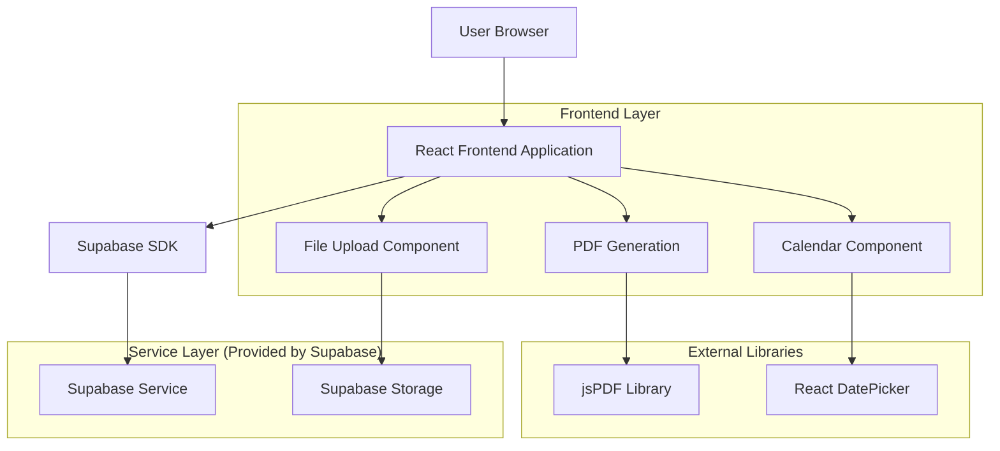
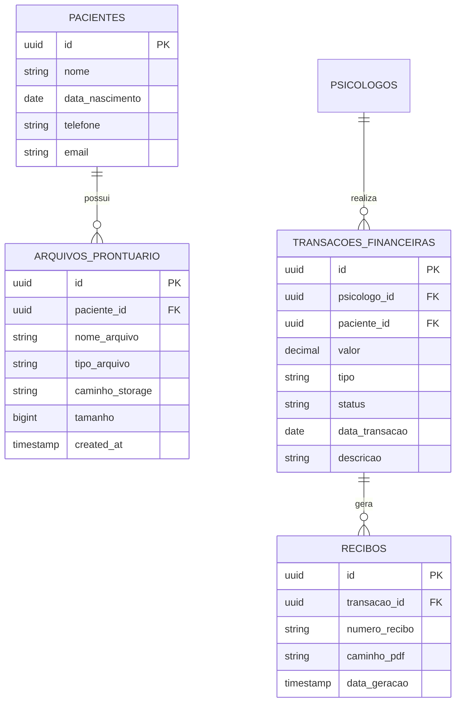

# Arquitetura Técnica - Melhorias Sistema Psicomind

## 1. Architecture design



## 2. Technology Description

- Frontend: React@18 + TypeScript + TailwindCSS@3 + Vite
- Backend: Supabase (PostgreSQL + Storage + Auth)
- Libraries: jsPDF@2.5.1 + react-datepicker@4.21.0 + lucide-react@0.263.1

## 3. Route definitions

| Route | Purpose |
|-------|---------|
| /pacientes | Página de gestão de pacientes com calendário de data de nascimento |
| /agendamentos | Página de agendamentos com calendário para data/hora |
| /prontuarios | Página de prontuários com sistema de upload de arquivos |
| /financeiro | Página financeira revisada com geração de recibos |

## 4. API definitions

### 4.1 Core API

**Upload de Arquivos**
```
POST /storage/v1/object/prontuarios/{paciente_id}/{filename}
```

Request:
| Param Name | Param Type | isRequired | Description |
|------------|------------|------------|-------------|
| file | File | true | Arquivo a ser enviado (PDF, JPG, PNG, DOC) |
| paciente_id | string | true | ID do paciente |
| filename | string | true | Nome do arquivo |

Response:
| Param Name | Param Type | Description |
|------------|------------|-------------|
| path | string | Caminho do arquivo no storage |
| fullPath | string | URL completa do arquivo |

**Buscar Arquivos do Paciente**
```
GET /storage/v1/object/list/prontuarios/{paciente_id}
```

Response:
| Param Name | Param Type | Description |
|------------|------------|-------------|
| name | string | Nome do arquivo |
| size | number | Tamanho em bytes |
| created_at | string | Data de criação |
| updated_at | string | Data de atualização |

## 5. Data model

### 5.1 Data model definition



### 5.2 Data Definition Language

**Tabela de Arquivos de Prontuário**
```sql
-- Criar tabela para arquivos de prontuário
CREATE TABLE IF NOT EXISTS arquivos_prontuario (
    id UUID PRIMARY KEY DEFAULT gen_random_uuid(),
    paciente_id UUID NOT NULL REFERENCES pacientes(id) ON DELETE CASCADE,
    psicologo_id UUID NOT NULL REFERENCES psicologos(id) ON DELETE CASCADE,
    nome_arquivo VARCHAR(255) NOT NULL,
    nome_original VARCHAR(255) NOT NULL,
    tipo_arquivo VARCHAR(50) NOT NULL,
    tamanho BIGINT NOT NULL,
    caminho_storage TEXT NOT NULL,
    descricao TEXT,
    created_at TIMESTAMP WITH TIME ZONE DEFAULT NOW(),
    updated_at TIMESTAMP WITH TIME ZONE DEFAULT NOW()
);

-- Índices para performance
CREATE INDEX idx_arquivos_prontuario_paciente ON arquivos_prontuario(paciente_id);
CREATE INDEX idx_arquivos_prontuario_psicologo ON arquivos_prontuario(psicologo_id);
CREATE INDEX idx_arquivos_prontuario_tipo ON arquivos_prontuario(tipo_arquivo);

-- RLS Policies
ALTER TABLE arquivos_prontuario ENABLE ROW LEVEL SECURITY;

CREATE POLICY "Psicólogos podem ver arquivos de seus pacientes" ON arquivos_prontuario
    FOR SELECT USING (psicologo_id = auth.uid());

CREATE POLICY "Psicólogos podem inserir arquivos para seus pacientes" ON arquivos_prontuario
    FOR INSERT WITH CHECK (psicologo_id = auth.uid());

CREATE POLICY "Psicólogos podem deletar arquivos de seus pacientes" ON arquivos_prontuario
    FOR DELETE USING (psicologo_id = auth.uid());
```

**Tabela de Recibos**
```sql
-- Criar tabela para controle de recibos
CREATE TABLE IF NOT EXISTS recibos (
    id UUID PRIMARY KEY DEFAULT gen_random_uuid(),
    transacao_id UUID NOT NULL REFERENCES transacoes_financeiras(id) ON DELETE CASCADE,
    psicologo_id UUID NOT NULL REFERENCES psicologos(id) ON DELETE CASCADE,
    numero_recibo VARCHAR(50) NOT NULL UNIQUE,
    data_geracao TIMESTAMP WITH TIME ZONE DEFAULT NOW(),
    dados_recibo JSONB NOT NULL,
    created_at TIMESTAMP WITH TIME ZONE DEFAULT NOW()
);

-- Índices
CREATE INDEX idx_recibos_transacao ON recibos(transacao_id);
CREATE INDEX idx_recibos_psicologo ON recibos(psicologo_id);
CREATE INDEX idx_recibos_numero ON recibos(numero_recibo);

-- RLS Policies
ALTER TABLE recibos ENABLE ROW LEVEL SECURITY;

CREATE POLICY "Psicólogos podem ver seus recibos" ON recibos
    FOR SELECT USING (psicologo_id = auth.uid());

CREATE POLICY "Psicólogos podem criar recibos" ON recibos
    FOR INSERT WITH CHECK (psicologo_id = auth.uid());

-- Função para gerar número de recibo
CREATE OR REPLACE FUNCTION gerar_numero_recibo(psicologo_uuid UUID)
RETURNS TEXT AS $$
DECLARE
    contador INTEGER;
    ano_atual TEXT;
    numero_recibo TEXT;
BEGIN
    ano_atual := EXTRACT(YEAR FROM NOW())::TEXT;
    
    -- Buscar próximo número sequencial do ano
    SELECT COALESCE(MAX(
        CAST(SPLIT_PART(numero_recibo, '/', 1) AS INTEGER)
    ), 0) + 1
    INTO contador
    FROM recibos 
    WHERE psicologo_id = psicologo_uuid 
    AND numero_recibo LIKE '%/' || ano_atual;
    
    numero_recibo := LPAD(contador::TEXT, 4, '0') || '/' || ano_atual;
    
    RETURN numero_recibo;
END;
$$ LANGUAGE plpgsql;
```

**Storage Buckets**
```sql
-- Criar bucket para arquivos de prontuário
INSERT INTO storage.buckets (id, name, public) 
VALUES ('prontuarios', 'prontuarios', false)
ON CONFLICT (id) DO NOTHING;

-- Políticas de storage
CREATE POLICY "Psicólogos podem fazer upload de arquivos" ON storage.objects
    FOR INSERT WITH CHECK (
        bucket_id = 'prontuarios' AND
        auth.role() = 'authenticated'
    );

CREATE POLICY "Psicólogos podem ver arquivos de seus pacientes" ON storage.objects
    FOR SELECT USING (
        bucket_id = 'prontuarios' AND
        auth.role() = 'authenticated'
    );

CREATE POLICY "Psicólogos podem deletar arquivos de seus pacientes" ON storage.objects
    FOR DELETE USING (
        bucket_id = 'prontuarios' AND
        auth.role() = 'authenticated'
    );
```

## 6. Componentes Frontend

### 6.1 Componente de Calendário
```typescript
interface CalendarPickerProps {
  value?: string;
  onChange: (date: string) => void;
  placeholder?: string;
  disabled?: boolean;
  minDate?: Date;
  maxDate?: Date;
}

// Implementação com react-datepicker
const CalendarPicker: React.FC<CalendarPickerProps>
```

### 6.2 Componente de Upload
```typescript
interface FileUploadProps {
  pacienteId: string;
  onUploadComplete: (file: ArquivoProntuario) => void;
  acceptedTypes?: string[];
  maxSize?: number;
}

// Implementação com drag & drop
const FileUpload: React.FC<FileUploadProps>
```

### 6.3 Gerador de Recibos
```typescript
interface ReciboData {
  transacao: TransacaoFinanceira;
  psicologo: Psicologo;
  paciente: Paciente;
  numeroRecibo: string;
}

// Implementação com jsPDF
const generateReciboPDF: (data: ReciboData) => Promise<Blob>
```

## 7. Validações e Segurança

### 7.1 Upload de Arquivos
- Tipos permitidos: PDF, JPG, JPEG, PNG, DOC, DOCX
- Tamanho máximo: 10MB por arquivo
- Validação de MIME type no frontend e backend
- Scan de vírus (futuro)

### 7.2 Geração de Recibos
- Numeração sequencial por psicólogo/ano
- Dados imutáveis após geração
- Assinatura digital com timestamp
- Validação de integridade

### 7.3 RLS (Row Level Security)
- Psicólogos só acessam dados próprios
- Pacientes vinculados ao psicólogo autenticado
- Arquivos isolados por psicólogo
- Recibos protegidos por ownership