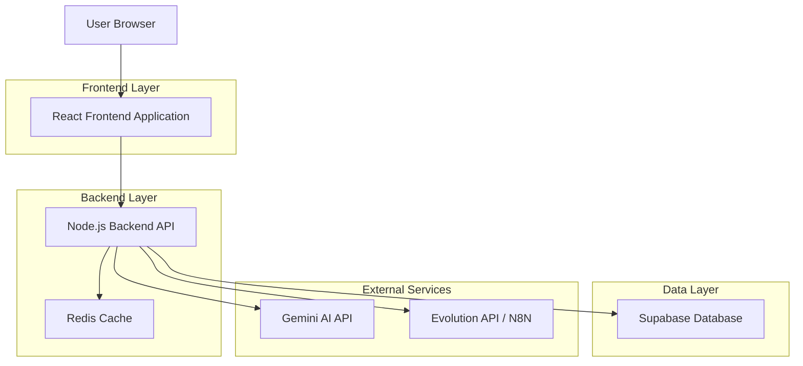
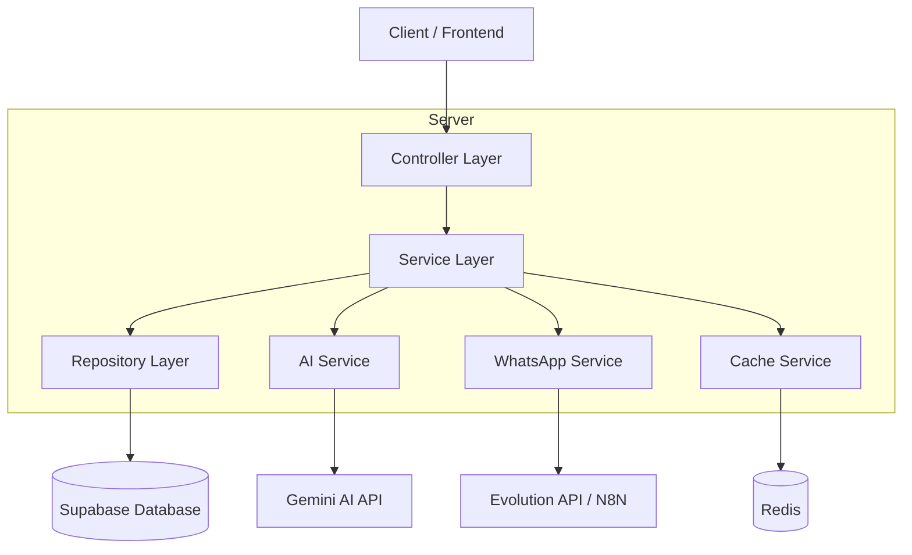
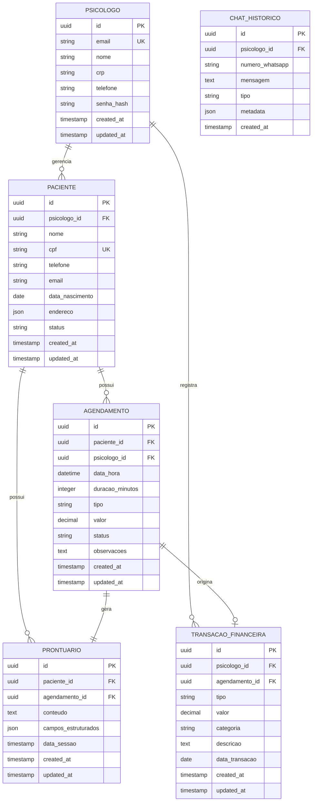

# Arquitetura Técnica - Psicomind

## 1. Architecture design



## 2. Technology Description

- Frontend: React@18 + TypeScript + TailwindCSS@3 + Vite + React Router
- Backend: Node.js + Express@4 + TypeScript
- Database: Supabase (PostgreSQL)
- Cache: Redis
- Authentication: Supabase Auth
- AI Integration: Google Gemini AI
- WhatsApp Integration: Evolution API ou N8N

## 3. Route definitions

| Route | Purpose |
|-------|---------|
| / | Redirect para dashboard após login |
| /login | Página de login e autenticação |
| /dashboard | Dashboard principal com KPIs e visão geral |
| /pacientes | Gestão completa de pacientes |
| /pacientes/:id | Detalhes e edição de paciente específico |
| /agendamentos | Calendário e gestão de consultas |
| /agendamentos/novo | Formulário para novo agendamento |
| /prontuarios | Lista de prontuários |
| /prontuarios/:id | Visualização e edição de prontuário |
| /financeiro | Controle financeiro e transações |
| /financeiro/relatorios | Relatórios financeiros detalhados |
| /chat-ia | Interface do assistente virtual |
| /relatorios | Dashboards e analytics do negócio |
| /configuracoes | Configurações do sistema e perfil |

## 4. API definitions

### 4.1 Core API

**Autenticação**
```
POST /api/auth/login
```

Request:
| Param Name | Param Type | isRequired | Description |
|------------|------------|------------|-------------|
| email | string | true | Email do psicólogo |
| password | string | true | Senha do usuário |

Response:
| Param Name | Param Type | Description |
|------------|------------|-------------|
| token | string | JWT token para autenticação |
| user | object | Dados do usuário logado |

**Gestão de Pacientes**
```
GET /api/pacientes
POST /api/pacientes
PUT /api/pacientes/:id
DELETE /api/pacientes/:id
```

Request (POST/PUT):
| Param Name | Param Type | isRequired | Description |
|------------|------------|------------|-------------|
| nome | string | true | Nome completo do paciente |
| cpf | string | true | CPF do paciente |
| telefone | string | true | Telefone para contato |
| email | string | false | Email do paciente |
| data_nascimento | date | true | Data de nascimento |
| endereco | object | false | Endereço completo |

**Agendamentos**
```
GET /api/agendamentos
POST /api/agendamentos
PUT /api/agendamentos/:id
DELETE /api/agendamentos/:id
```

Request (POST/PUT):
| Param Name | Param Type | isRequired | Description |
|------------|------------|------------|-------------|
| paciente_id | uuid | true | ID do paciente |
| data_hora | datetime | true | Data e hora da consulta |
| duracao | integer | true | Duração em minutos |
| tipo | string | true | Tipo de consulta |
| valor | decimal | true | Valor da consulta em R$ |

**Chat IA**
```
POST /api/chat/webhook
POST /api/chat/send-message
```

Request (webhook):
| Param Name | Param Type | isRequired | Description |
|------------|------------|------------|-------------|
| from | string | true | Número do WhatsApp |
| message | string | true | Mensagem recebida |
| timestamp | datetime | true | Timestamp da mensagem |

## 5. Server architecture diagram



## 6. Data model

### 6.1 Data model definition



### 6.2 Data Definition Language

**Tabela de Psicólogos**
```sql
-- create table
CREATE TABLE psicologos (
    id UUID PRIMARY KEY DEFAULT gen_random_uuid(),
    email VARCHAR(255) UNIQUE NOT NULL,
    nome VARCHAR(255) NOT NULL,
    crp VARCHAR(20) UNIQUE NOT NULL,
    telefone VARCHAR(20) NOT NULL,
    senha_hash VARCHAR(255) NOT NULL,
    created_at TIMESTAMP WITH TIME ZONE DEFAULT NOW(),
    updated_at TIMESTAMP WITH TIME ZONE DEFAULT NOW()
);

-- create index
CREATE INDEX idx_psicologos_email ON psicologos(email);
CREATE INDEX idx_psicologos_crp ON psicologos(crp);

-- permissions
GRANT SELECT ON psicologos TO anon;
GRANT ALL PRIVILEGES ON psicologos TO authenticated;
```

**Tabela de Pacientes**
```sql
-- create table
CREATE TABLE pacientes (
    id UUID PRIMARY KEY DEFAULT gen_random_uuid(),
    psicologo_id UUID NOT NULL REFERENCES psicologos(id) ON DELETE CASCADE,
    nome VARCHAR(255) NOT NULL,
    cpf VARCHAR(14) UNIQUE NOT NULL,
    telefone VARCHAR(20) NOT NULL,
    email VARCHAR(255),
    data_nascimento DATE NOT NULL,
    endereco JSONB,
    status VARCHAR(20) DEFAULT 'ativo' CHECK (status IN ('ativo', 'inativo', 'arquivado')),
    created_at TIMESTAMP WITH TIME ZONE DEFAULT NOW(),
    updated_at TIMESTAMP WITH TIME ZONE DEFAULT NOW()
);

-- create index
CREATE INDEX idx_pacientes_psicologo_id ON pacientes(psicologo_id);
CREATE INDEX idx_pacientes_cpf ON pacientes(cpf);
CREATE INDEX idx_pacientes_nome ON pacientes(nome);

-- permissions
GRANT SELECT ON pacientes TO anon;
GRANT ALL PRIVILEGES ON pacientes TO authenticated;
```

**Tabela de Agendamentos**
```sql
-- create table
CREATE TABLE agendamentos (
    id UUID PRIMARY KEY DEFAULT gen_random_uuid(),
    paciente_id UUID NOT NULL REFERENCES pacientes(id) ON DELETE CASCADE,
    psicologo_id UUID NOT NULL REFERENCES psicologos(id) ON DELETE CASCADE,
    data_hora TIMESTAMP WITH TIME ZONE NOT NULL,
    duracao_minutos INTEGER NOT NULL DEFAULT 50,
    tipo VARCHAR(50) NOT NULL DEFAULT 'consulta',
    valor DECIMAL(10,2) NOT NULL,
    status VARCHAR(20) DEFAULT 'agendado' CHECK (status IN ('agendado', 'confirmado', 'realizado', 'cancelado', 'faltou')),
    observacoes TEXT,
    created_at TIMESTAMP WITH TIME ZONE DEFAULT NOW(),
    updated_at TIMESTAMP WITH TIME ZONE DEFAULT NOW()
);

-- create index
CREATE INDEX idx_agendamentos_paciente_id ON agendamentos(paciente_id);
CREATE INDEX idx_agendamentos_psicologo_id ON agendamentos(psicologo_id);
CREATE INDEX idx_agendamentos_data_hora ON agendamentos(data_hora);
CREATE INDEX idx_agendamentos_status ON agendamentos(status);

-- permissions
GRANT SELECT ON agendamentos TO anon;
GRANT ALL PRIVILEGES ON agendamentos TO authenticated;
```

**Tabela de Prontuários**
```sql
-- create table
CREATE TABLE prontuarios (
    id UUID PRIMARY KEY DEFAULT gen_random_uuid(),
    paciente_id UUID NOT NULL REFERENCES pacientes(id) ON DELETE CASCADE,
    agendamento_id UUID REFERENCES agendamentos(id) ON DELETE SET NULL,
    conteudo TEXT NOT NULL,
    campos_estruturados JSONB,
    data_sessao TIMESTAMP WITH TIME ZONE NOT NULL,
    created_at TIMESTAMP WITH TIME ZONE DEFAULT NOW(),
    updated_at TIMESTAMP WITH TIME ZONE DEFAULT NOW()
);

-- create index
CREATE INDEX idx_prontuarios_paciente_id ON prontuarios(paciente_id);
CREATE INDEX idx_prontuarios_data_sessao ON prontuarios(data_sessao DESC);

-- permissions
GRANT SELECT ON prontuarios TO anon;
GRANT ALL PRIVILEGES ON prontuarios TO authenticated;
```

**Tabela de Transações Financeiras**
```sql
-- create table
CREATE TABLE transacoes_financeiras (
    id UUID PRIMARY KEY DEFAULT gen_random_uuid(),
    psicologo_id UUID NOT NULL REFERENCES psicologos(id) ON DELETE CASCADE,
    agendamento_id UUID REFERENCES agendamentos(id) ON DELETE SET NULL,
    tipo VARCHAR(20) NOT NULL CHECK (tipo IN ('receita', 'despesa')),
    valor DECIMAL(10,2) NOT NULL,
    categoria VARCHAR(100) NOT NULL,
    descricao TEXT,
    data_transacao DATE NOT NULL,
    created_at TIMESTAMP WITH TIME ZONE DEFAULT NOW(),
    updated_at TIMESTAMP WITH TIME ZONE DEFAULT NOW()
);

-- create index
CREATE INDEX idx_transacoes_psicologo_id ON transacoes_financeiras(psicologo_id);
CREATE INDEX idx_transacoes_data ON transacoes_financeiras(data_transacao DESC);
CREATE INDEX idx_transacoes_tipo ON transacoes_financeiras(tipo);

-- permissions
GRANT SELECT ON transacoes_financeiras TO anon;
GRANT ALL PRIVILEGES ON transacoes_financeiras TO authenticated;
```

**Tabela de Histórico de Chat**
```sql
-- create table
CREATE TABLE chat_historico (
    id UUID PRIMARY KEY DEFAULT gen_random_uuid(),
    psicologo_id UUID NOT NULL REFERENCES psicologos(id) ON DELETE CASCADE,
    numero_whatsapp VARCHAR(20) NOT NULL,
    mensagem TEXT NOT NULL,
    tipo VARCHAR(20) NOT NULL CHECK (tipo IN ('recebida', 'enviada', 'automatica')),
    metadata JSONB,
    created_at TIMESTAMP WITH TIME ZONE DEFAULT NOW()
);

-- create index
CREATE INDEX idx_chat_psicologo_id ON chat_historico(psicologo_id);
CREATE INDEX idx_chat_numero ON chat_historico(numero_whatsapp);
CREATE INDEX idx_chat_created_at ON chat_historico(created_at DESC);

-- permissions
GRANT SELECT ON chat_historico TO anon;
GRANT ALL PRIVILEGES ON chat_historico TO authenticated;
```

**Dados Iniciais**
```sql
-- inserir dados de exemplo
INSERT INTO psicologos (email, nome, crp, telefone, senha_hash) VALUES
('dr.silva@email.com', 'Dr. João Silva', 'CRP-01/12345', '(11) 99999-9999', '$2b$10$hashedpassword');

INSERT INTO pacientes (psicologo_id, nome, cpf, telefone, data_nascimento) VALUES
((SELECT id FROM psicologos WHERE email = 'dr.silva@email.com'), 'Maria Santos', '123.456.789-00', '(11) 88888-8888', '1990-05-15');
```