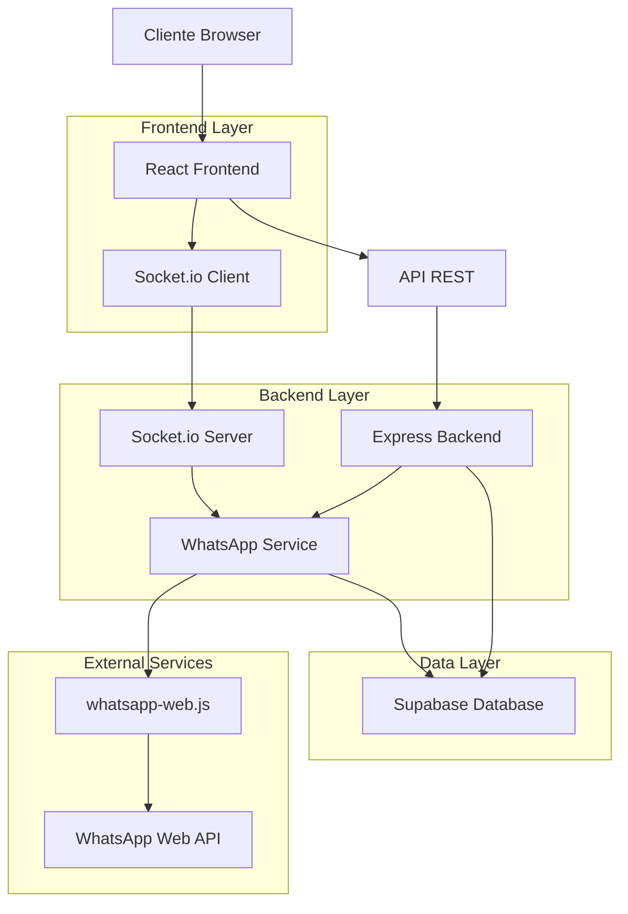
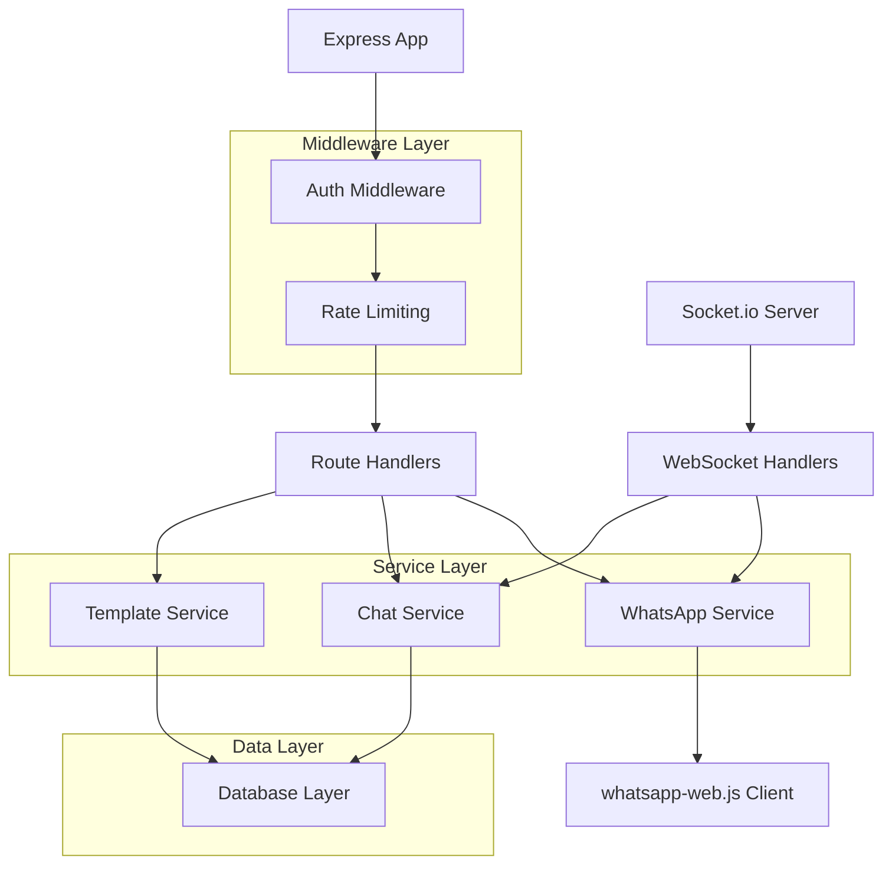
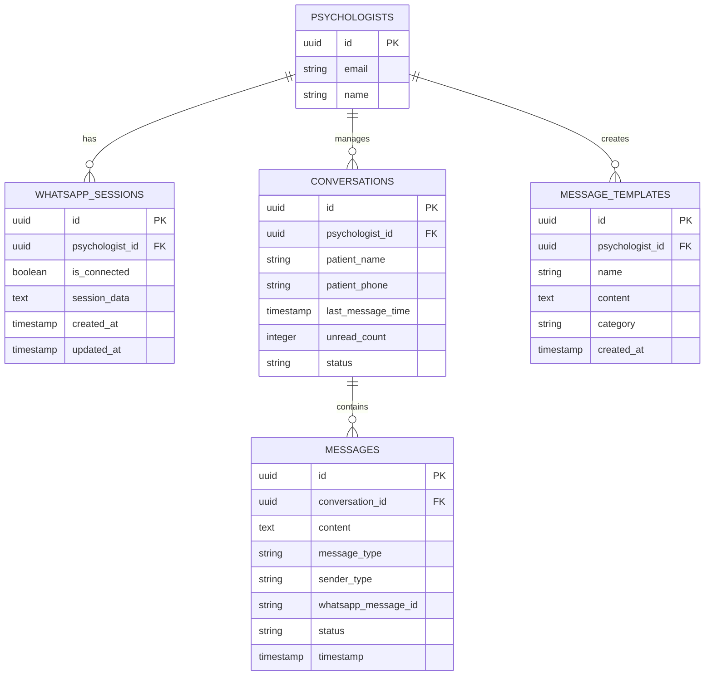

# Arquitetura Técnica - Integração WhatsApp Web Completa

## 1. Arquitetura do Sistema



## 2. Stack Tecnológico

- **Frontend**: React@18 + TypeScript + Tailwind CSS + Vite
- **Backend**: Node.js + Express@4 + Socket.io@4
- **Database**: Supabase (PostgreSQL)
- **WhatsApp**: whatsapp-web.js@1.23.0
- **Real-time**: Socket.io para WebSocket
- **Authentication**: Supabase Auth

## 3. Definição de Rotas

| Rota | Propósito |
|------|-----------|
| /whatsapp-config | Página de configuração e conexão WhatsApp |
| /whatsapp-chat | Interface principal de chat |
| /whatsapp-templates | Gestão de templates de mensagens |
| /whatsapp-reports | Relatórios e estatísticas |

## 4. Definições de API

### 4.1 APIs Core do WhatsApp

**Inicializar conexão WhatsApp**
```
POST /api/whatsapp/initialize
```

Request:
| Parâmetro | Tipo | Obrigatório | Descrição |
|-----------|------|-------------|-----------|
| psychologist_id | string | true | ID do psicólogo |

Response:
| Parâmetro | Tipo | Descrição |
|-----------|------|-----------|
| success | boolean | Status da operação |
| session_id | string | ID da sessão criada |

**Obter QR Code**
```
GET /api/whatsapp/qr-code/:psychologist_id
```

Response:
| Parâmetro | Tipo | Descrição |
|-----------|------|-----------|
| qr_code | string | QR Code em base64 |
| status | string | Status da conexão |

**Enviar mensagem**
```
POST /api/whatsapp/send-message
```

Request:
| Parâmetro | Tipo | Obrigatório | Descrição |
|-----------|------|-------------|-----------|
| to | string | true | Número do destinatário |
| message | string | true | Conteúdo da mensagem |
| type | string | false | Tipo: text, image, document |

**Obter conversas**
```
GET /api/whatsapp/conversations/:psychologist_id
```

Response:
```json
{
  "conversations": [
    {
      "id": "uuid",
      "patient_name": "João Silva",
      "patient_phone": "+5511999999999",
      "last_message": "Olá, doutor!",
      "last_message_time": "2024-01-15T10:30:00Z",
      "unread_count": 2,
      "status": "active"
    }
  ]
}
```

**Obter mensagens de uma conversa**
```
GET /api/whatsapp/messages/:conversation_id
```

Response:
```json
{
  "messages": [
    {
      "id": "uuid",
      "content": "Olá, doutor!",
      "type": "text",
      "sender_type": "patient",
      "timestamp": "2024-01-15T10:30:00Z",
      "status": "delivered",
      "whatsapp_message_id": "msg_123"
    }
  ]
}
```

### 4.2 APIs de Templates

**Criar template**
```
POST /api/whatsapp/templates
```

Request:
| Parâmetro | Tipo | Obrigatório | Descrição |
|-----------|------|-------------|-----------|
| name | string | true | Nome do template |
| content | string | true | Conteúdo da mensagem |
| category | string | true | Categoria do template |

**Listar templates**
```
GET /api/whatsapp/templates/:psychologist_id
```

### 4.3 WebSocket Events

**Eventos do Cliente para Servidor:**
- `join_room`: Entrar na sala do psicólogo
- `send_message`: Enviar mensagem
- `mark_as_read`: Marcar mensagens como lidas

**Eventos do Servidor para Cliente:**
- `new_message`: Nova mensagem recebida
- `message_status_update`: Atualização de status da mensagem
- `connection_status`: Status da conexão WhatsApp
- `qr_code_update`: Novo QR Code disponível

## 5. Arquitetura do Servidor



## 6. Modelo de Dados

### 6.1 Diagrama ER



### 6.2 DDL (Data Definition Language)

**Tabela de Sessões WhatsApp**
```sql
-- Criar tabela de sessões WhatsApp
CREATE TABLE whatsapp_sessions (
    id UUID PRIMARY KEY DEFAULT gen_random_uuid(),
    psychologist_id UUID NOT NULL REFERENCES auth.users(id) ON DELETE CASCADE,
    is_connected BOOLEAN DEFAULT false,
    session_data TEXT,
    client_info JSONB,
    webhook_url TEXT,
    auto_reply_enabled BOOLEAN DEFAULT false,
    auto_reply_message TEXT,
    business_hours_enabled BOOLEAN DEFAULT false,
    business_hours_start TIME DEFAULT '09:00',
    business_hours_end TIME DEFAULT '18:00',
    away_message TEXT,
    created_at TIMESTAMP WITH TIME ZONE DEFAULT NOW(),
    updated_at TIMESTAMP WITH TIME ZONE DEFAULT NOW()
);

-- Criar tabela de conversas
CREATE TABLE whatsapp_conversations (
    id UUID PRIMARY KEY DEFAULT gen_random_uuid(),
    psychologist_id UUID NOT NULL REFERENCES auth.users(id) ON DELETE CASCADE,
    patient_id UUID REFERENCES pacientes(id) ON DELETE SET NULL,
    patient_name VARCHAR(255) NOT NULL,
    patient_phone VARCHAR(20) NOT NULL,
    last_message_time TIMESTAMP WITH TIME ZONE DEFAULT NOW(),
    unread_count INTEGER DEFAULT 0,
    status VARCHAR(20) DEFAULT 'active' CHECK (status IN ('active', 'archived', 'blocked')),
    created_at TIMESTAMP WITH TIME ZONE DEFAULT NOW(),
    updated_at TIMESTAMP WITH TIME ZONE DEFAULT NOW()
);

-- Criar tabela de mensagens
CREATE TABLE whatsapp_messages (
    id UUID PRIMARY KEY DEFAULT gen_random_uuid(),
    conversation_id UUID NOT NULL REFERENCES whatsapp_conversations(id) ON DELETE CASCADE,
    content TEXT NOT NULL,
    message_type VARCHAR(20) DEFAULT 'text' CHECK (message_type IN ('text', 'image', 'document', 'audio', 'video')),
    sender_type VARCHAR(20) NOT NULL CHECK (sender_type IN ('patient', 'psychologist')),
    whatsapp_message_id VARCHAR(255),
    media_url TEXT,
    media_type VARCHAR(50),
    status VARCHAR(20) DEFAULT 'sent' CHECK (status IN ('sent', 'delivered', 'read', 'failed')),
    timestamp TIMESTAMP WITH TIME ZONE DEFAULT NOW(),
    created_at TIMESTAMP WITH TIME ZONE DEFAULT NOW()
);

-- Criar tabela de templates
CREATE TABLE whatsapp_message_templates (
    id UUID PRIMARY KEY DEFAULT gen_random_uuid(),
    psychologist_id UUID NOT NULL REFERENCES auth.users(id) ON DELETE CASCADE,
    name VARCHAR(255) NOT NULL,
    content TEXT NOT NULL,
    category VARCHAR(100) DEFAULT 'general',
    usage_count INTEGER DEFAULT 0,
    created_at TIMESTAMP WITH TIME ZONE DEFAULT NOW(),
    updated_at TIMESTAMP WITH TIME ZONE DEFAULT NOW()
);

-- Criar índices para performance
CREATE INDEX idx_whatsapp_sessions_psychologist ON whatsapp_sessions(psychologist_id);
CREATE INDEX idx_whatsapp_conversations_psychologist ON whatsapp_conversations(psychologist_id);
CREATE INDEX idx_whatsapp_conversations_phone ON whatsapp_conversations(patient_phone);
CREATE INDEX idx_whatsapp_messages_conversation ON whatsapp_messages(conversation_id);
CREATE INDEX idx_whatsapp_messages_timestamp ON whatsapp_messages(timestamp DESC);
CREATE INDEX idx_whatsapp_templates_psychologist ON whatsapp_message_templates(psychologist_id);

-- Conceder permissões
GRANT ALL PRIVILEGES ON whatsapp_sessions TO authenticated;
GRANT ALL PRIVILEGES ON whatsapp_conversations TO authenticated;
GRANT ALL PRIVILEGES ON whatsapp_messages TO authenticated;
GRANT ALL PRIVILEGES ON whatsapp_message_templates TO authenticated;

GRANT SELECT ON whatsapp_sessions TO anon;
GRANT SELECT ON whatsapp_conversations TO anon;
GRANT SELECT ON whatsapp_messages TO anon;
GRANT SELECT ON whatsapp_message_templates TO anon;

-- Dados iniciais de exemplo
INSERT INTO whatsapp_message_templates (psychologist_id, name, content, category) VALUES
((SELECT id FROM auth.users WHERE email = 'admin@psicomind.com' LIMIT 1), 'Saudação', 'Olá! Como posso ajudá-lo hoje?', 'greeting'),
((SELECT id FROM auth.users WHERE email = 'admin@psicomind.com' LIMIT 1), 'Agendamento', 'Vamos agendar sua próxima sessão. Que dia seria melhor para você?', 'scheduling'),
((SELECT id FROM auth.users WHERE email = 'admin@psicomind.com' LIMIT 1), 'Confirmação', 'Sua sessão está confirmada para {data} às {hora}. Até lá!', 'confirmation');
```

## 7. Componentes de Segurança

### 7.1 Autenticação e Autorização
- **JWT Tokens**: Validação de sessão do usuário
- **Row Level Security**: Isolamento de dados por psicólogo
- **Rate Limiting**: Proteção contra spam e ataques
- **CORS**: Configuração adequada para produção

### 7.2 Validação de Dados
- **Input Sanitization**: Limpeza de dados de entrada
- **Schema Validation**: Validação com Joi/Zod
- **Phone Number Validation**: Formato internacional
- **Message Length Limits**: Prevenção de overflow

### 7.3 Logs e Auditoria
- **Action Logs**: Registro de todas as ações
- **Error Tracking**: Monitoramento de erros
- **Performance Metrics**: Métricas de performance
- **WhatsApp Events**: Log de eventos do WhatsApp