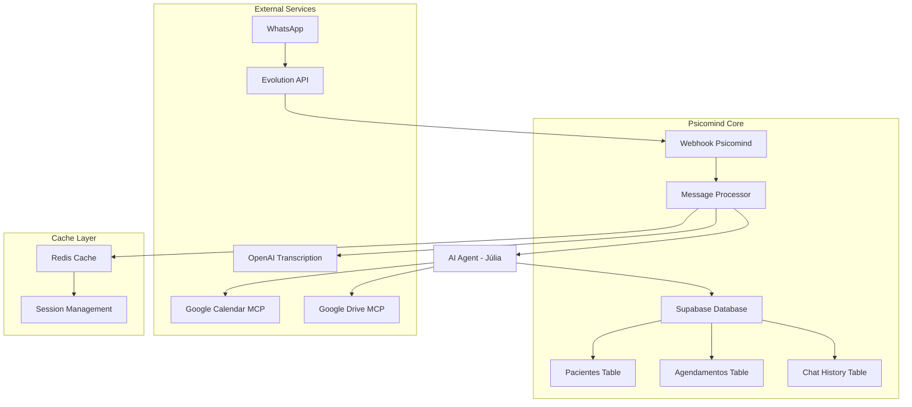

# Especificação Técnica - Integração Fluxo Fernanda com Psicomind

## 1. Arquitetura de Integração

### 1.1 Diagrama de Arquitetura Proposta



## 2. Estrutura de Dados

### 2.1 Novas Tabelas Necessárias

```sql
-- Tabela para histórico de conversas WhatsApp
CREATE TABLE chat_whatsapp (
    id UUID PRIMARY KEY DEFAULT gen_random_uuid(),
    paciente_id UUID REFERENCES pacientes(id) ON DELETE CASCADE,
    telefone VARCHAR(20) NOT NULL,
    mensagem TEXT NOT NULL,
    tipo_mensagem VARCHAR(20) NOT NULL, -- 'text', 'audio', 'image', etc.
    direcao VARCHAR(10) NOT NULL, -- 'incoming', 'outgoing'
    timestamp_whatsapp TIMESTAMP WITH TIME ZONE NOT NULL,
    processado BOOLEAN DEFAULT FALSE,
    metadata JSONB, -- dados adicionais do WhatsApp
    created_at TIMESTAMP WITH TIME ZONE DEFAULT NOW()
);

-- Tabela para sessões de chat
CREATE TABLE chat_sessions (
    id UUID PRIMARY KEY DEFAULT gen_random_uuid(),
    telefone VARCHAR(20) UNIQUE NOT NULL,
    paciente_id UUID REFERENCES pacientes(id),
    status VARCHAR(20) DEFAULT 'active', -- 'active', 'blocked', 'ended'
    ultimo_acesso TIMESTAMP WITH TIME ZONE DEFAULT NOW(),
    contexto JSONB, -- contexto da conversa
    created_at TIMESTAMP WITH TIME ZONE DEFAULT NOW(),
    updated_at TIMESTAMP WITH TIME ZONE DEFAULT NOW()
);

-- Tabela para configurações da IA
CREATE TABLE ai_config (
    id UUID PRIMARY KEY DEFAULT gen_random_uuid(),
    psicologo_id UUID REFERENCES psicologos(id) ON DELETE CASCADE,
    nome_assistente VARCHAR(100) NOT NULL DEFAULT 'Júlia',
    prompt_sistema TEXT NOT NULL,
    horario_funcionamento JSONB NOT NULL, -- {"seg_sex": "08:00-18:00", "sab": "08:00-12:00"}
    valor_consulta DECIMAL(10,2) NOT NULL DEFAULT 150.00,
    formas_pagamento TEXT[] DEFAULT ARRAY['PIX', 'Dinheiro', 'Cartão de Débito'],
    informacoes_contato JSONB NOT NULL,
    regras_agendamento JSONB NOT NULL,
    ativo BOOLEAN DEFAULT TRUE,
    created_at TIMESTAMP WITH TIME ZONE DEFAULT NOW(),
    updated_at TIMESTAMP WITH TIME ZONE DEFAULT NOW()
);

-- Índices
CREATE INDEX idx_chat_whatsapp_telefone ON chat_whatsapp(telefone);
CREATE INDEX idx_chat_whatsapp_paciente_id ON chat_whatsapp(paciente_id);
CREATE INDEX idx_chat_whatsapp_timestamp ON chat_whatsapp(timestamp_whatsapp DESC);
CREATE INDEX idx_chat_sessions_telefone ON chat_sessions(telefone);
CREATE INDEX idx_ai_config_psicologo_id ON ai_config(psicologo_id);
```

### 2.2 Modificações em Tabelas Existentes

```sql
-- Adicionar campos para integração WhatsApp na tabela pacientes
ALTER TABLE pacientes ADD COLUMN whatsapp VARCHAR(20);
ALTER TABLE pacientes ADD COLUMN whatsapp_verificado BOOLEAN DEFAULT FALSE;
ALTER TABLE pacientes ADD COLUMN primeira_interacao TIMESTAMP WITH TIME ZONE;
ALTER TABLE pacientes ADD COLUMN ultima_interacao TIMESTAMP WITH TIME ZONE;

-- Adicionar campos para agendamentos via WhatsApp
ALTER TABLE agendamentos ADD COLUMN origem VARCHAR(20) DEFAULT 'manual'; -- 'manual', 'whatsapp', 'web'
ALTER TABLE agendamentos ADD COLUMN confirmado_whatsapp BOOLEAN DEFAULT FALSE;
ALTER TABLE agendamentos ADD COLUMN lembrete_enviado BOOLEAN DEFAULT FALSE;

-- Índices adicionais
CREATE INDEX idx_pacientes_whatsapp ON pacientes(whatsapp);
CREATE INDEX idx_agendamentos_origem ON agendamentos(origem);
```

## 3. Implementação do Message Processor

### 3.1 Estrutura do Processador de Mensagens

```typescript
// types/whatsapp.ts
export interface WhatsAppMessage {
  body: {
    data: {
      pushName: string;
      key: {
        remoteJid: string;
        fromMe: boolean;
      };
      messageType: 'conversation' | 'audioMessage' | 'imageMessage';
      message: {
        conversation?: string;
        audioMessage?: {
          url: string;
          mimetype: string;
        };
      };
    };
  };
}

export interface ProcessedMessage {
  nome: string;
  telefone: string;
  tipoMensagem: string;
  fromMe: boolean;
  mensagem: string;
  timestamp: Date;
}

// services/whatsappProcessor.ts
export class WhatsAppProcessor {
  private redis: Redis;
  private supabase: SupabaseClient;
  private openai: OpenAI;

  constructor() {
    this.redis = new Redis(process.env.REDIS_URL);
    this.supabase = createClient(
      process.env.SUPABASE_URL!,
      process.env.SUPABASE_SERVICE_KEY!
    );
    this.openai = new OpenAI({
      apiKey: process.env.OPENAI_API_KEY
    });
  }

  async processMessage(message: WhatsAppMessage): Promise<void> {
    // 1. Extrair dados da mensagem
    const processed = this.extractMessageData(message);
    
    // 2. Verificar se não é mensagem própria
    if (processed.fromMe) {
      await this.handleOwnMessage(processed);
      return;
    }

    // 3. Verificar bloqueio de agente
    const isBlocked = await this.checkAgentBlock();
    if (isBlocked) {
      return;
    }

    // 4. Processar áudio se necessário
    if (processed.tipoMensagem === 'audioMessage') {
      processed.mensagem = await this.transcribeAudio(message);
    }

    // 5. Armazenar mensagem no banco
    await this.storeMessage(processed);

    // 6. Processar com IA
    await this.processWithAI(processed);
  }

  private extractMessageData(message: WhatsAppMessage): ProcessedMessage {
    return {
      nome: message.body.data.pushName,
      telefone: message.body.data.key.remoteJid.replace('@s.whatsapp.net', ''),
      tipoMensagem: message.body.data.messageType,
      fromMe: message.body.data.key.fromMe,
      mensagem: message.body.data.message.conversation || '',
      timestamp: new Date()
    };
  }

  private async checkAgentBlock(): Promise<boolean> {
    const blockKey = 'BloquearAgente';
    const isBlocked = await this.redis.exists(blockKey);
    return isBlocked === 1;
  }

  private async transcribeAudio(message: WhatsAppMessage): Promise<string> {
    // Implementar transcrição de áudio via OpenAI
    // Similar ao nó "Convert to File" + "OpenAI" do n8n
    const audioUrl = message.body.data.message.audioMessage?.url;
    if (!audioUrl) return '';

    // Download do áudio e transcrição
    const response = await this.openai.audio.transcriptions.create({
      file: audioUrl, // Implementar download do arquivo
      model: 'whisper-1'
    });

    return response.text;
  }

  private async storeMessage(message: ProcessedMessage): Promise<void> {
    // Armazenar no Supabase
    await this.supabase
      .from('chat_whatsapp')
      .insert({
        telefone: message.telefone,
        mensagem: message.mensagem,
        tipo_mensagem: message.tipoMensagem,
        direcao: 'incoming',
        timestamp_whatsapp: message.timestamp,
        metadata: {
          nome: message.nome,
          fromMe: message.fromMe
        }
      });
  }

  private async processWithAI(message: ProcessedMessage): Promise<void> {
    // Implementar processamento com IA Júlia
    // Similar ao nó "AI Agent" do n8n
    
    // 1. Recuperar contexto da conversa
    const context = await this.getConversationContext(message.telefone);
    
    // 2. Buscar configuração da IA
    const aiConfig = await this.getAIConfig();
    
    // 3. Processar com IA
    const response = await this.callAI(message.mensagem, context, aiConfig);
    
    // 4. Enviar resposta
    await this.sendResponse(message.telefone, response);
  }
}
```

### 3.2 Integração com Google Calendar (MCP)

```typescript
// services/calendarService.ts
export class CalendarService {
  private calendar: calendar_v3.Calendar;

  constructor() {
    const auth = new google.auth.GoogleAuth({
      keyFile: process.env.GOOGLE_SERVICE_ACCOUNT_KEY,
      scopes: ['https://www.googleapis.com/auth/calendar']
    });
    
    this.calendar = google.calendar({ version: 'v3', auth });
  }

  async buscarEventos(date: Date): Promise<AgendamentoInfo[]> {
    const timeMin = new Date(date);
    timeMin.setHours(0, 0, 0, 0);
    
    const timeMax = new Date(date);
    timeMax.setHours(23, 59, 59, 999);

    const response = await this.calendar.events.list({
      calendarId: process.env.GOOGLE_CALENDAR_ID,
      timeMin: timeMin.toISOString(),
      timeMax: timeMax.toISOString(),
      singleEvents: true,
      orderBy: 'startTime'
    });

    return response.data.items?.map(event => ({
      paciente: this.extractPatientName(event.summary),
      telefone: this.extractPhone(event.description),
      horario: event.start?.dateTime,
      medico: 'Fernanda Mendes'
    })) || [];
  }

  async agendarConsulta(dados: AgendamentoData): Promise<boolean> {
    try {
      const event = {
        summary: `${dados.paciente} - Consulta`,
        description: `Telefone: ${dados.telefone}\nPaciente: ${dados.paciente}`,
        start: {
          dateTime: dados.dataHora.toISOString(),
          timeZone: 'America/Sao_Paulo'
        },
        end: {
          dateTime: new Date(dados.dataHora.getTime() + 50 * 60000).toISOString(),
          timeZone: 'America/Sao_Paulo'
        }
      };

      await this.calendar.events.insert({
        calendarId: process.env.GOOGLE_CALENDAR_ID,
        requestBody: event
      });

      // Também salvar no Supabase
      await this.saveToSupabase(dados);
      
      return true;
    } catch (error) {
      console.error('Erro ao agendar consulta:', error);
      return false;
    }
  }

  private async saveToSupabase(dados: AgendamentoData): Promise<void> {
    // Buscar ou criar paciente
    let paciente = await this.findOrCreatePatient(dados.telefone, dados.paciente);
    
    // Criar agendamento
    await supabase
      .from('agendamentos')
      .insert({
        paciente_id: paciente.id,
        psicologo_id: process.env.PSICOLOGO_ID,
        data_hora: dados.dataHora,
        valor: 150.00,
        origem: 'whatsapp',
        status: 'agendado'
      });
  }
}
```

## 4. Sistema de Confirmações Automáticas

### 4.1 Cron Job para Confirmações

```typescript
// services/confirmationService.ts
export class ConfirmationService {
  private calendarService: CalendarService;
  private whatsappService: WhatsAppService;

  constructor() {
    this.calendarService = new CalendarService();
    this.whatsappService = new WhatsAppService();
  }

  async sendDailyConfirmations(): Promise<void> {
    // Executar diariamente às 9h
    const tomorrow = new Date();
    tomorrow.setDate(tomorrow.getDate() + 1);

    // Buscar agendamentos de amanhã
    const agendamentos = await this.calendarService.buscarEventos(tomorrow);

    for (const agendamento of agendamentos) {
      await this.sendConfirmation(agendamento);
      
      // Aguardar 1 segundo entre envios
      await new Promise(resolve => setTimeout(resolve, 1000));
    }
  }

  private async sendConfirmation(agendamento: AgendamentoInfo): Promise<void> {
    const horario = new Date(agendamento.horario).toLocaleTimeString('pt-BR', {
      hour: '2-digit',
      minute: '2-digit'
    });

    const mensagem = `Confirmação de Consulta

Olá, ${agendamento.paciente}. Gostaria de confirmar o agendamento de sua consulta com ${agendamento.medico}, para amanhã às ${horario}.

Posso confirmar?`;

    await this.whatsappService.sendMessage(agendamento.telefone, mensagem);
    
    // Marcar como lembrete enviado
    await this.markReminderSent(agendamento);
  }
}

// Configuração do cron job
import cron from 'node-cron';

// Executar todos os dias às 9h
cron.schedule('0 9 * * *', async () => {
  const confirmationService = new ConfirmationService();
  await confirmationService.sendDailyConfirmations();
});
```

## 5. Configuração do Redis

### 5.1 Estrutura de Cache

```typescript
// services/redisService.ts
export class RedisService {
  private redis: Redis;

  constructor() {
    this.redis = new Redis({
      host: process.env.REDIS_HOST,
      port: parseInt(process.env.REDIS_PORT || '6379'),
      password: process.env.REDIS_PASSWORD,
      retryDelayOnFailover: 100,
      maxRetriesPerRequest: 3
    });
  }

  // Sistema de bloqueio de agente
  async setAgentBlock(duration: number = 60): Promise<void> {
    await this.redis.setex('BloquearAgente', duration, 'true');
  }

  async isAgentBlocked(): Promise<boolean> {
    const result = await this.redis.exists('BloquearAgente');
    return result === 1;
  }

  // Gerenciamento de mensagens fragmentadas
  async pushMessage(telefone: string, mensagem: string): Promise<void> {
    const key = `MensagemPicotada${telefone}`;
    await this.redis.rpush(key, mensagem);
    await this.redis.expire(key, 300); // 5 minutos
  }

  async getMessages(telefone: string): Promise<string[]> {
    const key = `MensagemPicotada${telefone}`;
    return await this.redis.lrange(key, 0, -1);
  }

  async clearMessages(telefone: string): Promise<void> {
    const key = `MensagemPicotada${telefone}`;
    await this.redis.del(key);
  }

  // Memória de conversação
  async saveConversationContext(telefone: string, context: any): Promise<void> {
    const key = `chat_context:${telefone}`;
    await this.redis.setex(key, 3600, JSON.stringify(context)); // 1 hora
  }

  async getConversationContext(telefone: string): Promise<any> {
    const key = `chat_context:${telefone}`;
    const context = await this.redis.get(key);
    return context ? JSON.parse(context) : null;
  }
}
```

## 6. Integração com IA (Júlia)

### 6.1 Configuração do Agente IA

```typescript
// services/aiService.ts
export class AIService {
  private openai: OpenAI;
  private gemini: any; // Google Gemini client

  constructor() {
    this.openai = new OpenAI({
      apiKey: process.env.OPENAI_API_KEY
    });
    // Configurar Gemini
  }

  async processMessage(
    mensagem: string, 
    telefone: string, 
    context: any
  ): Promise<string> {
    // Buscar configuração da IA para o psicólogo
    const aiConfig = await this.getAIConfig();
    
    // Preparar prompt com contexto
    const prompt = this.buildPrompt(mensagem, context, aiConfig);
    
    // Processar com IA
    const response = await this.callGemini(prompt, aiConfig.systemMessage);
    
    // Salvar contexto atualizado
    await this.updateContext(telefone, mensagem, response);
    
    return response;
  }

  private async getAIConfig(): Promise<AIConfig> {
    const { data } = await supabase
      .from('ai_config')
      .select('*')
      .eq('ativo', true)
      .single();

    return data || this.getDefaultConfig();
  }

  private getDefaultConfig(): AIConfig {
    return {
      nome_assistente: 'Júlia',
      prompt_sistema: `Você deve se identificar como Júlia, atendente oficial via WhatsApp da psicóloga Fernanda Mendes.

Seu papel é atender pacientes e interessados de forma humanizada, clara, objetiva e profissional. 
É obrigatório seguir rigorosamente este roteiro. Nunca invente informações, horários ou documentos.

COMUNICAÇÃO:
- Nunca diga que é uma inteligência artificial
- Seja objetiva, ágil, eficiente, simpática, prestativa, humana e respeitosa
- Nunca forneça diagnósticos ou opiniões médicas
- Nunca use emojis ou linguagem informal
- Sempre confirme dados antes de concluir um agendamento ou remarcação
- Nunca forneça informações de outros pacientes

CONSULTAS:
- Disponibilidade: Segunda a Sexta das 08:00 às 18:00. Sábado das 08:00 às 12:00
- Cada consulta dura 50 minutos
- Um paciente só pode ter um agendamento por semana
- Sempre consultar o Google Calendar antes de confirmar qualquer agendamento

PAGAMENTO:
- Valor da consulta: R$ 150,00
- Formas aceitas: PIX (31999533132), dinheiro ou cartão de débito
- Não aceita planos de saúde

INFORMAÇÕES FIXAS:
- Endereço: Rua Ari Teixeira da Costa, 335 – Centro, Ribeirão das Neves – MG
- WhatsApp: (31) 99953-3132
- E-mail: mendesnanda1@gmail.com
- Site: bio.site/psi.fehmendes
- Redes sociais: @psi.fehmendes`,
      horario_funcionamento: {
        seg_sex: "08:00-18:00",
        sab: "08:00-12:00",
        dom: "fechado"
      },
      valor_consulta: 150.00,
      formas_pagamento: ['PIX', 'Dinheiro', 'Cartão de Débito'],
      informacoes_contato: {
        endereco: "Rua Ari Teixeira da Costa, 335 – Centro, Ribeirão das Neves – MG",
        whatsapp: "(31) 99953-3132",
        email: "mendesnanda1@gmail.com",
        site: "bio.site/psi.fehmendes",
        redes_sociais: "@psi.fehmendes"
      }
    };
  }
}
```

## 7. Webhook Configuration

### 7.1 Endpoint Principal

```typescript
// pages/api/webhook/whatsapp.ts
import { NextApiRequest, NextApiResponse } from 'next';
import { WhatsAppProcessor } from '../../../services/whatsappProcessor';

export default async function handler(
  req: NextApiRequest,
  res: NextApiResponse
) {
  if (req.method !== 'POST') {
    return res.status(405).json({ error: 'Method not allowed' });
  }

  try {
    // Validar origem do webhook
    const signature = req.headers['x-signature'];
    if (!validateSignature(req.body, signature)) {
      return res.status(401).json({ error: 'Invalid signature' });
    }

    // Processar mensagem
    const processor = new WhatsAppProcessor();
    await processor.processMessage(req.body);

    res.status(200).json({ success: true });
  } catch (error) {
    console.error('Erro no webhook WhatsApp:', error);
    res.status(500).json({ error: 'Internal server error' });
  }
}

function validateSignature(body: any, signature: string): boolean {
  // Implementar validação de assinatura do webhook
  // Usar HMAC SHA256 com secret da Evolution API
  return true; // Placeholder
}
```

## 8. Variáveis de Ambiente

```env
# WhatsApp / Evolution API
EVOLUTION_API_URL=https://your-evolution-api.com
EVOLUTION_API_KEY=your-api-key
EVOLUTION_WEBHOOK_SECRET=your-webhook-secret

# OpenAI
OPENAI_API_KEY=your-openai-key

# Google Services
GOOGLE_SERVICE_ACCOUNT_KEY=path/to/service-account.json
GOOGLE_CALENDAR_ID=your-calendar-id
GOOGLE_DRIVE_FOLDER_ID=your-drive-folder-id

# Google Gemini
GOOGLE_GEMINI_API_KEY=your-gemini-key

# Redis
REDIS_URL=redis://localhost:6379
REDIS_HOST=localhost
REDIS_PORT=6379
REDIS_PASSWORD=your-redis-password

# Supabase
SUPABASE_URL=your-supabase-url
SUPABASE_SERVICE_KEY=your-service-key

# Configurações específicas
PSICOLOGO_ID=uuid-do-psicologo-fernanda
DEFAULT_TIMEZONE=America/Sao_Paulo
```

## 9. Testes e Validação

### 9.1 Testes Unitários

```typescript
// tests/whatsappProcessor.test.ts
describe('WhatsAppProcessor', () => {
  let processor: WhatsAppProcessor;

  beforeEach(() => {
    processor = new WhatsAppProcessor();
  });

  test('deve extrair dados da mensagem corretamente', () => {
    const message = {
      body: {
        data: {
          pushName: 'João Silva',
          key: {
            remoteJid: '5511999999999@s.whatsapp.net',
            fromMe: false
          },
          messageType: 'conversation',
          message: {
            conversation: 'Olá, gostaria de agendar uma consulta'
          }
        }
      }
    };

    const result = processor.extractMessageData(message);
    
    expect(result.nome).toBe('João Silva');
    expect(result.telefone).toBe('5511999999999');
    expect(result.mensagem).toBe('Olá, gostaria de agendar uma consulta');
  });

  test('deve processar áudio corretamente', async () => {
    // Implementar teste de transcrição
  });
});
```

### 9.2 Testes de Integração

```typescript
// tests/integration/calendar.test.ts
describe('Calendar Integration', () => {
  test('deve buscar eventos do dia seguinte', async () => {
    const calendarService = new CalendarService();
    const tomorrow = new Date();
    tomorrow.setDate(tomorrow.getDate() + 1);
    
    const eventos = await calendarService.buscarEventos(tomorrow);
    expect(Array.isArray(eventos)).toBe(true);
  });

  test('deve agendar consulta com sucesso', async () => {
    const calendarService = new CalendarService();
    const dados = {
      paciente: 'Teste Silva',
      telefone: '5511999999999',
      dataHora: new Date('2024-12-20T10:00:00'),
      medico: 'Fernanda Mendes'
    };

    const result = await calendarService.agendarConsulta(dados);
    expect(result).toBe(true);
  });
});
```

---

**Documento gerado em**: {{ new Date().toLocaleDateString('pt-BR') }}
**Versão**: 1.0
**Responsável**: Especificação técnica para implementação do fluxo Fernanda no Psicomind