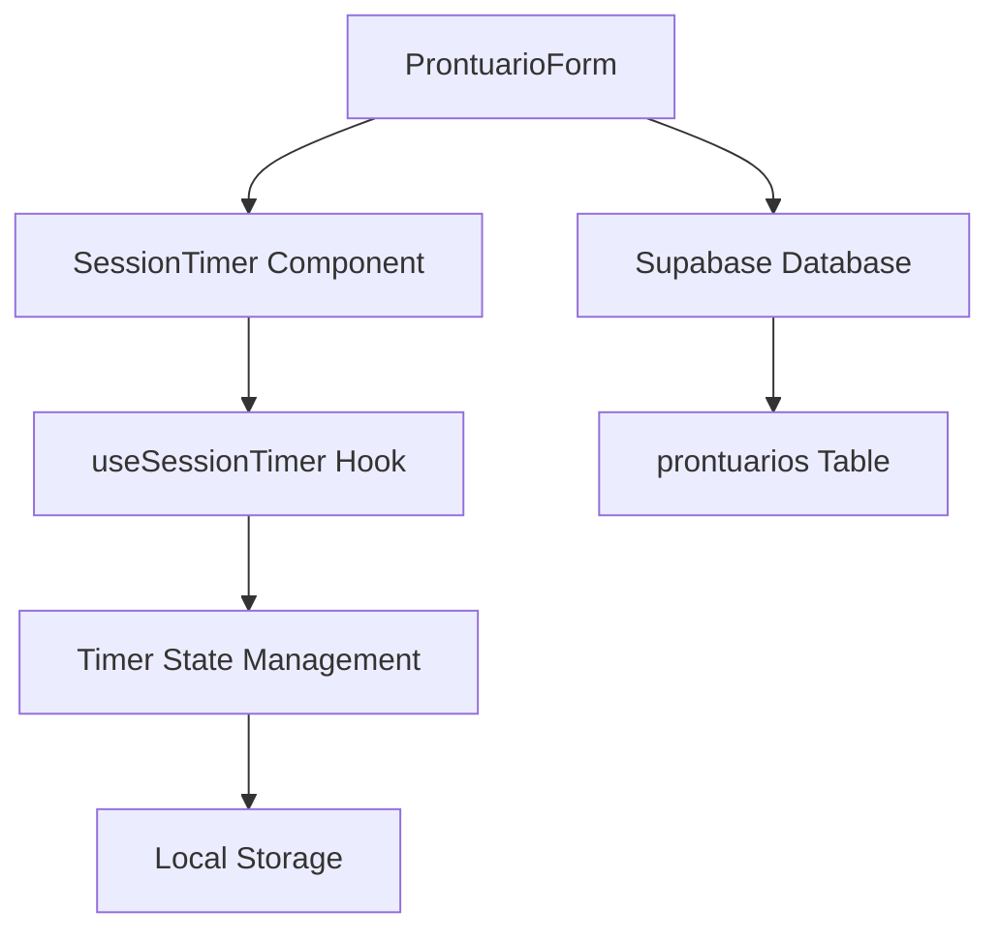
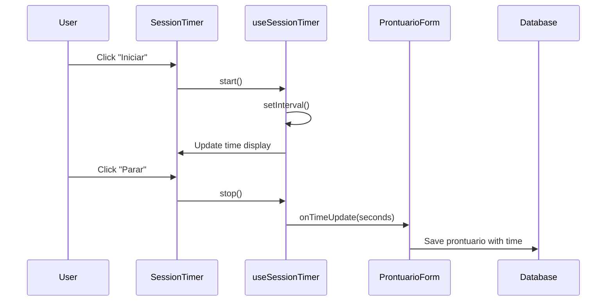

# Implementação Técnica - Cronômetro de Sessão

## 1. Arquitetura da Solução

### 1.1 Visão Geral


### 1.2 Fluxo de Dados


## 2. Estrutura de Arquivos

### 2.1 Novos Arquivos
```
src/
├── hooks/
│   └── useSessionTimer.ts          # Hook principal do cronômetro
├── components/
│   └── SessionTimer.tsx            # Componente visual do cronômetro
├── utils/
│   └── timeUtils.ts               # Utilitários de formatação de tempo
└── types/
    └── timer.ts                   # Tipos TypeScript para o cronômetro
```

### 2.2 Arquivos Modificados
```
src/
├── components/
│   └── ProntuarioForm.tsx         # Integração do cronômetro
├── lib/
│   └── supabase.ts               # Tipos atualizados
└── pages/
    └── Prontuarios.tsx           # Exibição do tempo nas listagens
```

## 3. Implementação Detalhada

### 3.1 Tipos TypeScript (`src/types/timer.ts`)

```typescript
export interface TimerState {
  seconds: number;
  isRunning: boolean;
  isPaused: boolean;
  startTime: Date | null;
  endTime: Date | null;
  lastPauseTime: Date | null;
  totalPausedTime: number;
}

export interface SessionTimerProps {
  onTimeUpdate: (seconds: number) => void;
  initialTime?: number;
  disabled?: boolean;
  autoSave?: boolean;
  sessionId?: string;
}

export interface TimerControls {
  start: () => void;
  pause: () => void;
  resume: () => void;
  stop: () => void;
  reset: () => void;
  setManualTime: (seconds: number) => void;
}

export interface UseSessionTimerReturn extends TimerControls {
  time: number;
  formattedTime: string;
  isRunning: boolean;
  isPaused: boolean;
  isStopped: boolean;
  startTime: Date | null;
  endTime: Date | null;
}
```

### 3.2 Utilitários de Tempo (`src/utils/timeUtils.ts`)

```typescript
/**
 * Formata segundos para HH:MM:SS
 */
export const formatTime = (seconds: number): string => {
  const hours = Math.floor(seconds / 3600);
  const minutes = Math.floor((seconds % 3600) / 60);
  const secs = seconds % 60;
  
  return `${hours.toString().padStart(2, '0')}:${minutes.toString().padStart(2, '0')}:${secs.toString().padStart(2, '0')}`;
};

/**
 * Converte string HH:MM:SS para segundos
 */
export const parseTimeString = (timeString: string): number => {
  const parts = timeString.split(':');
  if (parts.length !== 3) return 0;
  
  const [hours, minutes, seconds] = parts.map(Number);
  if (isNaN(hours) || isNaN(minutes) || isNaN(seconds)) return 0;
  
  return (hours * 3600) + (minutes * 60) + seconds;
};

/**
 * Valida formato de tempo HH:MM:SS
 */
export const isValidTimeFormat = (timeString: string): boolean => {
  const timeRegex = /^([0-1]?[0-9]|2[0-3]):[0-5][0-9]:[0-5][0-9]$/;
  return timeRegex.test(timeString);
};

/**
 * Converte segundos para formato legível
 */
export const formatDuration = (seconds: number): string => {
  if (seconds < 60) return `${seconds}s`;
  if (seconds < 3600) return `${Math.floor(seconds / 60)}min`;
  
  const hours = Math.floor(seconds / 3600);
  const minutes = Math.floor((seconds % 3600) / 60);
  
  if (minutes === 0) return `${hours}h`;
  return `${hours}h ${minutes}min`;
};

/**
 * Calcula diferença entre duas datas em segundos
 */
export const getTimeDifferenceInSeconds = (start: Date, end: Date): number => {
  return Math.floor((end.getTime() - start.getTime()) / 1000);
};
```

### 3.3 Hook useSessionTimer (`src/hooks/useSessionTimer.ts`)

```typescript
import { useState, useEffect, useRef, useCallback } from 'react';
import { TimerState, UseSessionTimerReturn } from '../types/timer';
import { formatTime } from '../utils/timeUtils';

const STORAGE_KEY_PREFIX = 'session_timer_';

export const useSessionTimer = (
  initialTime = 0,
  sessionId?: string,
  autoSave = true
): UseSessionTimerReturn => {
  const [state, setState] = useState<TimerState>({
    seconds: initialTime,
    isRunning: false,
    isPaused: false,
    startTime: null,
    endTime: null,
    lastPauseTime: null,
    totalPausedTime: 0,
  });

  const intervalRef = useRef<NodeJS.Timeout | null>(null);
  const storageKey = sessionId ? `${STORAGE_KEY_PREFIX}${sessionId}` : null;

  // Carregar estado do localStorage se disponível
  useEffect(() => {
    if (storageKey && autoSave) {
      const savedState = localStorage.getItem(storageKey);
      if (savedState) {
        try {
          const parsed = JSON.parse(savedState);
          setState(prev => ({
            ...prev,
            ...parsed,
            startTime: parsed.startTime ? new Date(parsed.startTime) : null,
            endTime: parsed.endTime ? new Date(parsed.endTime) : null,
            lastPauseTime: parsed.lastPauseTime ? new Date(parsed.lastPauseTime) : null,
          }));
        } catch (error) {
          console.error('Erro ao carregar estado do timer:', error);
        }
      }
    }
  }, [storageKey, autoSave]);

  // Salvar estado no localStorage
  const saveState = useCallback((newState: TimerState) => {
    if (storageKey && autoSave) {
      localStorage.setItem(storageKey, JSON.stringify(newState));
    }
  }, [storageKey, autoSave]);

  // Limpar intervalo ao desmontar
  useEffect(() => {
    return () => {
      if (intervalRef.current) {
        clearInterval(intervalRef.current);
      }
    };
  }, []);

  // Função para iniciar o timer
  const start = useCallback(() => {
    const now = new Date();
    const newState: TimerState = {
      ...state,
      isRunning: true,
      isPaused: false,
      startTime: state.startTime || now,
      endTime: null,
    };

    setState(newState);
    saveState(newState);

    intervalRef.current = setInterval(() => {
      setState(prev => {
        const updated = { ...prev, seconds: prev.seconds + 1 };
        saveState(updated);
        return updated;
      });
    }, 1000);
  }, [state, saveState]);

  // Função para pausar o timer
  const pause = useCallback(() => {
    if (intervalRef.current) {
      clearInterval(intervalRef.current);
      intervalRef.current = null;
    }

    const now = new Date();
    const newState: TimerState = {
      ...state,
      isRunning: false,
      isPaused: true,
      lastPauseTime: now,
    };

    setState(newState);
    saveState(newState);
  }, [state, saveState]);

  // Função para retomar o timer
  const resume = useCallback(() => {
    if (state.isPaused) {
      const now = new Date();
      const pauseDuration = state.lastPauseTime 
        ? Math.floor((now.getTime() - state.lastPauseTime.getTime()) / 1000)
        : 0;

      const newState: TimerState = {
        ...state,
        isRunning: true,
        isPaused: false,
        totalPausedTime: state.totalPausedTime + pauseDuration,
        lastPauseTime: null,
      };

      setState(newState);
      saveState(newState);

      intervalRef.current = setInterval(() => {
        setState(prev => {
          const updated = { ...prev, seconds: prev.seconds + 1 };
          saveState(updated);
          return updated;
        });
      }, 1000);
    }
  }, [state, saveState]);

  // Função para parar o timer
  const stop = useCallback(() => {
    if (intervalRef.current) {
      clearInterval(intervalRef.current);
      intervalRef.current = null;
    }

    const now = new Date();
    const newState: TimerState = {
      ...state,
      isRunning: false,
      isPaused: false,
      endTime: now,
    };

    setState(newState);
    saveState(newState);

    // Limpar do localStorage após parar
    if (storageKey && autoSave) {
      localStorage.removeItem(storageKey);
    }
  }, [state, saveState, storageKey, autoSave]);

  // Função para resetar o timer
  const reset = useCallback(() => {
    if (intervalRef.current) {
      clearInterval(intervalRef.current);
      intervalRef.current = null;
    }

    const newState: TimerState = {
      seconds: 0,
      isRunning: false,
      isPaused: false,
      startTime: null,
      endTime: null,
      lastPauseTime: null,
      totalPausedTime: 0,
    };

    setState(newState);
    
    // Limpar do localStorage
    if (storageKey && autoSave) {
      localStorage.removeItem(storageKey);
    }
  }, [storageKey, autoSave]);

  // Função para definir tempo manualmente
  const setManualTime = useCallback((seconds: number) => {
    if (seconds >= 0) {
      const newState: TimerState = {
        ...state,
        seconds,
      };
      setState(newState);
      saveState(newState);
    }
  }, [state, saveState]);

  return {
    time: state.seconds,
    formattedTime: formatTime(state.seconds),
    isRunning: state.isRunning,
    isPaused: state.isPaused,
    isStopped: !state.isRunning && !state.isPaused && state.seconds > 0,
    startTime: state.startTime,
    endTime: state.endTime,
    start,
    pause,
    resume,
    stop,
    reset,
    setManualTime,
  };
};
```

### 3.4 Componente SessionTimer (`src/components/SessionTimer.tsx`)

```typescript
import React, { useState } from 'react';
import { Play, Pause, Square, RotateCcw, Clock, Edit3, Check, X } from 'lucide-react';
import { useSessionTimer } from '../hooks/useSessionTimer';
import { SessionTimerProps } from '../types/timer';
import { parseTimeString, isValidTimeFormat } from '../utils/timeUtils';

export const SessionTimer: React.FC<SessionTimerProps> = ({
  onTimeUpdate,
  initialTime = 0,
  disabled = false,
  autoSave = true,
  sessionId,
}) => {
  const timer = useSessionTimer(initialTime, sessionId, autoSave);
  const [isEditing, setIsEditing] = useState(false);
  const [editValue, setEditValue] = useState(timer.formattedTime);

  // Notificar mudanças de tempo
  React.useEffect(() => {
    onTimeUpdate(timer.time);
  }, [timer.time, onTimeUpdate]);

  // Atualizar valor de edição quando o tempo muda
  React.useEffect(() => {
    if (!isEditing) {
      setEditValue(timer.formattedTime);
    }
  }, [timer.formattedTime, isEditing]);

  const handleEditStart = () => {
    if (!disabled && !timer.isRunning) {
      setIsEditing(true);
      setEditValue(timer.formattedTime);
    }
  };

  const handleEditSave = () => {
    if (isValidTimeFormat(editValue)) {
      const seconds = parseTimeString(editValue);
      timer.setManualTime(seconds);
      setIsEditing(false);
    }
  };

  const handleEditCancel = () => {
    setEditValue(timer.formattedTime);
    setIsEditing(false);
  };

  const handleKeyPress = (e: React.KeyboardEvent) => {
    if (e.key === 'Enter') {
      handleEditSave();
    } else if (e.key === 'Escape') {
      handleEditCancel();
    }
  };

  const getStatusColor = () => {
    if (disabled) return 'text-gray-400';
    if (timer.isRunning) return 'text-green-600';
    if (timer.isPaused) return 'text-yellow-600';
    if (timer.isStopped) return 'text-blue-600';
    return 'text-gray-600';
  };

  const getStatusText = () => {
    if (disabled) return 'Desabilitado';
    if (timer.isRunning) return 'Em andamento';
    if (timer.isPaused) return 'Pausado';
    if (timer.isStopped) return 'Finalizado';
    return 'Pronto para iniciar';
  };

  return (
    <div className="bg-gray-50 border border-gray-200 rounded-lg p-4 mb-6">
      <div className="flex items-center justify-between mb-4">
        <h4 className="text-lg font-medium text-gray-900 flex items-center">
          <Clock className="h-5 w-5 mr-2" />
          Cronômetro da Sessão
        </h4>
        <span className={`text-sm font-medium ${getStatusColor()}`}>
          {getStatusText()}
        </span>
      </div>

      {/* Display do Tempo */}
      <div className="text-center mb-4">
        {isEditing ? (
          <div className="flex items-center justify-center space-x-2">
            <input
              type="text"
              value={editValue}
              onChange={(e) => setEditValue(e.target.value)}
              onKeyPress={handleKeyPress}
              className="text-3xl font-mono font-bold text-center border border-gray-300 rounded px-2 py-1 w-32"
              placeholder="HH:MM:SS"
              autoFocus
            />
            <button
              onClick={handleEditSave}
              className="p-1 text-green-600 hover:text-green-800"
              title="Salvar"
            >
              <Check className="h-5 w-5" />
            </button>
            <button
              onClick={handleEditCancel}
              className="p-1 text-red-600 hover:text-red-800"
              title="Cancelar"
            >
              <X className="h-5 w-5" />
            </button>
          </div>
        ) : (
          <div className="flex items-center justify-center space-x-2">
            <span className={`text-4xl font-mono font-bold ${getStatusColor()}`}>
              {timer.formattedTime}
            </span>
            {!disabled && !timer.isRunning && (
              <button
                onClick={handleEditStart}
                className="p-1 text-gray-400 hover:text-gray-600"
                title="Editar tempo manualmente"
              >
                <Edit3 className="h-4 w-4" />
              </button>
            )}
          </div>
        )}
      </div>

      {/* Controles */}
      <div className="flex justify-center space-x-2">
        {!timer.isRunning && !timer.isPaused && (
          <button
            onClick={timer.start}
            disabled={disabled}
            className="flex items-center px-4 py-2 bg-green-600 text-white rounded-lg hover:bg-green-700 disabled:bg-gray-300 disabled:cursor-not-allowed transition-colors"
          >
            <Play className="h-4 w-4 mr-2" />
            Iniciar
          </button>
        )}

        {timer.isRunning && (
          <button
            onClick={timer.pause}
            disabled={disabled}
            className="flex items-center px-4 py-2 bg-yellow-600 text-white rounded-lg hover:bg-yellow-700 disabled:bg-gray-300 disabled:cursor-not-allowed transition-colors"
          >
            <Pause className="h-4 w-4 mr-2" />
            Pausar
          </button>
        )}

        {timer.isPaused && (
          <button
            onClick={timer.resume}
            disabled={disabled}
            className="flex items-center px-4 py-2 bg-green-600 text-white rounded-lg hover:bg-green-700 disabled:bg-gray-300 disabled:cursor-not-allowed transition-colors"
          >
            <Play className="h-4 w-4 mr-2" />
            Retomar
          </button>
        )}

        {(timer.isRunning || timer.isPaused) && (
          <button
            onClick={timer.stop}
            disabled={disabled}
            className="flex items-center px-4 py-2 bg-red-600 text-white rounded-lg hover:bg-red-700 disabled:bg-gray-300 disabled:cursor-not-allowed transition-colors"
          >
            <Square className="h-4 w-4 mr-2" />
            Parar
          </button>
        )}

        {timer.isStopped && (
          <button
            onClick={timer.reset}
            disabled={disabled}
            className="flex items-center px-4 py-2 bg-gray-600 text-white rounded-lg hover:bg-gray-700 disabled:bg-gray-300 disabled:cursor-not-allowed transition-colors"
          >
            <RotateCcw className="h-4 w-4 mr-2" />
            Resetar
          </button>
        )}
      </div>

      {/* Informações adicionais */}
      {(timer.startTime || timer.endTime) && (
        <div className="mt-4 text-sm text-gray-600 text-center">
          {timer.startTime && (
            <div>Início: {timer.startTime.toLocaleTimeString()}</div>
          )}
          {timer.endTime && (
            <div>Fim: {timer.endTime.toLocaleTimeString()}</div>
          )}
        </div>
      )}
    </div>
  );
};

export default SessionTimer;
```

## 4. Integração com ProntuarioForm

### 4.1 Modificações no Schema

```typescript
// Adicionar ao prontuarioSchema
const prontuarioSchema = z.object({
  // ... campos existentes
  duracao_sessao_segundos: z.number().min(0).default(0),
  tempo_inicio_sessao: z.string().optional(),
  tempo_fim_sessao: z.string().optional(),
});
```

### 4.2 Estado e Handlers

```typescript
// Adicionar ao ProntuarioForm
const [sessionTime, setSessionTime] = useState(
  prontuario?.duracao_sessao_segundos || 0
);

const handleTimeUpdate = useCallback((seconds: number) => {
  setSessionTime(seconds);
}, []);

// Modificar onSubmit para incluir dados do cronômetro
const onSubmit = async (data: ProntuarioFormData) => {
  // ... código existente
  
  const prontuarioData = {
    ...data,
    duracao_sessao_segundos: sessionTime,
    tempo_inicio_sessao: timer.startTime?.toISOString(),
    tempo_fim_sessao: timer.endTime?.toISOString(),
    // ... resto dos dados
  };
  
  // ... resto da função
};
```

## 5. Alterações no Banco de Dados

### 5.1 Migration SQL

```sql
-- Arquivo: supabase/migrations/004_add_session_timer.sql

-- Adicionar campos de cronometragem à tabela prontuarios
ALTER TABLE prontuarios 
ADD COLUMN duracao_sessao_segundos INTEGER DEFAULT 0,
ADD COLUMN tempo_inicio_sessao TIMESTAMP WITH TIME ZONE,
ADD COLUMN tempo_fim_sessao TIMESTAMP WITH TIME ZONE;

-- Adicionar índice para consultas por duração
CREATE INDEX idx_prontuarios_duracao ON prontuarios(duracao_sessao_segundos);

-- Adicionar comentários para documentação
COMMENT ON COLUMN prontuarios.duracao_sessao_segundos IS 'Duração total da sessão em segundos';
COMMENT ON COLUMN prontuarios.tempo_inicio_sessao IS 'Timestamp do início da sessão';
COMMENT ON COLUMN prontuarios.tempo_fim_sessao IS 'Timestamp do fim da sessão';
```

### 5.2 Atualização dos Tipos

```typescript
// Atualizar em src/lib/supabase.ts
export interface Prontuario {
  id: string;
  paciente_id: string;
  agendamento_id?: string;
  conteudo: string;
  campos_estruturados?: any;
  data_sessao: string;
  // Novos campos
  duracao_sessao_segundos?: number;
  tempo_inicio_sessao?: string;
  tempo_fim_sessao?: string;
  created_at: string;
  updated_at: string;
}
```

## 6. Testes

### 6.1 Testes Unitários

```typescript
// __tests__/hooks/useSessionTimer.test.ts
import { renderHook, act } from '@testing-library/react';
import { useSessionTimer } from '../../src/hooks/useSessionTimer';

describe('useSessionTimer', () => {
  beforeEach(() => {
    jest.useFakeTimers();
  });

  afterEach(() => {
    jest.useRealTimers();
  });

  it('should start timer correctly', () => {
    const { result } = renderHook(() => useSessionTimer());
    
    act(() => {
      result.current.start();
    });

    expect(result.current.isRunning).toBe(true);
    expect(result.current.isPaused).toBe(false);
  });

  it('should count time correctly', () => {
    const { result } = renderHook(() => useSessionTimer());
    
    act(() => {
      result.current.start();
    });

    act(() => {
      jest.advanceTimersByTime(5000);
    });

    expect(result.current.time).toBe(5);
  });

  // ... mais testes
});
```

### 6.2 Testes de Integração

```typescript
// __tests__/components/SessionTimer.test.tsx
import { render, screen, fireEvent } from '@testing-library/react';
import SessionTimer from '../../src/components/SessionTimer';

describe('SessionTimer', () => {
  const mockOnTimeUpdate = jest.fn();

  beforeEach(() => {
    mockOnTimeUpdate.mockClear();
  });

  it('should render timer display', () => {
    render(<SessionTimer onTimeUpdate={mockOnTimeUpdate} />);
    
    expect(screen.getByText('00:00:00')).toBeInTheDocument();
    expect(screen.getByText('Iniciar')).toBeInTheDocument();
  });

  it('should start timer when start button is clicked', () => {
    render(<SessionTimer onTimeUpdate={mockOnTimeUpdate} />);
    
    fireEvent.click(screen.getByText('Iniciar'));
    
    expect(screen.getByText('Pausar')).toBeInTheDocument();
    expect(screen.getByText('Parar')).toBeInTheDocument();
  });

  // ... mais testes
});
```

## 7. Performance e Otimizações

### 7.1 Otimizações de Performance
- **Debounce**: Salvar no localStorage com debounce para evitar muitas escritas
- **Memoização**: Usar React.memo e useMemo para evitar re-renders desnecessários
- **Cleanup**: Limpar intervalos e listeners adequadamente

### 7.2 Gerenciamento de Memória
- **Intervalos**: Sempre limpar intervalos ao desmontar componentes
- **LocalStorage**: Limpar dados antigos periodicamente
- **Event Listeners**: Remover listeners não utilizados

## 8. Considerações de Segurança

### 8.1 Validação de Dados
- **Input sanitization**: Validar todas as entradas de tempo
- **Range validation**: Verificar limites mínimos e máximos
- **Type checking**: Garantir tipos corretos em todas as operações

### 8.2 Persistência Segura
- **LocalStorage**: Não armazenar dados sensíveis
- **Backup**: Implementar backup automático do estado
- **Recovery**: Mecanismo de recuperação em caso de falha

Este documento fornece uma base sólida para a implementação completa do cronômetro de sessão no sistema Psicomind.