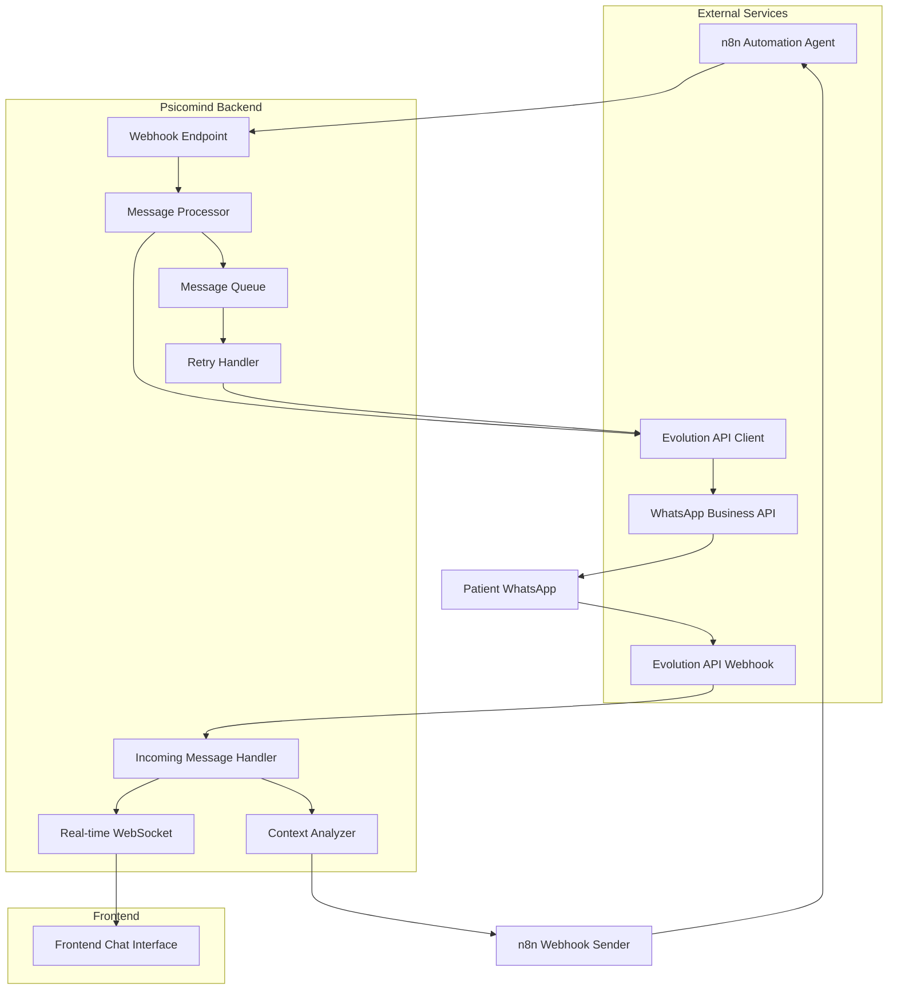
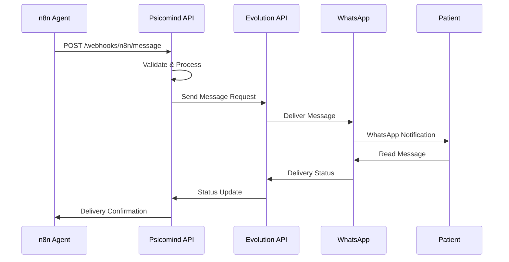

# PRD - Integração de Mensagens n8n + Evolution API

## 1. Visão Geral do Produto

O sistema de integração de mensagens visa conectar o Psicomind com agentes automatizados executados no n8n através de webhooks, utilizando a Evolution API como ponte de comunicação. Esta solução permitirá que psicólogos automatizem fluxos de comunicação com pacientes, desde lembretes de consultas até follow-ups terapêuticos, mantendo a experiência humanizada e personalizada.

**Objetivo Principal:** Criar uma interface robusta e escalável para comunicação automatizada entre psicólogos e pacientes, integrando agentes inteligentes do n8n com a Evolution API para WhatsApp Business.

**Benefícios:**
- **Para Psicólogos:** Automação de tarefas repetitivas, melhor gestão do tempo, comunicação mais eficiente
- **Para Pacientes:** Respostas mais rápidas, lembretes automáticos, suporte 24/7 para questões básicas
- **Para a Clínica:** Redução de no-shows, melhor engajamento dos pacientes, otimização de processos

**Casos de Uso Principais:**
- Lembretes automáticos de consultas
- Follow-up pós-sessão
- Triagem inicial de novos pacientes
- Respostas automáticas fora do horário comercial
- Coleta de feedback e avaliações

## 2. Preparação do Frontend para Integração do Chat

### 2.1 Componentes de UI para Exibição e Envio de Mensagens

**Interface de Chat em Tempo Real:**
- **ChatContainer:** Componente principal que gerencia o estado global do chat
- **ConversationList:** Lista de conversas ativas com indicadores visuais de status
- **MessageArea:** Área principal de exibição de mensagens com suporte a diferentes tipos de mídia
- **MessageBubble:** Componente individual para cada mensagem com indicadores de status
- **MessageInput:** Campo de entrada com suporte a texto, emojis, anexos e comandos rápidos
- **AutomationIndicator:** Indicador visual quando mensagens são enviadas por automação

**Notificações e Indicadores de Status:**
- **NotificationBadge:** Contador de mensagens não lidas
- **TypingIndicator:** Indicador de digitação em tempo real
- **ConnectionStatus:** Status da conexão com Evolution API
- **AutomationStatus:** Status dos agentes n8n (ativo/inativo/erro)
- **MessageStatus:** Indicadores de entrega, leitura e falha

**Histórico de Conversas:**
- **ConversationHistory:** Histórico completo de conversas com busca e filtros
- **MessageSearch:** Busca avançada por conteúdo, data e tipo de mensagem
- **ConversationArchive:** Arquivo de conversas antigas com paginação
- **ExportOptions:** Opções para exportar conversas em PDF/CSV

### 2.2 Lógica para Conexão com o Serviço de Mensagens

**Hooks Personalizados:**
- **useN8nIntegration:** Gerencia conexão e comunicação com agentes n8n
- **useEvolutionAPI:** Interface com a Evolution API para WhatsApp
- **useMessageSync:** Sincronização bidirecional de mensagens
- **useAutomationRules:** Gerenciamento de regras de automação

**Gerenciamento de Estado:**
- **MessageStore:** Store global para mensagens usando Zustand
- **ConversationStore:** Estado das conversas ativas
- **AutomationStore:** Estado dos agentes e regras de automação
- **ConnectionStore:** Estado das conexões com APIs externas

### 2.3 Sincronização em Tempo Real das Mensagens

**WebSocket Integration:**
- Conexão persistente com servidor para atualizações em tempo real
- Reconexão automática em caso de falha
- Queue de mensagens offline para envio posterior
- Heartbeat para monitoramento de conexão

**Event Handling:**
- Eventos de nova mensagem
- Eventos de status de entrega
- Eventos de automação ativada/desativada
- Eventos de erro e recuperação

## 3. Configuração da Integração Back-end

### 3.1 Estrutura de Payloads para Comunicação via Webhook

**Webhook de Entrada (n8n → Psicomind):**
```json
{
  "event_type": "automation_trigger",
  "automation_id": "uuid",
  "patient_id": "uuid",
  "psychologist_id": "uuid",
  "trigger_data": {
    "type": "appointment_reminder",
    "appointment_id": "uuid",
    "scheduled_time": "2024-01-15T10:00:00Z"
  },
  "message_template": {
    "content": "Olá {patient_name}, lembrando da sua consulta amanhã às {time}",
    "variables": {
      "patient_name": "João",
      "time": "10:00"
    }
  },
  "delivery_options": {
    "immediate": true,
    "scheduled_time": null,
    "retry_attempts": 3
  }
}
```

**Webhook de Saída (Psicomind → n8n):**
```json
{
  "event_type": "message_received",
  "conversation_id": "uuid",
  "patient_id": "uuid",
  "psychologist_id": "uuid",
  "message": {
    "content": "Preciso remarcar minha consulta",
    "type": "text",
    "timestamp": "2024-01-15T09:30:00Z"
  },
  "context": {
    "last_appointment": "2024-01-10T10:00:00Z",
    "next_appointment": "2024-01-16T10:00:00Z",
    "patient_mood": "anxious"
  }
}
```

### 3.2 Mapeamento de Fluxos de Mensagens

**Fluxo de Automação (n8n → Evolution API):**
1. n8n detecta trigger (agendamento, horário, evento)
2. n8n processa dados e gera mensagem personalizada
3. n8n envia webhook para Psicomind
4. Psicomind valida e processa payload
5. Psicomind envia mensagem via Evolution API
6. Evolution API entrega mensagem via WhatsApp
7. Status de entrega é reportado de volta

**Fluxo de Resposta (WhatsApp → n8n):**
1. Paciente responde via WhatsApp
2. Evolution API recebe mensagem
3. Psicomind processa e categoriza mensagem
4. Psicomind envia webhook para n8n
5. n8n analisa contexto e decide próxima ação
6. Ciclo se repete conforme necessário

### 3.3 Tratamento de Erros e Reconexão

**Estratégias de Retry:**
- Exponential backoff para tentativas de reenvio
- Dead letter queue para mensagens que falharam múltiplas vezes
- Circuit breaker para APIs indisponíveis
- Fallback para notificação manual em caso de falha crítica

**Monitoramento e Alertas:**
- Health checks automáticos das APIs
- Alertas em tempo real para falhas
- Dashboard de métricas de entrega
- Logs detalhados para debugging

## 4. Requisitos Técnicos

### 4.1 Especificações da API de Mensagens

**Endpoints Principais:**

**POST /api/webhooks/n8n/message**
- Recebe mensagens de automação do n8n
- Valida payload e credenciais
- Processa e envia via Evolution API

**POST /api/webhooks/evolution/incoming**
- Recebe mensagens do Evolution API
- Processa e encaminha para n8n quando necessário
- Atualiza estado das conversas

**GET /api/automations/status**
- Retorna status de todas as automações ativas
- Métricas de performance e entrega
- Logs de erro recentes

**POST /api/automations/toggle**
- Ativa/desativa automações específicas
- Configuração de regras e triggers
- Validação de permissões

### 4.2 Protocolos de Segurança

**Autenticação e Autorização:**
- JWT tokens para autenticação de APIs
- API keys específicas para n8n e Evolution API
- Rate limiting por usuário e endpoint
- Validação de origem dos webhooks

**Criptografia:**
- HTTPS obrigatório para todas as comunicações
- Criptografia de mensagens sensíveis em repouso
- Hashing de dados pessoais para logs
- Rotação automática de chaves de API

**Compliance LGPD:**
- Consentimento explícito para automações
- Opt-out fácil para pacientes
- Anonimização de dados em logs
- Auditoria completa de acesso a dados

### 4.3 Ambiente de Testes

**Sandbox Environment:**
- Instância isolada para testes
- Dados fictícios para simulação
- Webhooks de teste para n8n
- Mock da Evolution API

**Testes Automatizados:**
- Testes de integração end-to-end
- Testes de carga para webhooks
- Testes de failover e recuperação
- Validação de payloads

## 5. Arquitetura da Solução

### 5.1 Fluxo de Dados entre Componentes



### 5.2 Diagramas de Sequência

**Sequência de Automação:**


### 5.3 Estrutura de Banco de Dados

**Novas Tabelas Necessárias:**

```sql
-- Tabela de Automações
CREATE TABLE automations (
    id UUID PRIMARY KEY DEFAULT gen_random_uuid(),
    psychologist_id UUID NOT NULL REFERENCES psicologos(id),
    name VARCHAR(255) NOT NULL,
    description TEXT,
    n8n_workflow_id VARCHAR(255),
    trigger_type VARCHAR(50) NOT NULL,
    trigger_config JSONB DEFAULT '{}',
    is_active BOOLEAN DEFAULT true,
    created_at TIMESTAMP WITH TIME ZONE DEFAULT NOW(),
    updated_at TIMESTAMP WITH TIME ZONE DEFAULT NOW()
);

-- Tabela de Mensagens de Automação
CREATE TABLE automation_messages (
    id UUID PRIMARY KEY DEFAULT gen_random_uuid(),
    automation_id UUID NOT NULL REFERENCES automations(id),
    conversation_id UUID NOT NULL REFERENCES conversations(id),
    n8n_execution_id VARCHAR(255),
    template_used TEXT,
    variables_used JSONB DEFAULT '{}',
    delivery_status VARCHAR(50) DEFAULT 'pending',
    sent_at TIMESTAMP WITH TIME ZONE,
    delivered_at TIMESTAMP WITH TIME ZONE,
    error_message TEXT,
    retry_count INTEGER DEFAULT 0,
    created_at TIMESTAMP WITH TIME ZONE DEFAULT NOW()
);

-- Tabela de Webhooks
CREATE TABLE webhook_logs (
    id UUID PRIMARY KEY DEFAULT gen_random_uuid(),
    source VARCHAR(50) NOT NULL, -- 'n8n' ou 'evolution'
    endpoint VARCHAR(255) NOT NULL,
    payload JSONB NOT NULL,
    response_status INTEGER,
    response_body TEXT,
    processing_time_ms INTEGER,
    error_message TEXT,
    created_at TIMESTAMP WITH TIME ZONE DEFAULT NOW()
);

-- Tabela de Configurações de Automação
CREATE TABLE automation_configs (
    id UUID PRIMARY KEY DEFAULT gen_random_uuid(),
    psychologist_id UUID NOT NULL REFERENCES psicologos(id),
    n8n_webhook_url VARCHAR(500),
    n8n_api_key VARCHAR(255),
    evolution_api_url VARCHAR(500),
    evolution_api_key VARCHAR(255),
    auto_response_enabled BOOLEAN DEFAULT false,
    business_hours_only BOOLEAN DEFAULT true,
    max_daily_messages INTEGER DEFAULT 50,
    created_at TIMESTAMP WITH TIME ZONE DEFAULT NOW(),
    updated_at TIMESTAMP WITH TIME ZONE DEFAULT NOW()
);
```

### 5.4 APIs e Endpoints

**Endpoints de Automação:**
- `POST /api/automations` - Criar nova automação
- `GET /api/automations` - Listar automações do psicólogo
- `PUT /api/automations/:id` - Atualizar automação
- `DELETE /api/automations/:id` - Deletar automação
- `POST /api/automations/:id/test` - Testar automação

**Endpoints de Webhook:**
- `POST /api/webhooks/n8n/message` - Receber mensagens do n8n
- `POST /api/webhooks/evolution/incoming` - Receber mensagens da Evolution API
- `GET /api/webhooks/logs` - Visualizar logs de webhooks
- `POST /api/webhooks/test` - Testar conectividade

## 6. Implementação por Fases

### 6.1 Fase 1: Infraestrutura Básica (2-3 semanas)
**Objetivos:**
- Configurar estrutura de banco de dados
- Implementar endpoints básicos de webhook
- Criar sistema de logs e monitoramento
- Configurar ambiente de desenvolvimento

**Entregáveis:**
- Tabelas de banco criadas e migradas
- Endpoints de webhook funcionais
- Sistema de logs implementado
- Documentação técnica inicial

### 6.2 Fase 2: Interface de Usuário (3-4 semanas)
**Objetivos:**
- Desenvolver componentes de chat
- Implementar interface de configuração de automações
- Criar dashboard de monitoramento
- Integrar WebSocket para tempo real

**Entregáveis:**
- Interface de chat funcional
- Tela de configuração de automações
- Dashboard de métricas
- Sincronização em tempo real

### 6.3 Fase 3: Integração Completa (4-5 semanas)
**Objetivos:**
- Integrar com n8n via webhooks
- Conectar com Evolution API
- Implementar sistema de retry e failover
- Realizar testes de integração

**Entregáveis:**
- Integração n8n funcional
- Conexão Evolution API estável
- Sistema de recuperação de erros
- Testes automatizados

### 6.4 Fase 4: Otimizações e Melhorias (2-3 semanas)
**Objetivos:**
- Otimizar performance
- Implementar recursos avançados
- Melhorar UX/UI
- Preparar para produção

**Entregáveis:**
- Performance otimizada
- Recursos avançados implementados
- Interface polida
- Sistema pronto para produção

## 7. Critérios de Aceitação

### 7.1 Funcionalidades Obrigatórias

**Comunicação Básica:**
- ✅ Envio de mensagens via n8n para WhatsApp
- ✅ Recebimento de respostas do WhatsApp
- ✅ Sincronização bidirecional de mensagens
- ✅ Interface de chat em tempo real

**Automações:**
- ✅ Configuração de triggers de automação
- ✅ Templates de mensagem personalizáveis
- ✅ Agendamento de mensagens
- ✅ Controle de ativação/desativação

**Monitoramento:**
- ✅ Dashboard de métricas de entrega
- ✅ Logs detalhados de webhooks
- ✅ Alertas de falha em tempo real
- ✅ Relatórios de performance

### 7.2 Métricas de Performance

**Latência:**
- Tempo de resposta de webhooks < 500ms
- Entrega de mensagens < 2 segundos
- Sincronização em tempo real < 100ms
- Carregamento de interface < 1 segundo

**Confiabilidade:**
- Uptime > 99.5%
- Taxa de entrega de mensagens > 98%
- Taxa de sucesso de webhooks > 99%
- Tempo de recuperação de falhas < 30 segundos

**Escalabilidade:**
- Suporte a 1000+ mensagens por minuto
- 100+ automações simultâneas
- 50+ psicólogos ativos
- 1000+ pacientes cadastrados

### 7.3 Testes de Qualidade

**Testes Funcionais:**
- Testes de integração end-to-end
- Testes de regressão automatizados
- Testes de usabilidade
- Testes de acessibilidade

**Testes de Performance:**
- Testes de carga
- Testes de stress
- Testes de volume
- Testes de recuperação

## 8. Considerações de Segurança

### 8.1 Criptografia de Mensagens

**Em Trânsito:**
- TLS 1.3 para todas as comunicações
- Certificados SSL válidos
- HSTS habilitado
- Perfect Forward Secrecy

**Em Repouso:**
- Criptografia AES-256 para dados sensíveis
- Chaves gerenciadas por HSM
- Backup criptografado
- Logs anonimizados

### 8.2 Proteção de Dados Pessoais (LGPD)

**Consentimento:**
- Opt-in explícito para automações
- Consentimento granular por tipo de mensagem
- Facilidade para revogar consentimento
- Registro de consentimentos

**Minimização de Dados:**
- Coleta apenas de dados necessários
- Retenção limitada por tempo
- Anonimização automática
- Direito ao esquecimento

### 8.3 Auditoria e Compliance

**Logs de Auditoria:**
- Registro de todos os acessos
- Trilha de modificações
- Logs de consentimento
- Relatórios de compliance

**Monitoramento:**
- Detecção de anomalias
- Alertas de segurança
- Análise de comportamento
- Resposta a incidentes

---

## Conclusão

Este PRD estabelece as bases para uma integração robusta e escalável entre o Psicomind, n8n e Evolution API, garantindo uma experiência de usuário fluida e segura. A implementação em fases permite validação contínua e ajustes conforme necessário, assegurando que a solução final atenda às necessidades dos psicólogos e pacientes.

A arquitetura proposta é flexível o suficiente para acomodar futuras expansões e integrações, mantendo sempre o foco na segurança, performance e experiência do usuário.