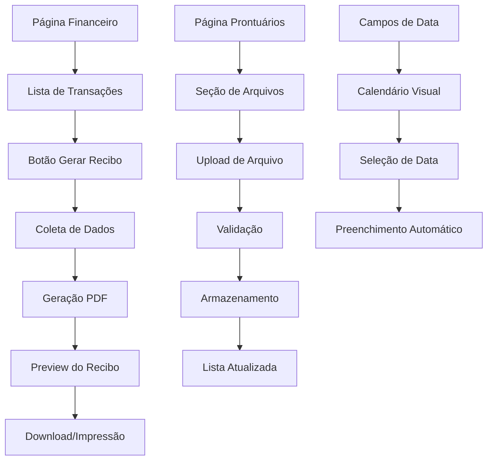

# PRD - Melhorias do Sistema Psicomind

## 1. Product Overview

Este documento define as especificações para implementar quatro melhorias críticas no sistema Psicomind: componente de calendário auxiliar, sistema de upload de arquivos, revisão do módulo financeiro e geração de recibos oficiais.

- **Objetivo Principal**: Aprimorar a experiência do usuário e funcionalidades profissionais do sistema de gestão psicológica
- **Valor de Mercado**: Aumentar a competitividade do produto oferecendo ferramentas mais robustas e profissionais para psicólogos

## 2. Core Features

### 2.1 User Roles

| Role | Registration Method | Core Permissions |
|------|---------------------|------------------|
| Psicólogo | Email + CRP | Acesso completo ao sistema, geração de recibos, upload de arquivos |

### 2.2 Feature Module

Nossas melhorias consistem nas seguintes funcionalidades principais:

1. **Componente de Calendário**: seletor visual de datas, integração com campos existentes, melhor UX.
2. **Sistema de Upload**: upload de arquivos por paciente, visualização, download, organização segura.
3. **Módulo Financeiro Revisado**: correção de fluxos, validação de links, otimização de navegação.
4. **Geração de Recibos**: documentos oficiais, assinatura digital, informações profissionais completas.

### 2.3 Page Details

| Page Name | Module Name | Feature description |
|-----------|-------------|---------------------|
| Pacientes | Calendário de Data | Adicionar seletor visual de data de nascimento com calendário dropdown |
| Agendamentos | Calendário de Data | Implementar calendário para seleção de data e hora dos agendamentos |
| Prontuários | Upload de Arquivos | Permitir anexar documentos, imagens e arquivos relacionados ao paciente |
| Prontuários | Visualização de Arquivos | Exibir lista de arquivos anexados com opções de download e visualização |
| Financeiro | Revisão de Fluxos | Corrigir navegação, validar links, otimizar filtros e busca |
| Financeiro | Geração de Recibos | Botão para gerar recibo oficial com dados da transação e assinatura profissional |
| Transações | Recibo Digital | Documento formatado com informações completas, CRP, telefone e assinatura |

## 3. Core Process

### Fluxo do Calendário:
1. Usuário clica em campo de data
2. Sistema exibe calendário visual sobreposto
3. Usuário seleciona data no calendário
4. Campo é preenchido automaticamente
5. Calendário se fecha

### Fluxo de Upload de Arquivos:
1. Usuário acessa prontuário do paciente
2. Clica em "Anexar Arquivo"
3. Seleciona arquivo do dispositivo
4. Sistema valida tipo e tamanho
5. Arquivo é enviado e armazenado
6. Lista de arquivos é atualizada

### Fluxo de Geração de Recibo:
1. Usuário visualiza transação financeira
2. Clica em "Gerar Recibo"
3. Sistema coleta dados da transação e do psicólogo
4. Gera documento PDF formatado
5. Exibe preview do recibo
6. Permite download ou impressão

## 4. User Interface Design

### 4.1 Design Style

- **Cores Primárias**: Azul (#3B82F6), Verde (#10B981) para sucesso, Vermelho (#EF4444) para alertas
- **Cores Secundárias**: Cinza (#6B7280) para textos, Branco (#FFFFFF) para fundos
- **Estilo de Botões**: Arredondados (rounded-lg), com gradientes suaves e efeitos hover
- **Fontes**: Inter ou system fonts, tamanhos 14px (corpo), 16px (títulos), 12px (legendas)
- **Layout**: Card-based com sombras suaves, navegação top-level, sidebar responsiva
- **Ícones**: Lucide React icons, estilo outline, tamanho 20px padrão

### 4.2 Page Design Overview

| Page Name | Module Name | UI Elements |
|-----------|-------------|-------------|
| Calendário | Seletor de Data | Dropdown overlay, grid de dias, navegação mês/ano, botões de ação, cores de destaque para data atual |
| Upload | Área de Drop | Zona de arrastar e soltar, progress bar, lista de arquivos, ícones por tipo, botões de ação |
| Financeiro | Lista Revisada | Tabela responsiva, filtros aprimorados, paginação, botões de ação por linha, indicadores de status |
| Recibo | Documento PDF | Layout profissional, cabeçalho com logo, dados organizados em seções, assinatura digital, rodapé oficial |

### 4.3 Responsiveness

O sistema é desktop-first com adaptação mobile-responsive. Todos os componentes devem funcionar adequadamente em tablets e smartphones, com otimização para touch interaction nos calendários e uploads.