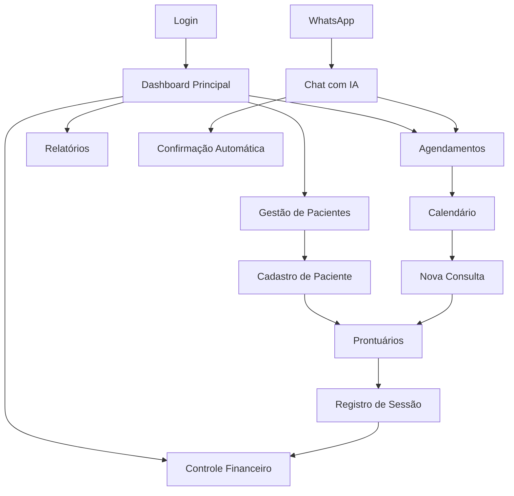

# PRD - Psicomind: Sistema de Gestão para Psicólogos

## 1. Product Overview

O Psicomind é uma aplicação SaaS moderna e intuitiva, desenvolvida especificamente para psicólogos que precisam gerenciar todos os aspectos do seu negócio de forma independente e eficiente.

A plataforma oferece uma solução completa de CRM especializada em saúde mental, integrando gestão de pacientes, agendamentos, prontuários eletrônicos, controle financeiro e dashboards analíticos em uma única interface.

O produto visa revolucionar a gestão de consultórios psicológicos, proporcionando maior organização, eficiência operacional e insights estratégicos para o crescimento do negócio.

## 2. Core Features

### 2.1 User Roles

| Role | Registration Method | Core Permissions |
|------|---------------------|------------------|
| Psicólogo | Cadastro com CRP e validação profissional | Acesso completo a todas as funcionalidades do sistema |
| Assistente | Convite do psicólogo principal | Acesso limitado a agendamentos e cadastro de pacientes |

### 2.2 Feature Module

Nossa aplicação Psicomind consiste nas seguintes páginas principais:

1. **Dashboard Principal**: visão geral dos KPIs, gráficos de desempenho, resumo financeiro e agenda do dia.
2. **Gestão de Pacientes**: cadastro completo, histórico, dados pessoais e de contato.
3. **Agendamentos**: calendário interativo, marcação de consultas, reagendamentos e cancelamentos.
4. **Prontuários**: criação, edição e consulta de prontuários eletrônicos seguros.
5. **Controle Financeiro**: registro de entradas e saídas, relatórios financeiros e cobrança.
6. **Chat com IA**: assistente virtual para agendamentos automatizados via WhatsApp.
7. **Relatórios e Analytics**: dashboards detalhados com métricas do negócio.

### 2.3 Page Details

| Page Name | Module Name | Feature description |
|-----------|-------------|---------------------|
| Dashboard Principal | Visão Geral | Exibir KPIs principais, gráficos de consultas mensais, receita, pacientes ativos e agenda do dia |
| Dashboard Principal | Resumo Financeiro | Mostrar receita mensal, contas a receber, despesas e margem de lucro |
| Gestão de Pacientes | Cadastro de Pacientes | Criar, editar, visualizar e excluir dados completos dos pacientes incluindo informações pessoais e histórico |
| Gestão de Pacientes | Busca e Filtros | Pesquisar pacientes por nome, CPF, telefone e aplicar filtros por status e data de cadastro |
| Agendamentos | Calendário | Visualizar agenda em formato mensal, semanal e diário com cores por tipo de consulta |
| Agendamentos | Marcação de Consultas | Agendar novas consultas, definir horários, duração e tipo de atendimento |
| Agendamentos | Gestão de Horários | Configurar horários disponíveis, bloqueios e intervalos entre consultas |
| Prontuários | Criação de Prontuários | Criar prontuários eletrônicos com campos estruturados e texto livre |
| Prontuários | Histórico Clínico | Visualizar evolução do paciente, sessões anteriores e anotações importantes |
| Prontuários | Segurança e Privacidade | Controlar acesso aos prontuários com criptografia e logs de auditoria |
| Controle Financeiro | Registro de Transações | Cadastrar receitas de consultas, despesas operacionais e categorizar movimentações |
| Controle Financeiro | Relatórios Financeiros | Gerar relatórios de faturamento, fluxo de caixa e análise de rentabilidade |
| Controle Financeiro | Cobrança | Enviar lembretes de pagamento e controlar inadimplência |
| Chat com IA | Assistente Virtual | Integrar com WhatsApp via Evolution API para agendamentos automatizados usando Gemini IA |
| Chat com IA | Configuração de Respostas | Personalizar respostas automáticas e fluxos de conversação |
| Relatórios e Analytics | Dashboards Interativos | Criar gráficos dinâmicos de performance, taxa de ocupação e crescimento |
| Relatórios e Analytics | Métricas de Negócio | Analisar indicadores como ticket médio, retenção de pacientes e produtividade |

## 3. Core Process

### Fluxo Principal do Psicólogo:
1. **Login** → Acesso ao sistema com credenciais seguras
2. **Dashboard** → Visualização geral do dia e KPIs importantes
3. **Verificação de Agenda** → Consulta dos agendamentos do dia
4. **Atendimento** → Acesso rápido ao prontuário do paciente
5. **Registro de Sessão** → Atualização do prontuário pós-consulta
6. **Gestão Financeira** → Registro da receita da consulta

### Fluxo de Agendamento com IA:
1. **Cliente envia mensagem** → WhatsApp via Evolution API
2. **IA processa solicitação** → Gemini IA interpreta a mensagem
3. **Verificação de disponibilidade** → Sistema consulta agenda
4. **Confirmação automática** → IA responde com horários disponíveis
5. **Agendamento confirmado** → Registro no sistema e notificação ao psicólogo

## 4. User Interface Design

### 4.1 Design Style

- **Cores Primárias**: Azul profissional (#2563EB), Verde saúde (#059669)
- **Cores Secundárias**: Cinza neutro (#6B7280), Branco (#FFFFFF)
- **Estilo de Botões**: Arredondados com sombra sutil, efeito hover suave
- **Tipografia**: Inter ou Roboto, tamanhos 14px (corpo), 18px (subtítulos), 24px (títulos)
- **Layout**: Design baseado em cards, navegação lateral fixa, header superior
- **Ícones**: Estilo outline minimalista, biblioteca Heroicons ou Feather

### 4.2 Page Design Overview

| Page Name | Module Name | UI Elements |
|-----------|-------------|-------------|
| Dashboard Principal | Visão Geral | Cards com métricas, gráficos coloridos, layout em grid 3x2, cores azul e verde |
| Dashboard Principal | Resumo Financeiro | Gráfico de linha para receita, cards com valores em destaque, formato monetário brasileiro |
| Gestão de Pacientes | Lista de Pacientes | Tabela responsiva, filtros no topo, botão de ação flutuante, paginação inferior |
| Agendamentos | Calendário | Interface de calendário full-screen, cores por tipo de consulta, modal para detalhes |
| Prontuários | Editor | Interface de texto rico, sidebar com histórico, botões de ação no header |
| Controle Financeiro | Transações | Tabela com categorização por cores, filtros de data, resumo em cards superiores |
| Chat com IA | Interface de Chat | Bubble chat style, cores diferenciadas para IA e usuário, status de conexão |

### 4.3 Responsiveness

O produto é desktop-first com adaptação completa para tablets e smartphones. Inclui otimização para touch em dispositivos móveis, com navegação por hambúrguer menu e cards empilhados verticalmente em telas menores.