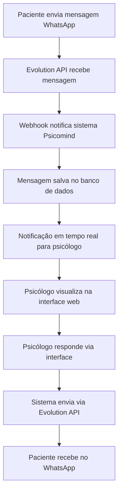

# PRD - Sistema de Chat de Atendimento via WhatsApp

## 1. Visão Geral do Produto

O Sistema de Chat de Atendimento via WhatsApp é uma funcionalidade integrada ao Psicomind que permite aos psicólogos se comunicarem diretamente com seus pacientes através do WhatsApp, utilizando a Evolution API como ponte de integração. O sistema oferece uma interface web centralizada para gerenciar todas as conversas, mantendo o histórico e garantindo a segurança das informações.

- **Objetivo Principal**: Facilitar a comunicação entre psicólogos e pacientes através de uma plataforma familiar (WhatsApp) com interface profissional de gerenciamento.
- **Público-Alvo**: Psicólogos que desejam manter contato direto e organizado com seus pacientes.
- **Valor de Mercado**: Diferencial competitivo significativo, aumentando a adesão ao tratamento e satisfação dos pacientes.

## 2. Funcionalidades Principais

### 2.1 Papéis de Usuário

| Papel | Método de Acesso | Permissões Principais |
|-------|------------------|----------------------|
| Psicólogo | Login no sistema web | Visualizar, enviar e gerenciar todas as conversas com seus pacientes |
| Paciente | WhatsApp pessoal | Enviar mensagens para o psicólogo através do número configurado |
| Admin | Login no sistema web | Configurar integrações, monitorar uso e gerenciar configurações globais |

### 2.2 Módulos Funcionais

O sistema de chat consiste nas seguintes páginas principais:

1. **Página de Conversas**: interface principal para visualização e gerenciamento de todas as conversas ativas
2. **Interface de Chat**: tela de conversa individual com paciente específico
3. **Configurações de WhatsApp**: página para configuração da Evolution API e números
4. **Histórico de Conversas**: arquivo completo de mensagens por paciente
5. **Notificações**: centro de alertas para novas mensagens e status

### 2.3 Detalhes das Páginas

| Página | Módulo | Descrição da Funcionalidade |
|--------|--------|----------------------------|
| Conversas | Lista de Conversas | Exibir todas as conversas ativas, ordenadas por última mensagem. Mostrar preview da última mensagem, status de leitura e indicador de mensagens não lidas |
| Conversas | Filtros e Busca | Filtrar conversas por paciente, status, data. Buscar por conteúdo de mensagens ou nome do paciente |
| Chat Individual | Interface de Mensagens | Exibir histórico completo da conversa com scroll infinito. Mostrar timestamps, status de entrega e leitura |
| Chat Individual | Envio de Mensagens | Enviar mensagens de texto, emojis. Suporte futuro para imagens e áudios. Indicador de digitação |
| Chat Individual | Informações do Paciente | Painel lateral com dados do paciente, próximos agendamentos e histórico de sessões |
| Configurações | Integração Evolution API | Configurar URL da API, token de autenticação, webhook endpoints |
| Configurações | Número WhatsApp | Vincular e configurar número de WhatsApp para recebimento de mensagens |
| Histórico | Arquivo de Conversas | Visualizar conversas arquivadas, exportar conversas, busca avançada por período |
| Notificações | Alertas em Tempo Real | Notificações push para novas mensagens, sons configuráveis, badges de contagem |

## 3. Fluxo Principal de Uso

### Fluxo do Psicólogo:
1. Acessa a página de Conversas no sistema
2. Visualiza lista de conversas ativas com pacientes
3. Clica em uma conversa para abrir o chat individual
4. Lê mensagens recebidas e responde através da interface web
5. Pode acessar informações do paciente no painel lateral
6. Recebe notificações em tempo real para novas mensagens

### Fluxo do Paciente:
1. Envia mensagem via WhatsApp para o número do psicólogo
2. Mensagem é recebida automaticamente pelo sistema
3. Psicólogo visualiza e responde através da interface web
4. Paciente recebe resposta em seu WhatsApp normalmente

## 4. Design da Interface

### 4.1 Estilo de Design

- **Cores Primárias**: Verde WhatsApp (#25D366) para elementos de chat, Azul (#3B82F6) para ações principais
- **Cores Secundárias**: Cinza claro (#F3F4F6) para backgrounds, Branco (#FFFFFF) para cards de mensagem
- **Estilo de Botões**: Arredondados com sombra sutil, hover com transição suave
- **Tipografia**: Inter ou similar, tamanhos 14px para mensagens, 16px para títulos
- **Layout**: Design responsivo com sidebar para lista de conversas e área principal para chat
- **Ícones**: Lucide React para consistência, ícones do WhatsApp para elementos específicos

### 4.2 Visão Geral das Páginas

| Página | Módulo | Elementos de UI |
|--------|--------|-----------------|
| Conversas | Lista de Conversas | Cards com avatar do paciente, nome, preview da mensagem, timestamp, badge de não lidas. Cores: fundo branco, texto cinza escuro, destaque verde para não lidas |
| Conversas | Barra de Busca | Input com ícone de lupa, placeholder "Buscar conversas...", filtros dropdown. Estilo: borda sutil, foco azul |
| Chat Individual | Área de Mensagens | Bolhas de mensagem estilo WhatsApp, mensagens recebidas à esquerda (fundo cinza claro), enviadas à direita (fundo verde). Timestamps discretos |
| Chat Individual | Input de Envio | Campo de texto expansível, botão de envio com ícone, indicador de digitação. Estilo: borda arredondada, botão verde |
| Chat Individual | Painel do Paciente | Card lateral com foto, nome, telefone, próximos agendamentos. Fundo branco, bordas sutis |

### 4.3 Responsividade

O sistema é projetado mobile-first com adaptação para desktop:
- **Mobile**: Lista de conversas em tela cheia, chat individual sobrepõe a lista
- **Tablet**: Sidebar com lista de conversas (30%) e área de chat (70%)
- **Desktop**: Layout de três colunas: lista de conversas, chat ativo, informações do paciente
- **Touch**: Otimizado para gestos de swipe e tap, botões com área mínima de 44px