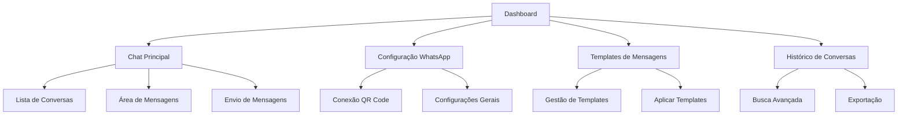

# PRD - Sistema de Chat WhatsApp Web Integrado

## 1. Product Overview

Sistema de chat integrado ao WhatsApp Web que permite aos psicólogos se comunicarem diretamente com seus pacientes através de uma interface moderna e profissional dentro do sistema Psicomind. O sistema oferece gestão completa de conversas, histórico de mensagens e integração total com o cadastro de pacientes existente.

O produto resolve a necessidade de centralizar a comunicação com pacientes, oferecendo um ambiente profissional e seguro para interações terapêuticas via WhatsApp, mantendo o histórico organizado e vinculado ao prontuário de cada paciente.

## 2. Core Features

### 2.1 User Roles

| Role | Registration Method | Core Permissions |
|------|---------------------|------------------|
| Psicólogo | Login existente no sistema | Acesso completo ao chat, envio/recebimento de mensagens, gestão de conversas |
| Paciente | Automático via WhatsApp | Envio de mensagens via WhatsApp (externo ao sistema) |

### 2.2 Feature Module

O sistema de chat WhatsApp Web consiste nas seguintes páginas principais:

1. **Chat Principal**: interface de conversas, lista de pacientes, área de mensagens, envio de mídia
2. **Configuração WhatsApp**: configuração da conexão, QR Code, status da conexão
3. **Templates de Mensagens**: criação e gestão de mensagens pré-definidas
4. **Histórico de Conversas**: busca e filtros avançados, exportação de conversas

### 2.3 Page Details

| Page Name | Module Name | Feature description |
|-----------|-------------|---------------------|
| Chat Principal | Lista de Conversas | Exibir todas as conversas ativas com pacientes, status online/offline, última mensagem, contador de não lidas |
| Chat Principal | Área de Mensagens | Visualizar histórico completo de mensagens, indicadores de entrega/leitura, timestamps, suporte a emojis |
| Chat Principal | Envio de Mensagens | Enviar mensagens de texto, imagens, documentos, áudios, usar templates pré-definidos |
| Chat Principal | Busca de Conversas | Buscar por nome do paciente, conteúdo de mensagens, filtrar por data, status |
| Configuração WhatsApp | Conexão WhatsApp | Gerar QR Code para conectar WhatsApp Web, verificar status da conexão, reconectar automaticamente |
| Configuração WhatsApp | Configurações Gerais | Definir mensagens automáticas, horário de funcionamento, respostas automáticas |
| Templates de Mensagens | Gestão de Templates | Criar, editar, excluir templates de mensagens, categorizar por tipo (agendamento, lembretes, etc.) |
| Templates de Mensagens | Uso de Templates | Aplicar templates rapidamente nas conversas, personalizar com dados do paciente |
| Histórico de Conversas | Busca Avançada | Filtrar conversas por período, paciente, tipo de mensagem, exportar relatórios |
| Histórico de Conversas | Exportação | Exportar conversas em PDF, backup de mensagens, integração com prontuário |

## 3. Core Process

### Fluxo Principal do Psicólogo:
1. Acessa a página de Chat Principal
2. Visualiza lista de conversas com pacientes
3. Seleciona uma conversa para ver o histórico de mensagens
4. Envia mensagens de texto, mídia ou usa templates
5. Recebe notificações em tempo real de novas mensagens
6. Pode buscar conversas específicas ou filtrar por critérios

### Fluxo de Configuração:
1. Acessa Configuração WhatsApp
2. Escaneia QR Code para conectar WhatsApp Web
3. Define configurações de mensagens automáticas
4. Cria e gerencia templates de mensagens
5. Monitora status da conexão

### Fluxo de Comunicação com Paciente:
1. Paciente envia mensagem via WhatsApp
2. Sistema recebe mensagem automaticamente
3. Associa mensagem ao paciente cadastrado
4. Notifica psicólogo em tempo real
5. Psicólogo responde através da interface
6. Mensagem é enviada via WhatsApp Web

## 4. User Interface Design

### 4.1 Design Style

- **Cores Primárias**: Verde WhatsApp (#25D366), Azul Psicomind (#3B82F6)
- **Cores Secundárias**: Cinza claro (#F3F4F6), Branco (#FFFFFF), Cinza escuro (#374151)
- **Estilo de Botões**: Arredondados com sombra sutil, efeito hover suave
- **Fonte**: Inter ou similar, tamanhos 14px (texto), 16px (títulos), 12px (metadados)
- **Layout**: Interface dividida em 3 colunas (lista conversas, mensagens, detalhes)
- **Ícones**: Lucide React, estilo minimalista, cores consistentes com o tema

### 4.2 Page Design Overview

| Page Name | Module Name | UI Elements |
|-----------|-------------|-------------|
| Chat Principal | Lista de Conversas | Cards com avatar do paciente, nome, última mensagem, timestamp, contador de não lidas em verde, status online com indicador verde |
| Chat Principal | Área de Mensagens | Bolhas de mensagem estilo WhatsApp, mensagens enviadas em azul à direita, recebidas em cinza à esquerda, timestamps discretos |
| Chat Principal | Envio de Mensagens | Input com bordas arredondadas, botões para anexos (📎), emojis (😊), templates (📋), botão enviar em verde |
| Configuração WhatsApp | QR Code | Card centralizado com QR Code grande, status da conexão com indicadores coloridos, botão reconectar |
| Templates de Mensagens | Lista Templates | Cards organizados por categoria, preview da mensagem, botões editar/excluir, botão adicionar flutuante |

### 4.3 Responsiveness

Interface mobile-first com adaptação para desktop. Em dispositivos móveis, a lista de conversas ocupa tela inteira, ao selecionar conversa, mostra apenas área de mensagens. Em desktop, layout de 3 colunas com redimensionamento dinâmico. Otimizado para touch com botões de tamanho adequado e gestos intuitivos.