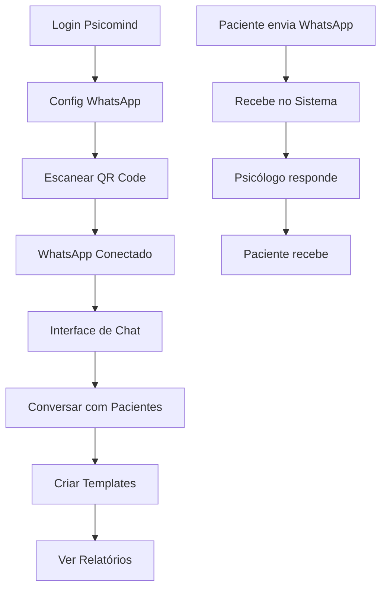

# PRD - Integração WhatsApp Web Completa

## 1. Visão Geral do Produto

Sistema de integração WhatsApp Web para o Psicomind que permite aos psicólogos se conectarem ao WhatsApp através de QR Code e gerenciarem conversas com pacientes diretamente na plataforma. A solução replica a experiência do WhatsApp Web oficial com funcionalidades específicas para consultórios psicológicos.

- **Objetivo**: Centralizar comunicação WhatsApp no sistema Psicomind
- **Público-alvo**: Psicólogos que atendem pacientes via WhatsApp
- **Valor**: Integração profissional, histórico organizado e gestão eficiente de conversas

## 2. Funcionalidades Principais

### 2.1 Papéis de Usuário

| Papel | Método de Acesso | Permissões Principais |
|-------|------------------|----------------------|
| Psicólogo | Login no sistema | Conectar WhatsApp, gerenciar conversas, criar templates |
| Paciente | WhatsApp pessoal | Enviar/receber mensagens (automático) |

### 2.2 Módulos Funcionais

Nossa integração WhatsApp Web consiste nas seguintes páginas principais:

1. **Configuração WhatsApp**: conexão via QR Code, configurações de auto-resposta, horário comercial
2. **Chat Interface**: interface de conversas, lista de contatos, histórico de mensagens
3. **Templates de Mensagens**: criação e gestão de templates, mensagens rápidas
4. **Relatórios WhatsApp**: estatísticas de conversas, relatórios de atendimento

### 2.3 Detalhes das Páginas

| Página | Módulo | Descrição da Funcionalidade |
|--------|--------|----------------------------|
| Configuração WhatsApp | Status de Conexão | Exibir QR Code, status da conexão, informações do cliente conectado |
| Configuração WhatsApp | Auto-resposta | Configurar mensagens automáticas, horário comercial, mensagem de ausência |
| Configuração WhatsApp | Configurações Avançadas | Webhook URL, logs de auditoria, configurações de segurança |
| Chat Interface | Lista de Conversas | Listar conversas ativas, buscar contatos, filtrar por status |
| Chat Interface | Área de Chat | Enviar/receber mensagens, status de entrega, histórico completo |
| Chat Interface | Informações do Contato | Dados do paciente, histórico de atendimentos, notas |
| Templates | Gerenciar Templates | Criar, editar, excluir templates de mensagens |
| Templates | Categorias | Organizar templates por categorias (saudação, agendamento, etc.) |
| Relatórios | Estatísticas | Número de mensagens, tempo de resposta, conversas ativas |
| Relatórios | Exportação | Exportar conversas, relatórios em PDF/Excel |

## 3. Fluxo Principal de Uso

### Fluxo do Psicólogo:
1. **Login** no sistema Psicomind
2. **Acesso** à página de Configuração WhatsApp
3. **Conexão** via QR Code (escaneamento com celular)
4. **Configuração** de auto-resposta e horários
5. **Navegação** para interface de chat
6. **Gestão** de conversas com pacientes
7. **Criação** de templates para respostas rápidas
8. **Visualização** de relatórios e estatísticas

### Fluxo do Paciente:
1. **Envio** de mensagem WhatsApp para o psicólogo
2. **Recebimento** automático no sistema
3. **Resposta** do psicólogo através da interface
4. **Continuação** da conversa normalmente

## 4. Design da Interface

### 4.1 Estilo de Design

- **Cores Primárias**: Verde WhatsApp (#25D366), Azul Psicomind (#3B82F6)
- **Cores Secundárias**: Cinza claro (#F3F4F6), Branco (#FFFFFF)
- **Estilo de Botões**: Arredondados com sombra sutil
- **Tipografia**: Inter, tamanhos 12px-24px
- **Layout**: Card-based com navegação lateral
- **Ícones**: Lucide React, estilo outline
- **Animações**: Transições suaves, loading spinners

### 4.2 Visão Geral das Páginas

| Página | Módulo | Elementos de UI |
|--------|--------|-----------------|
| Configuração WhatsApp | Status Conexão | Card com QR Code 200x200px, status colorido, botões ação |
| Configuração WhatsApp | Auto-resposta | Toggle switches, campos de texto, seletor de horário |
| Chat Interface | Lista Conversas | Lista scrollável, avatars circulares, badges de notificação |
| Chat Interface | Área Chat | Bolhas de mensagem, input com emoji, indicadores de status |
| Templates | Lista Templates | Cards organizados, botões editar/excluir, modal de criação |
| Relatórios | Dashboard | Gráficos Chart.js, cards de métricas, filtros de data |

### 4.3 Responsividade

- **Desktop-first**: Otimizado para telas 1024px+
- **Mobile-adaptive**: Breakpoints em 768px e 480px
- **Touch-friendly**: Botões mínimo 44px, gestos de swipe
- **Progressive Web App**: Funciona offline, instalável