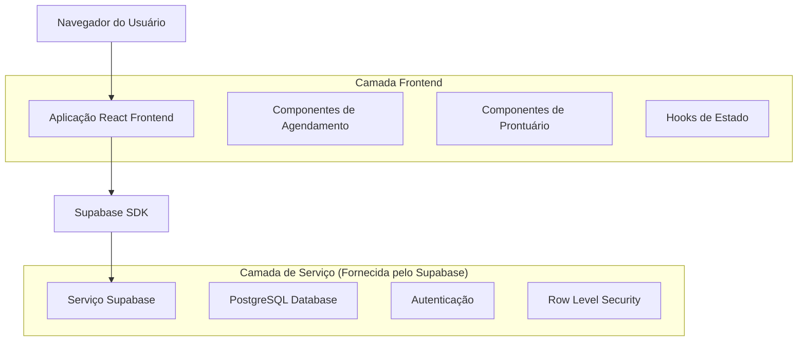
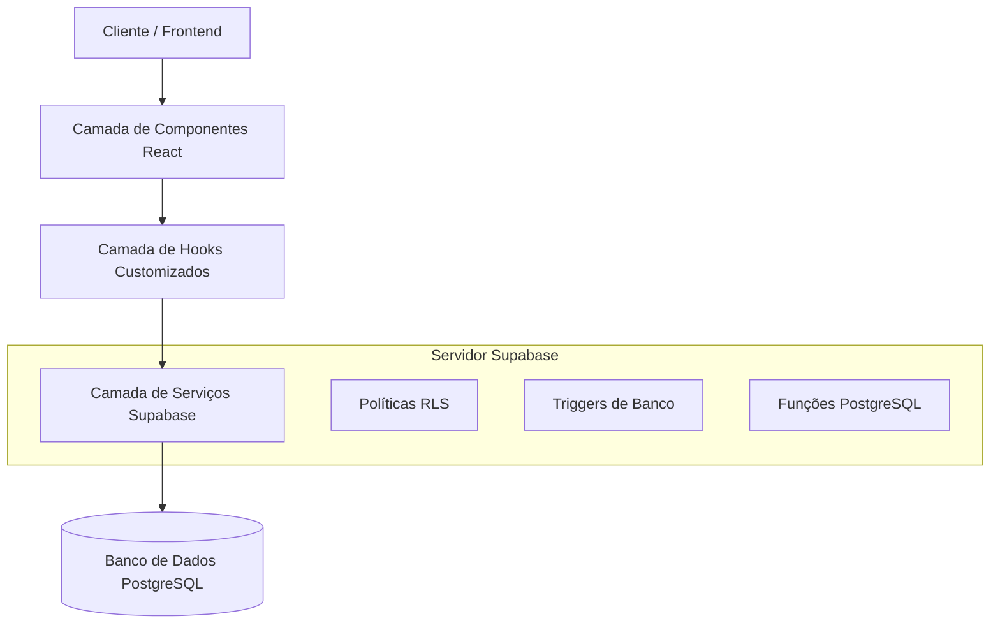

# Reestruturação do Sistema de Prontuários - Arquitetura Técnica

## 1. Arquitetura de Design



## 2. Descrição da Tecnologia
- Frontend: React@18 + TypeScript + TailwindCSS@3 + Vite
- Backend: Supabase (PostgreSQL + Auth + RLS)
- Estado: Zustand para gerenciamento de estado
- Formulários: React Hook Form + Zod para validação

## 3. Definições de Rotas

| Rota | Propósito |
|------|-----------|
| /agendamentos | Página principal de agendamentos com calendário e lista |
| /agendamentos/novo | Modal/formulário para criar novo agendamento |
| /agendamentos/:id/sessao | Interface para conduzir sessão e criar prontuário |
| /prontuarios | Lista de todos os prontuários com filtros |
| /prontuarios/:id | Visualização/edição de prontuário específico |
| /pacientes/:id/historico | Histórico completo de sessões do paciente |
| /pacientes/:id/sessao/:sessaoId | Prontuário específico no contexto do paciente |

## 4. Definições de API

### 4.1 APIs Principais

**Agendamentos**
```
GET /api/agendamentos
```
Parâmetros:
| Nome do Parâmetro | Tipo | Obrigatório | Descrição |
|-------------------|------|-------------|-----------|
| psicologo_id | UUID | true | ID do psicólogo logado |
| data_inicio | string | false | Filtro por data inicial (ISO) |
| data_fim | string | false | Filtro por data final (ISO) |
| status | string | false | Filtro por status |

Resposta:
| Nome do Parâmetro | Tipo | Descrição |
|-------------------|------|-----------|
| agendamentos | array | Lista de agendamentos com dados do paciente |
| tem_prontuario | boolean | Indica se já existe prontuário para o agendamento |

**Prontuários por Sessão**
```
POST /api/agendamentos/:id/prontuario
```
Parâmetros:
| Nome do Parâmetro | Tipo | Obrigatório | Descrição |
|-------------------|------|-------------|-----------|
| agendamento_id | UUID | true | ID do agendamento |
| observacoes | string | true | Observações da sessão |
| diagnostico | string | false | Diagnóstico atualizado |
| plano_tratamento | string | false | Plano de tratamento |
| medicamentos | string | false | Medicamentos prescritos |
| duracao_sessao_segundos | integer | true | Duração em segundos |

**Histórico do Paciente**
```
GET /api/pacientes/:id/historico
```
Resposta:
| Nome do Parâmetro | Tipo | Descrição |
|-------------------|------|-----------|
| sessoes | array | Lista ordenada de agendamentos com prontuários |
| estatisticas | object | Resumo de evolução do paciente |

## 5. Arquitetura do Servidor



## 6. Modelo de Dados

### 6.1 Definição do Modelo de Dados

```mermaid
erDiagram
    PSICOLOGOS ||--o{ PACIENTES : possui
    PSICOLOGOS ||--o{ AGENDAMENTOS : cria
    PACIENTES ||--o{ AGENDAMENTOS : participa
    AGENDAMENTOS ||--o| PRONTUARIOS : gera
    PACIENTES ||--o{ PRONTUARIOS : possui
    AGENDAMENTOS ||--o{ TRANSACOES_FINANCEIRAS : gera

    PSICOLOGOS {
        uuid id PK
        string email UK
        string nome
        string crp UK
        string telefone
        string senha_hash
        timestamp created_at
        timestamp updated_at
    }
    
    PACIENTES {
        uuid id PK
        uuid psicologo_id FK
        string nome
        string cpf UK
        string telefone
        string email
        date data_nascimento
        jsonb endereco
        string status
        timestamp created_at
        timestamp updated_at
    }
    
    AGENDAMENTOS {
        uuid id PK
        uuid paciente_id FK
        uuid psicologo_id FK
        timestamp data_hora
        integer duracao_minutos
        string tipo
        decimal valor
        string status
        text observacoes
        timestamp created_at
        timestamp updated_at
    }
    
    PRONTUARIOS {
        uuid id PK
        uuid paciente_id FK
        uuid psicologo_id FK
        uuid agendamento_id FK UK
        text conteudo
        text diagnostico
        text observacoes
        text plano_tratamento
        text medicamentos
        timestamp data_sessao
        integer duracao_sessao_segundos
        timestamp tempo_inicio_sessao
        timestamp tempo_fim_sessao
        timestamp proxima_sessao
        jsonb campos_estruturados
        timestamp created_at
        timestamp updated_at
    }
```

### 6.2 Linguagem de Definição de Dados

**Migração Principal - Reestruturação de Prontuários**
```sql
-- Migration: Reestruturação do sistema de prontuários
-- Data: 2025-01-08
-- Descrição: Implementa relacionamento 1:1 entre agendamentos e prontuários

-- 1. Adicionar constraint única para agendamento_id em prontuarios
ALTER TABLE prontuarios 
ADD CONSTRAINT uk_prontuarios_agendamento_id UNIQUE (agendamento_id);

-- 2. Tornar agendamento_id obrigatório para novos prontuários
-- (Manter NULL para prontuários existentes durante migração)
ALTER TABLE prontuarios 
ALTER COLUMN agendamento_id SET DEFAULT NULL;

-- 3. Adicionar campo status_sessao em agendamentos
ALTER TABLE agendamentos 
ADD COLUMN status_sessao VARCHAR(20) DEFAULT 'nao_iniciada' 
CHECK (status_sessao IN ('nao_iniciada', 'em_andamento', 'finalizada'));

-- 4. Adicionar índices para performance
CREATE INDEX idx_prontuarios_agendamento_id ON prontuarios(agendamento_id);
CREATE INDEX idx_agendamentos_status_sessao ON agendamentos(status_sessao);
CREATE INDEX idx_prontuarios_data_sessao_paciente ON prontuarios(paciente_id, data_sessao DESC);

-- 5. Criar função para validar relacionamento agendamento-prontuário
CREATE OR REPLACE FUNCTION validate_prontuario_agendamento()
RETURNS TRIGGER AS $$
BEGIN
    -- Verificar se agendamento existe e pertence ao mesmo psicólogo
    IF NEW.agendamento_id IS NOT NULL THEN
        IF NOT EXISTS (
            SELECT 1 FROM agendamentos 
            WHERE id = NEW.agendamento_id 
            AND psicologo_id = NEW.psicologo_id
            AND paciente_id = NEW.paciente_id
        ) THEN
            RAISE EXCEPTION 'Agendamento não encontrado ou não pertence ao mesmo psicólogo/paciente';
        END IF;
        
        -- Verificar se agendamento já possui prontuário
        IF EXISTS (
            SELECT 1 FROM prontuarios 
            WHERE agendamento_id = NEW.agendamento_id 
            AND id != COALESCE(NEW.id, '00000000-0000-0000-0000-000000000000'::uuid)
        ) THEN
            RAISE EXCEPTION 'Este agendamento já possui um prontuário';
        END IF;
    END IF;
    
    RETURN NEW;
END;
$$ LANGUAGE plpgsql;

-- 6. Criar trigger para validação
CREATE TRIGGER trigger_validate_prontuario_agendamento
    BEFORE INSERT OR UPDATE ON prontuarios
    FOR EACH ROW
    EXECUTE FUNCTION validate_prontuario_agendamento();

-- 7. Criar função para atualizar status do agendamento
CREATE OR REPLACE FUNCTION update_agendamento_status()
RETURNS TRIGGER AS $$
BEGIN
    -- Quando prontuário é criado, marcar agendamento como finalizado
    IF TG_OP = 'INSERT' AND NEW.agendamento_id IS NOT NULL THEN
        UPDATE agendamentos 
        SET status_sessao = 'finalizada',
            status = 'realizado'
        WHERE id = NEW.agendamento_id;
    END IF;
    
    RETURN NEW;
END;
$$ LANGUAGE plpgsql;

-- 8. Criar trigger para atualização automática de status
CREATE TRIGGER trigger_update_agendamento_status
    AFTER INSERT ON prontuarios
    FOR EACH ROW
    EXECUTE FUNCTION update_agendamento_status();

-- 9. Atualizar políticas RLS para incluir agendamento_id
DROP POLICY IF EXISTS "Psicólogos podem ver prontuários de seus pacientes" ON prontuarios;

CREATE POLICY "Psicólogos podem ver prontuários de seus pacientes" ON prontuarios
    FOR ALL USING (
        auth.uid()::text = psicologo_id::text
        OR EXISTS (
            SELECT 1 FROM pacientes 
            WHERE pacientes.id = prontuarios.paciente_id 
            AND pacientes.psicologo_id::text = auth.uid()::text
        )
    );

-- 10. Criar view para histórico do paciente
CREATE OR REPLACE VIEW vw_historico_paciente AS
SELECT 
    p.id as paciente_id,
    p.nome as paciente_nome,
    a.id as agendamento_id,
    a.data_hora,
    a.duracao_minutos,
    a.tipo as tipo_sessao,
    a.valor,
    a.status as status_agendamento,
    a.status_sessao,
    pr.id as prontuario_id,
    pr.diagnostico,
    pr.observacoes,
    pr.plano_tratamento,
    pr.duracao_sessao_segundos,
    pr.created_at as prontuario_criado_em,
    CASE 
        WHEN pr.id IS NOT NULL THEN true 
        ELSE false 
    END as tem_prontuario
FROM pacientes p
LEFT JOIN agendamentos a ON a.paciente_id = p.id
LEFT JOIN prontuarios pr ON pr.agendamento_id = a.id
ORDER BY p.id, a.data_hora DESC;

-- 11. Conceder permissões na view
GRANT SELECT ON vw_historico_paciente TO authenticated;

-- 12. Comentários para documentação
COMMENT ON CONSTRAINT uk_prontuarios_agendamento_id ON prontuarios IS 'Garante relacionamento 1:1 entre agendamento e prontuário';
COMMENT ON COLUMN agendamentos.status_sessao IS 'Status específico da sessão: nao_iniciada, em_andamento, finalizada';
COMMENT ON VIEW vw_historico_paciente IS 'View para consulta otimizada do histórico completo do paciente';
```

**Script de Migração de Dados Existentes**
```sql
-- Migration: Migração de dados existentes para nova estrutura
-- Data: 2025-01-08
-- Descrição: Vincula prontuários existentes aos agendamentos correspondentes

-- 1. Backup dos dados atuais
CREATE TABLE prontuarios_backup AS SELECT * FROM prontuarios;

-- 2. Tentar vincular prontuários existentes aos agendamentos
-- Baseado na data da sessão e paciente
UPDATE prontuarios 
SET agendamento_id = (
    SELECT a.id 
    FROM agendamentos a 
    WHERE a.paciente_id = prontuarios.paciente_id
    AND DATE(a.data_hora) = DATE(prontuarios.data_sessao)
    AND a.status IN ('realizado', 'confirmado')
    ORDER BY ABS(EXTRACT(EPOCH FROM (a.data_hora - prontuarios.data_sessao)))
    LIMIT 1
)
WHERE agendamento_id IS NULL
AND EXISTS (
    SELECT 1 FROM agendamentos a 
    WHERE a.paciente_id = prontuarios.paciente_id
    AND DATE(a.data_hora) = DATE(prontuarios.data_sessao)
);

-- 3. Para prontuários que não puderam ser vinculados,
-- criar agendamentos retroativos
INSERT INTO agendamentos (
    paciente_id, 
    psicologo_id, 
    data_hora, 
    duracao_minutos, 
    tipo, 
    valor, 
    status,
    status_sessao,
    observacoes,
    created_at
)
SELECT 
    pr.paciente_id,
    pr.psicologo_id,
    pr.data_sessao,
    COALESCE(pr.duracao_sessao_segundos / 60, 50) as duracao_minutos,
    'consulta' as tipo,
    0.00 as valor, -- Valor padrão, pode ser ajustado manualmente
    'realizado' as status,
    'finalizada' as status_sessao,
    'Agendamento criado automaticamente durante migração' as observacoes,
    pr.created_at
FROM prontuarios pr
WHERE pr.agendamento_id IS NULL;

-- 4. Vincular prontuários aos agendamentos recém-criados
UPDATE prontuarios 
SET agendamento_id = (
    SELECT a.id 
    FROM agendamentos a 
    WHERE a.paciente_id = prontuarios.paciente_id
    AND a.data_hora = prontuarios.data_sessao
    AND a.observacoes LIKE '%migração%'
    LIMIT 1
)
WHERE agendamento_id IS NULL;

-- 5. Verificar integridade da migração
SELECT 
    COUNT(*) as total_prontuarios,
    COUNT(agendamento_id) as prontuarios_vinculados,
    COUNT(*) - COUNT(agendamento_id) as prontuarios_sem_vinculo
FROM prontuarios;

-- 6. Relatório de migração
SELECT 
    'Prontuários migrados com sucesso' as status,
    COUNT(*) as quantidade
FROM prontuarios 
WHERE agendamento_id IS NOT NULL

UNION ALL

SELECT 
    'Prontuários sem vínculo (requer atenção manual)' as status,
    COUNT(*) as quantidade
FROM prontuarios 
WHERE agendamento_id IS NULL;
```

## 7. Componentes e Hooks Customizados

### 7.1 Novos Hooks
- `useAgendamentoSessao`: Gerencia estado da sessão em andamento
- `useHistoricoPaciente`: Carrega histórico completo do paciente
- `useProntuarioSessao`: Vincula prontuário ao agendamento específico

### 7.2 Componentes Atualizados
- `AgendamentoCard`: Adicionar indicador de prontuário e botão "Iniciar Sessão"
- `ProntuarioForm`: Integrar com agendamento específico
- `HistoricoPaciente`: Novo componente para timeline de sessões
- `SessaoAtiva`: Novo componente para conduzir sessão em tempo real

### 7.3 Validações de Negócio
- Validar que prontuário só pode ser criado para agendamento "realizado"
- Impedir criação de múltiplos prontuários para mesmo agendamento
- Validar consistência de datas entre agendamento e prontuário