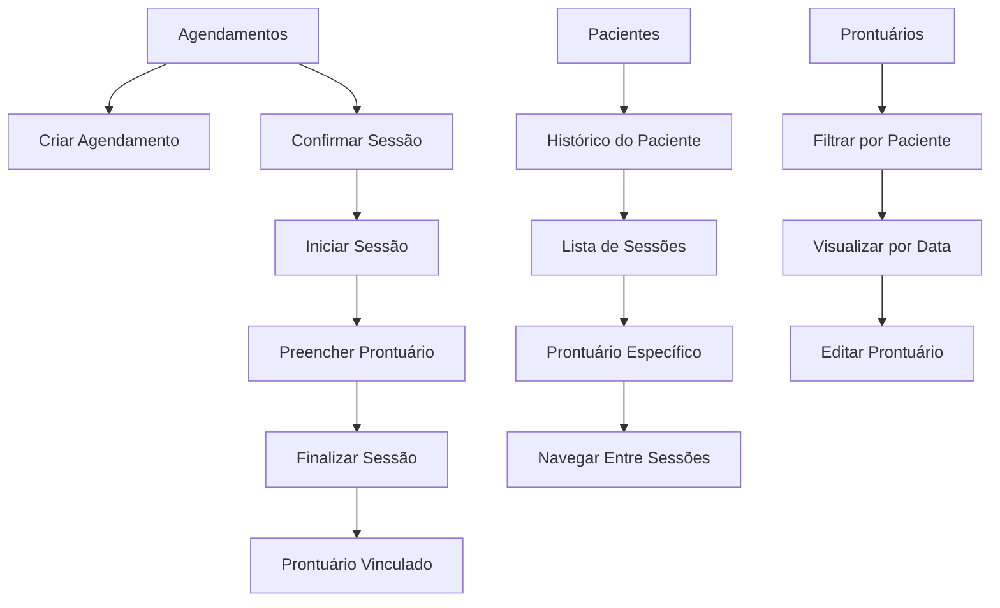

# Reestruturação do Sistema de Prontuários - Documento de Requisitos

## 1. Visão Geral do Produto

O sistema Psicomind será reestruturado para que cada prontuário seja resultado direto de uma sessão específica (agendamento), criando um histórico cronológico detalhado e organizado do tratamento de cada paciente. Esta mudança estrutural transforma o fluxo de trabalho de "Prontuários independentes" para "Agendamento → Sessão → Prontuário", proporcionando maior rastreabilidade e organização clínica.

## 2. Funcionalidades Principais

### 2.1 Papéis de Usuário
| Papel | Método de Registro | Permissões Principais |
|-------|-------------------|----------------------|
| Psicólogo | Registro por email | Acesso completo aos seus pacientes, agendamentos e prontuários |

### 2.2 Módulos de Funcionalidade

Nossa reestruturação abrange as seguintes páginas principais:
1. **Agendamentos**: visualização de consultas, criação de sessões, controle de status
2. **Prontuários**: criação automática por sessão, histórico do paciente, edição de registros
3. **Pacientes**: visualização do histórico completo, navegação entre sessões

### 2.3 Detalhes das Páginas

| Nome da Página | Nome do Módulo | Descrição da Funcionalidade |
|----------------|----------------|----------------------------|
| Agendamentos | Gestão de Sessões | Criar agendamento, marcar como "realizado", gerar prontuário automaticamente |
| Agendamentos | Controle de Status | Alterar status (agendado → confirmado → realizado), validar conclusão de sessão |
| Prontuários | Criação por Sessão | Criar prontuário vinculado a agendamento específico, cronômetro de sessão, campos estruturados |
| Prontuários | Histórico do Paciente | Visualizar todos os prontuários de um paciente em ordem cronológica, filtrar por período |
| Prontuários | Edição de Registros | Editar prontuários existentes, manter vínculo com agendamento original |
| Pacientes | Visualização de Histórico | Exibir linha do tempo de todas as sessões, resumo de evolução, acesso rápido aos prontuários |

## 3. Processo Principal

### 3.1 Fluxo de Trabalho Principal

**Fluxo do Psicólogo:**
1. Criar agendamento para paciente
2. Confirmar agendamento antes da sessão
3. Iniciar sessão (alterar status para "em andamento")
4. Realizar consulta e preencher prontuário
5. Finalizar sessão (alterar status para "realizado")
6. Prontuário fica automaticamente vinculado ao agendamento

**Fluxo de Visualização do Histórico:**
1. Acessar página do paciente
2. Visualizar linha do tempo de todas as sessões
3. Clicar em sessão específica para ver prontuário detalhado
4. Navegar entre sessões anteriores e posteriores

### 3.2 Diagrama de Navegação

## 4. Design da Interface do Usuário

### 4.1 Estilo de Design
- **Cores Primárias**: Azul (#3B82F6) e Verde (#10B981)
- **Cores Secundárias**: Cinza (#6B7280) e Branco (#FFFFFF)
- **Estilo de Botões**: Arredondados com sombra sutil
- **Fonte**: Inter, tamanhos 14px (corpo), 16px (títulos), 24px (cabeçalhos)
- **Layout**: Baseado em cards com navegação superior
- **Ícones**: Lucide React com estilo minimalista

### 4.2 Visão Geral do Design das Páginas

| Nome da Página | Nome do Módulo | Elementos da UI |
|----------------|----------------|-----------------|
| Agendamentos | Lista de Sessões | Cards com status colorido, botão "Iniciar Sessão", indicador de prontuário criado |
| Agendamentos | Formulário de Sessão | Modal com campos de agendamento, seletor de paciente, validação de horários |
| Prontuários | Formulário de Sessão | Layout em duas colunas, cronômetro visível, campos estruturados, botão "Salvar e Finalizar" |
| Prontuários | Histórico do Paciente | Timeline vertical, cards de sessão com resumo, filtros por data e tipo |
| Pacientes | Perfil com Histórico | Header com dados do paciente, timeline de sessões, estatísticas de evolução |

### 4.3 Responsividade
O produto é desktop-first com adaptação mobile, otimizado para tablets em modo paisagem para facilitar o preenchimento de prontuários durante as consultas.

## 5. Regras de Negócio

### 5.1 Relacionamento Agendamento-Prontuário
- Cada agendamento pode ter no máximo 1 prontuário
- Prontuários só podem ser criados para agendamentos com status "realizado"
- Agendamentos cancelados ou com falta não geram prontuários

### 5.2 Controle de Acesso
- Psicólogos só podem ver prontuários de seus próprios pacientes
- Prontuários não podem ser excluídos, apenas editados
- Histórico de alterações deve ser mantido para auditoria

### 5.3 Validações
- Data da sessão no prontuário deve coincidir com data do agendamento
- Duração da sessão deve ser registrada automaticamente
- Campos obrigatórios: observações, data da sessão, paciente vinculado

## 6. Critérios de Sucesso

### 6.1 Funcionalidades Essenciais
- [ ] Criação automática de prontuário ao finalizar sessão
- [ ] Visualização cronológica do histórico do paciente
- [ ] Navegação fluida entre sessões do mesmo paciente
- [ ] Migração completa dos dados existentes

### 6.2 Melhorias de Usabilidade
- [ ] Redução de cliques para acessar prontuários
- [ ] Interface intuitiva para navegação temporal
- [ ] Indicadores visuais de progresso do tratamento
- [ ] Busca eficiente por período ou conteúdo

### 6.3 Integridade dos Dados
- [ ] Manutenção de todos os prontuários existentes
- [ ] Vínculo correto entre agendamentos e prontuários
- [ ] Preservação do histórico de alterações
- [ ] Backup automático durante migração