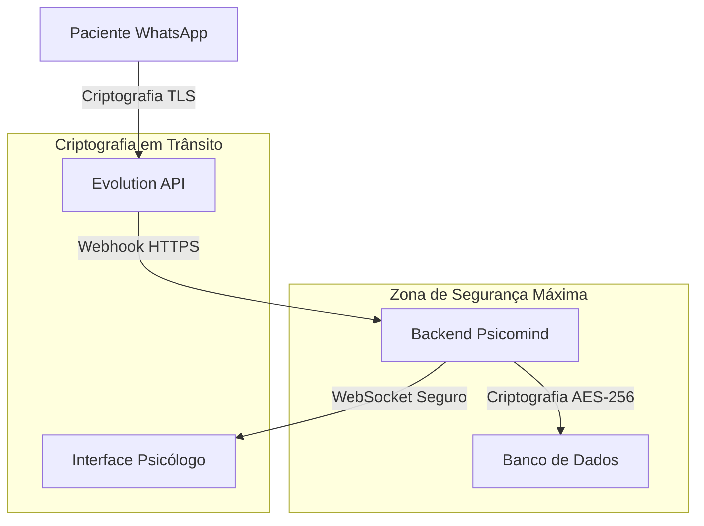

# Segurança e Compliance - Sistema de Chat WhatsApp

## 1. Visão Geral de Segurança

O sistema de chat para atendimento psicológico via WhatsApp deve atender aos mais altos padrões de segurança e privacidade, considerando a natureza extremamente sensível dos dados de saúde mental. Este documento estabelece as diretrizes de segurança, compliance com LGPD e boas práticas para proteção de dados.

## 2. Classificação de Dados

### 2.1 Tipos de Dados Processados

| Tipo de Dado | Classificação | Exemplos | Nível de Proteção |
|--------------|---------------|----------|-------------------|
| Dados Pessoais Básicos | Sensível | Nome, telefone, email | Alto |
| Dados de Saúde Mental | Altamente Sensível | Conteúdo das conversas, diagnósticos mencionados | Crítico |
| Dados de Autenticação | Crítico | Senhas, tokens, chaves API | Máximo |
| Metadados de Comunicação | Moderado | Timestamps, status de entrega | Médio |

### 2.2 Fluxo de Dados Sensíveis



## 3. Implementação de Segurança

### 3.1 Criptografia de Dados

**Criptografia em Trânsito:**
- Todas as comunicações via HTTPS/TLS 1.3
- WebSockets seguros (WSS) para tempo real
- Certificados SSL/TLS válidos e atualizados
- Validação de certificados obrigatória

**Criptografia em Repouso:**
```sql
-- Função para criptografar conteúdo sensível
CREATE OR REPLACE FUNCTION encrypt_message_content(content TEXT, key_id TEXT)
RETURNS TEXT AS $$
BEGIN
    RETURN pgp_sym_encrypt(content, key_id);
END;
$$ LANGUAGE plpgsql;

-- Função para descriptografar conteúdo
CREATE OR REPLACE FUNCTION decrypt_message_content(encrypted_content TEXT, key_id TEXT)
RETURNS TEXT AS $$
BEGIN
    RETURN pgp_sym_decrypt(encrypted_content, key_id);
END;
$$ LANGUAGE plpgsql;

-- Atualizar tabela de mensagens para suportar criptografia
ALTER TABLE mensagens ADD COLUMN conteudo_criptografado TEXT;
ALTER TABLE mensagens ADD COLUMN key_id VARCHAR(50);
```

### 3.2 Controle de Acesso

**Autenticação Multi-Fator:**
```typescript
interface AuthConfig {
  requireMFA: boolean;
  mfaMethods: ('sms' | 'email' | 'authenticator')[];
  sessionTimeout: number; // em minutos
  maxFailedAttempts: number;
}

const chatAuthConfig: AuthConfig = {
  requireMFA: true,
  mfaMethods: ['authenticator', 'sms'],
  sessionTimeout: 30,
  maxFailedAttempts: 3
};
```

**Controle de Acesso Baseado em Função (RBAC):**
```sql
-- Criar tabela de permissões específicas para chat
CREATE TABLE chat_permissions (
    id UUID PRIMARY KEY DEFAULT gen_random_uuid(),
    psicologo_id UUID NOT NULL REFERENCES psicologos(id),
    permission_type VARCHAR(50) NOT NULL,
    granted_at TIMESTAMP WITH TIME ZONE DEFAULT NOW(),
    granted_by UUID REFERENCES psicologos(id),
    
    CHECK (permission_type IN (
        'chat_read', 'chat_write', 'chat_export', 
        'chat_delete', 'chat_config', 'chat_audit'
    ))
);

-- Política RLS para permissões
CREATE POLICY "Psicólogos podem ver suas permissões" ON chat_permissions
    FOR SELECT USING (psicologo_id = auth.uid());
```

### 3.3 Auditoria e Logs

**Sistema de Auditoria Completo:**
```sql
-- Tabela de logs de auditoria para chat
CREATE TABLE chat_audit_logs (
    id UUID PRIMARY KEY DEFAULT gen_random_uuid(),
    psicologo_id UUID REFERENCES psicologos(id),
    paciente_id UUID REFERENCES pacientes(id),
    action_type VARCHAR(50) NOT NULL,
    resource_type VARCHAR(50) NOT NULL,
    resource_id UUID,
    details JSONB DEFAULT '{}',
    ip_address INET,
    user_agent TEXT,
    timestamp TIMESTAMP WITH TIME ZONE DEFAULT NOW(),
    
    CHECK (action_type IN (
        'message_sent', 'message_received', 'message_read',
        'conversation_accessed', 'data_exported', 'config_changed'
    )),
    
    CHECK (resource_type IN (
        'message', 'conversation', 'configuration', 'export'
    ))
);

-- Índices para consultas de auditoria
CREATE INDEX idx_chat_audit_psicologo ON chat_audit_logs(psicologo_id);
CREATE INDEX idx_chat_audit_timestamp ON chat_audit_logs(timestamp DESC);
CREATE INDEX idx_chat_audit_action ON chat_audit_logs(action_type);

-- Função para registrar ações de auditoria
CREATE OR REPLACE FUNCTION log_chat_action(
    p_psicologo_id UUID,
    p_paciente_id UUID,
    p_action_type VARCHAR(50),
    p_resource_type VARCHAR(50),
    p_resource_id UUID,
    p_details JSONB DEFAULT '{}',
    p_ip_address INET DEFAULT NULL,
    p_user_agent TEXT DEFAULT NULL
)
RETURNS void AS $$
BEGIN
    INSERT INTO chat_audit_logs (
        psicologo_id, paciente_id, action_type, resource_type,
        resource_id, details, ip_address, user_agent
    ) VALUES (
        p_psicologo_id, p_paciente_id, p_action_type, p_resource_type,
        p_resource_id, p_details, p_ip_address, p_user_agent
    );
END;
$$ LANGUAGE plpgsql;
```

## 4. Compliance com LGPD

### 4.1 Princípios da LGPD Aplicados

**Finalidade e Adequação:**
- Dados coletados exclusivamente para comunicação terapêutica
- Processamento limitado ao necessário para o atendimento
- Consentimento explícito do paciente documentado

**Transparência:**
```sql
-- Tabela para registro de consentimentos
CREATE TABLE chat_consent_records (
    id UUID PRIMARY KEY DEFAULT gen_random_uuid(),
    paciente_id UUID NOT NULL REFERENCES pacientes(id),
    consent_type VARCHAR(50) NOT NULL,
    consent_text TEXT NOT NULL,
    granted_at TIMESTAMP WITH TIME ZONE DEFAULT NOW(),
    ip_address INET,
    evidence JSONB DEFAULT '{}',
    
    CHECK (consent_type IN (
        'whatsapp_communication', 'data_processing', 
        'data_retention', 'data_sharing'
    ))
);
```

**Direitos do Titular:**
```typescript
interface DataSubjectRights {
  access: () => Promise<ConversationData>;
  rectification: (data: Partial<ConversationData>) => Promise<void>;
  erasure: () => Promise<void>;
  portability: () => Promise<ExportedData>;
  objection: () => Promise<void>;
}

// Implementação dos direitos LGPD
class LGPDComplianceService {
  async exportPatientData(pacienteId: string): Promise<ExportedData> {
    // Exportar todas as conversas e dados relacionados
  }
  
  async deletePatientData(pacienteId: string): Promise<void> {
    // Anonimizar ou deletar dados conforme política de retenção
  }
  
  async anonymizeOldData(): Promise<void> {
    // Anonimizar dados antigos automaticamente
  }
}
```

### 4.2 Políticas de Retenção de Dados

```sql
-- Função para anonimização automática de dados antigos
CREATE OR REPLACE FUNCTION anonymize_old_chat_data()
RETURNS void AS $$
BEGIN
    -- Anonimizar mensagens com mais de 5 anos
    UPDATE mensagens 
    SET 
        conteudo = '[DADOS ANONIMIZADOS]',
        metadata = '{"anonymized": true, "original_date": "' || created_at || '"}'
    WHERE created_at < NOW() - INTERVAL '5 years'
    AND conteudo != '[DADOS ANONIMIZADOS]';
    
    -- Log da ação de anonimização
    INSERT INTO chat_audit_logs (action_type, resource_type, details)
    VALUES ('data_anonymized', 'bulk_messages', '{"retention_policy": "5_years"}');
END;
$$ LANGUAGE plpgsql;

-- Agendar execução automática da anonimização
-- (implementar via cron job ou scheduler)
```

## 5. Configurações de Segurança da Evolution API

### 5.1 Configuração Segura da API

```typescript
interface EvolutionAPISecurityConfig {
  apiUrl: string;
  apiKey: string;
  webhookSecret: string;
  allowedIPs: string[];
  rateLimiting: {
    maxRequests: number;
    windowMs: number;
  };
  encryption: {
    enabled: boolean;
    algorithm: string;
    keyRotationDays: number;
  };
}

const secureEvolutionConfig: EvolutionAPISecurityConfig = {
  apiUrl: process.env.EVOLUTION_API_URL!,
  apiKey: process.env.EVOLUTION_API_KEY!,
  webhookSecret: process.env.EVOLUTION_WEBHOOK_SECRET!,
  allowedIPs: process.env.EVOLUTION_ALLOWED_IPS?.split(',') || [],
  rateLimiting: {
    maxRequests: 100,
    windowMs: 60000 // 1 minuto
  },
  encryption: {
    enabled: true,
    algorithm: 'AES-256-GCM',
    keyRotationDays: 30
  }
};
```

### 5.2 Validação de Webhooks

```typescript
import crypto from 'crypto';

class WebhookValidator {
  static validateEvolutionWebhook(
    payload: string,
    signature: string,
    secret: string
  ): boolean {
    const expectedSignature = crypto
      .createHmac('sha256', secret)
      .update(payload)
      .digest('hex');
    
    return crypto.timingSafeEqual(
      Buffer.from(signature),
      Buffer.from(expectedSignature)
    );
  }
  
  static validateIPWhitelist(clientIP: string, allowedIPs: string[]): boolean {
    return allowedIPs.includes(clientIP) || allowedIPs.includes('0.0.0.0');
  }
}
```

## 6. Monitoramento e Alertas de Segurança

### 6.1 Métricas de Segurança

```sql
-- View para métricas de segurança
CREATE VIEW chat_security_metrics AS
SELECT 
    DATE_TRUNC('hour', timestamp) as hour,
    action_type,
    COUNT(*) as action_count,
    COUNT(DISTINCT psicologo_id) as unique_users,
    COUNT(DISTINCT ip_address) as unique_ips
FROM chat_audit_logs
WHERE timestamp >= NOW() - INTERVAL '24 hours'
GROUP BY DATE_TRUNC('hour', timestamp), action_type
ORDER BY hour DESC;

-- Alertas automáticos para atividades suspeitas
CREATE OR REPLACE FUNCTION check_suspicious_activity()
RETURNS void AS $$
DECLARE
    suspicious_count INTEGER;
BEGIN
    -- Verificar tentativas de acesso excessivas
    SELECT COUNT(*) INTO suspicious_count
    FROM chat_audit_logs
    WHERE action_type = 'conversation_accessed'
    AND timestamp >= NOW() - INTERVAL '1 hour'
    AND psicologo_id = ANY(
        SELECT psicologo_id
        FROM chat_audit_logs
        WHERE timestamp >= NOW() - INTERVAL '1 hour'
        GROUP BY psicologo_id
        HAVING COUNT(*) > 100
    );
    
    IF suspicious_count > 0 THEN
        -- Enviar alerta (implementar notificação)
        INSERT INTO chat_audit_logs (action_type, resource_type, details)
        VALUES ('security_alert', 'system', '{"alert_type": "excessive_access", "count": ' || suspicious_count || '}');
    END IF;
END;
$$ LANGUAGE plpgsql;
```

### 6.2 Backup e Recuperação

```sql
-- Estratégia de backup para dados de chat
CREATE OR REPLACE FUNCTION backup_chat_data(backup_date DATE DEFAULT CURRENT_DATE)
RETURNS void AS $$
BEGIN
    -- Criar backup das conversas
    CREATE TABLE IF NOT EXISTS backup_conversas_${backup_date} AS
    SELECT * FROM conversas WHERE DATE(created_at) = backup_date;
    
    -- Criar backup das mensagens
    CREATE TABLE IF NOT EXISTS backup_mensagens_${backup_date} AS
    SELECT * FROM mensagens WHERE DATE(created_at) = backup_date;
    
    -- Log do backup
    INSERT INTO chat_audit_logs (action_type, resource_type, details)
    VALUES ('data_backup', 'system', '{"backup_date": "' || backup_date || '"}');
END;
$$ LANGUAGE plpgsql;
```

## 7. Checklist de Implementação de Segurança

### 7.1 Pré-Implementação
- [ ] Configurar certificados SSL/TLS válidos
- [ ] Implementar autenticação multi-fator
- [ ] Configurar firewall e whitelist de IPs
- [ ] Estabelecer políticas de senha forte
- [ ] Configurar backup automático

### 7.2 Durante a Implementação
- [ ] Criptografar dados sensíveis em repouso
- [ ] Implementar validação de webhooks
- [ ] Configurar logs de auditoria completos
- [ ] Implementar rate limiting
- [ ] Testar políticas RLS

### 7.3 Pós-Implementação
- [ ] Realizar testes de penetração
- [ ] Configurar monitoramento de segurança
- [ ] Treinar usuários sobre segurança
- [ ] Documentar procedimentos de resposta a incidentes
- [ ] Agendar revisões de segurança regulares

### 7.4 Compliance LGPD
- [ ] Documentar base legal para processamento
- [ ] Implementar mecanismos de consentimento
- [ ] Configurar exportação de dados do titular
- [ ] Implementar direito ao esquecimento
- [ ] Estabelecer políticas de retenção
- [ ] Treinar equipe sobre LGPD